# react-native-ios-context-menu

<p>
  
</p>
<br>

## 🚧⚠️ Re-Write WIP ⚠️🚧

📝 Check [`TODO.md`](docs/TODO.md) for progress on re-write.

* ❤️ Support the new API's introduced in iOS 15.
* 🧡 New `SFSymbols` + menu icon config API.
* 💛 Support for use with [Mac Catalyst](https://developer.apple.com/documentation/uikit/uicommand/adding_menus_and_shortcuts_to_the_menu_bar_and_user_interface) (e.g. configuring the mac's menu bar + the iPad's [shortcuts/menu bar](https://twitter.com/stroughtonsmith/status/1440344820577226752?s=20)). 
* 💚 Typescript re-write (for better autocomplete).
* 💙 Documentation re-write (so its actually usable + better examples).
* 💜 ...and fixing all the bugs + issues so far 😅

<br>

| Notice                                                       |
| ------------------------------------------------------------ |
| 📝 **Note** #1: A future major version of this library will introduce breaking changes to the API (mainly just renaming some of the properties) in order to add new features (and better types). <br><br>However, the next minor version of this library will not introduce any breaking changes but will instead focus on adding typescript annotations and fixing the existing bugs, but will require your project/app to be built with Xcode 13.1. |
| 📝 **Note** #2: The documentation + examples are currently being rewritten.<br><br>💅 [`README-next.md`](./README-next.md) — The new version of the documentation (WIP).<br>💖 [`example/src/examples`](./example/src/examples) — The typescript rewrite of the examples (WIP). |

 ()<br>

### Versions

| Library Version | Compatibility                |
| :-------------- | ---------------------------- |
| `1.4`           | iOS 13 to iOS 15<br>Xcode 13 |
| `1.3` and Below | iOS 13 to 14<br>Xcode 12     |

📝 **Note**: Supports projects targeting iOS 10 but will use the action sheet fallback when running on iOS 12 and older.

---

<br>

A react native component to use [`UIMenu`](https://developer.apple.com/documentation/uikit/uimenu) on iOS 13 and later.
* Support for creating menu actions and submenus (i.e. nested and in-line menus)
* Support for customizing the menu icons (i.e. support for SF Symbols, `require(image)`, and `xcasset` icons, icon tint, etc.)
* Support for iOS 14 functionality (like the `UIButton` context menu, updating the menu while its visible, etc.)
* Support for setting (almost) all of the native [`UIMenu`](https://developer.apple.com/documentation/uikit/uimenu) and [`UIAction`](https://developer.apple.com/documentation/uikit/uiaction) properties (e.g. `UIMenuElementState`,  `MenuElementAtrributes`, `discoverabilityTitle`, etc.)
* Basic `ActionSheetIOS` menu fallback for iOS 12 and below.
* Support for creating custom context menu previews (with support for dynamic or fixed preview sizes, setting the [`UIPreviewParameters`](https://developer.apple.com/documentation/uikit/uipreviewparameters), specifying a [`UITargetedPreview`](https://developer.apple.com/documentation/uikit/uitargetedpreview), etc.)

<br>

<details open>
  <summary>Show/Hide Gifs</summary>


`ContextMenuView` **Left**: [Example 1](#411-contextmenuview-simple-example-1), [Example 2](#412-contextmenuview-simple-example-2), and **Right**: [Example 3](#413-contextmenuview-simple-example-3), [Example 4](#414-contextmenuview-simple-example-4)


`ContextMenuView` **Left**: [Example 5](#415-contextmenuview-simple-example-5), [Example 6](#416-contextmenuview-simple-example-6), and **Right**: [Example 7](#417-contextmenuview-simple-example-7), [Example 8](#418-contextmenuview-simple-example-8)


`ContextMenuView` **Left**: [Example 9](#419-contextmenuview-simple-example-9), and **Right**: [Example 10](#4110-contextmenuview-simple-example-10)


`ContextMenuView` **Left**: [Example 11](#4111-contextmenuview-simple-example-11), [Example 12](#4112-contextmenuview-simple-example-12), and **Right**: [Example 13](#4113-contextmenuview-simple-example-13), [Example 14](#4114-contextmenuview-simple-example-14)


`ContextMenuView` **Left**: [Example 15](#4115-contextmenuview-simple-example-15), [Example 16](#4116-contextmenuview-simple-example-16), and **Right**: [Example 17](#4117-contextmenuview-simple-example-17), [Example 18](#4118-contextmenuview-simple-example-18)
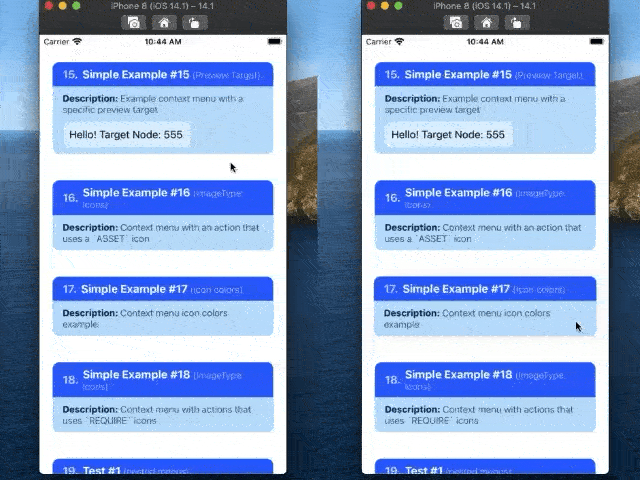

`ContextMenuView` **Left**: [Test 1](https://github.com/dominicstop/react-native-ios-context-menu/blob/master/example/src/components/ContextMenuView/ContextMenuViewTest01.js), and **Right**: [Test 2](https://github.com/dominicstop/react-native-ios-context-menu/blob/master/example/src/components/ContextMenuView/ContextMenuViewTest02.js)


`ContextMenuView` **Left**: [Test 3](https://github.com/dominicstop/react-native-ios-context-menu/blob/master/example/src/components/ContextMenuView/ContextMenuViewTest03.js), and **Right**: [Test 4](https://github.com/dominicstop/react-native-ios-context-menu/blob/master/example/src/components/ContextMenuView/ContextMenuViewTest04.js)


`ContextMenuView` **Left**: [Test 5](https://github.com/dominicstop/react-native-ios-context-menu/blob/master/example/src/components/ContextMenuView/ContextMenuViewTest05.js), and **Right**: [Test 6](https://github.com/dominicstop/react-native-ios-context-menu/blob/master/example/src/components/ContextMenuView/ContextMenuViewTest06.js)


`ContextMenuView` **Left/Right:** [Test 7](https://github.com/dominicstop/react-native-ios-context-menu/blob/master/example/src/components/ContextMenuView/ContextMenuViewTest07.js)


`ContextMenuView` `ActionSheetIOS` fallback for simple example 1 to 9


`ContextMenuView` `ActionSheetIOS` fallback for context menu view test 1 to 6


`ContextMenuButton` **Left**: [Example 1](#421-contextmenubutton-simple-example-1), and **Right**: [Example 2](#422-contextmenubutton-simple-example-2)


</details>

---
<br>

## 1. Installation
<details open>
  <summary>Show/Hide Section</summary>


```sh
# install via NPM
npm install react-native-ios-context-menu

# or install via yarn
yarn add react-native-ios-context-menu

# then run pod install (uses auto-linking)
cd ios && pod install
```

<br>

### 1.1 Installation Notes
If you encounter any errors/bugs while using this library, or want a particular feature implemented, please create an issue! ✨

<br>

#### 1.1.1 Xcode Build Error (Swift)
This library is written in Swift. If you are having trouble building your app after installing this library, try adding an empty swift file:
1. Open up your `ios/project.xcworkspace` project
2. On the project navigator panel (located on the right side of Xcode), right click on your project group (or another folder/group i.e the blue or yellow icons) and select the "*New File...*" option
3. In the popup sheet, select "Swift" as the template and then click the "*Next*" button
4. A "*Save As*" popup sheet should appear and then click "*Create*" (you can rename the file first if you want to)
5. If Xcode asks you to create a "*Objective-C Bridging Header*" choose *"Create Objective-C Bridging Header"*
<br>

#### 1.1.2 Xcode Build Error (Undefined symbol)
When installing this library on Xcode 12, you'll get the following error in Xcode:
```
Undefined symbol: (extension in UIKit):
__C.UIMenu.init(title: Swift.String, image: __C.UIImage?, identifier: __C.UIMenuIdentifier?, options: __C.UIMenuOptions, children: [__C.UIMenuElement]) -> __C.UIMenu

Undefined symbol: (extension in UIKit):
__C.UIAction.init(title: Swift.String, image: __C.UIImage?, identifier: __C.UIActionIdentifier?, discoverabilityTitle: Swift.String?, attributes: __C.UIMenuElementAttributes, state: __C.UIMenuElementState, handler: (__C.UIAction) -> ()) -> __C.UIAction
```

<br>

Here are some related issues in the RN repo: [Issue 30202](https://github.com/facebook/react-native/pull/30202) and [Issue 29178](https://github.com/facebook/react-native/pull/29178). This bug could be fixed in a future version of react native, but a workaround I've found is to do the following:

1. Open your `ios/project.xcworkspace` project.
2. In the project navigator panel (located on the right side of Xcode), select your project group (i.e. the item with the blueprint icon).
3. The Xcode project editor should appear. In the left panel, under the "Project" section, select your project (if it isn't already selected).
4. In the project section's top tab bar, select the "Build Settings" tab (also make sure the "All" and "Combined" tabs are selected).
5.  In the project navigator list, under the "Search Path" section, there should be a "Library Search Paths" setting (alternatively, you can search for "Library Search Paths" in the search bar).
6. Change the entry `"$(TOOLCHAIN_DIR)/usr/lib/swift-5.0/$(PLATFORM_NAME)"` to `"$(TOOLCHAIN_DIR)/usr/lib/swift-5.3/$(PLATFORM_NAME)"` i.e. change `swift-5.0` to `swift-5.3` (to show the popup dialog, double click the value/item).
	* Alternatively, according to this [issue comment](https://github.com/facebook/react-native/issues/29246#issuecomment-667518920), you can clear all the items listed in the "Library Search Paths" setting. **TLDR**: Xcode automatically manages this setting, and the RN template hardcodes it to use Swift 5.0.

7. If you haven't already, make sure to create an empty swift file. Then clean the build folder (the option is in the menu bar under: "Product" -> "Clean Build Folder") and try building your project again.
8. If you are still having problems building the app, try the following and build your project again:
	* Try clearing out Xcode's `derivedData` directory: `rm -rf ~/Library/Developer/Xcode/DerivedData/*` (check out this [gist](https://gist.github.com/maciekish/66b6deaa7bc979d0a16c50784e16d697) for instructions on how to clean up Xcode)
	* Try clearing out the `Cocoapods` cache: `rm -rf "${HOME}/Library/Caches/CocoaPods"` (and then try running `pod install` again).

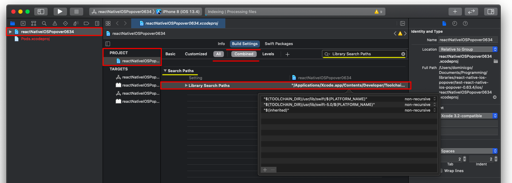

<br>

#### 1.1.3 Cocoapods Static Libraries Error
If you encounter the following error when running `pod install`:

```
[!] The following Swift pods cannot yet be integrated as static libraries:

The Swift pod `react-native-ios-context-menu` depends upon `React-Core`, which does not define modules. To opt into those targets generating module maps (which is necessary to import them from Swift when building as static libraries), you may set `use_modular_headers!` globally in your Podfile, or specify `:modular_headers => true` for particular dependencies.
```

<br>

Then try following these steps:
1. Open up your project's `ios/podfile` configuration
2. Under `target 'ProjectName' do` block, find the `'React-Core'` pod, and append the following snippet to the end of the line: `, :modular_headers => true`
3. It should now look something similar to this: `pod 'React-Core', :path => '../node_modules/react-native/', :modular_headers => true`
4. Try running `pod install` again.

</details>

<br>

## 2. Usage
<details open>
  <summary>Show/Hide Section</summary>

### 2.1 `ContextMenuView` Usage
Please check out the [examples section](#41-contextmenuview-examples) or the [examples directory](https://github.com/dominicstop/react-native-ios-context-menu/tree/master/example/src/components/ContextMenuView) for more on how to use it.
* See  [Example 1](#411-contextmenuview-simple-example-1) section for the basic `menuConfig` configuration.

```jsx
import { ContextMenuView } from "react-native-ios-context-menu";

<ContextMenuView
  onPressMenuItem={({nativeEvent}) => {
    alert(`${nativeEvent.actionKey} was pressed`);
  }}
  menuConfig={{
    menuTitle: 'Context Menu Example',
    menuItems: [{
      actionKey  : 'action-key',
      actionTitle: 'Action #1' ,
    }]
  }}
>
  <Text> Hello World </Text>
</ContextMenuView>
```

<br>

### 2.2 `ContextMenuView` Section Links
Here is an overview of all the documentation and examples for the `ContextMenuView` component.

<details open>
  <summary>Show/Hide Section</summary>

| Description                                                  | Section Link                                                 |
| ------------------------------------------------------------ | ------------------------------------------------------------ |
| General examples for  `ContextMenuView`.                     | [Example 1](#411-contextmenuview-simple-example-1) (bare min. example),<br>[Example 9](#419-contextmenuview-simple-example-9) (events). |
| Examples for configuring the menu icons.                     | [Example 2](#412-contextmenuview-simple-example-2) (SF Symbol icon),<br>[Example 16](#4116-contextmenuview-simple-example-16) (asset icon),<br>[Example 17](#4117-contextmenuview-simple-example-17) (icon tint), <br>[Example 18](#4118-contextmenuview-simple-example-18) (require icon). |
| Examples for the different menu configurations.              | [Example 3](#413-contextmenuview-simple-example-3) (submenus),<br>[Example 5](#415-contextmenuview-simple-example-5) (inline menu i.e. menu sections),<br>[Example 6](#416-contextmenuview-simple-example-6) (destructive menu attribute),<br>[Example 7](#417-contextmenuview-simple-example-7) (inline + destructive menu attribute),<br>[Example 10](#4110-contextmenuview-simple-example-10) (updating the menu). |
| Examples for the different menu action configurations.       | [Example 4](#414-contextmenuview-simple-example-4) (menu action attributes, e.g. disabled, destructive, etc.),<br>[Example 8](#418-contextmenuview-simple-example-8) (menu state),<br>[Example 13](#4113-contextmenuview-simple-example-13) (subtitles) |
| Examples for creating custom `ContextMenuView` previews.     | [Example 11](https://github.com/dominicstop/react-native-ios-context-menu#4111-contextmenuview-simple-example-11) (custom preview),<br>[Example 12](#4112-contextmenuview-simple-example-12) (preview size),<br>[Example 14](#4114-contextmenuview-simple-example-14) (`commitStyle`),<br>[Example 15](#4115-contextmenuview-simple-example-15) (target preview). |
| `MenuConfig` object and related enums/objects.<br>(used in the component's `menuConfig` prop.) | [`MenuConfig`](#332-menuconfig-object) object,<br>[`IconConfig`](#333-iconconfig-object) object,<br>[`MenuOptions`](#322-menuoptions-enum) enum. |
| `MenuAction` and related enums/objects.<br/>(used in a `MenuConfig` object i.e. the `MenuConfig.menuItems` property). | [`MenuAction`](#331-menuaction-object) object,<br>[`IconConfig`](#333-iconconfig-object) object,<br>[`MenuState`](#324-menustate-enum) enum,<br>[`MenuAttributes`](#323-menuatrributes-enum) enum. |
| `PreviewConfig` object and related enums.<br/>()used for the `previewConfig` prop.) | [`PreviewConfig`](#334-previewconfig-object) object,<br>[`PreviewType`](#325-previewtype-enum) enum,<br>[`PreviewSize`](#326-previewsize-enum) enum,<br>[`CommitStyle`](#327-commitstyle-enum) enum. |

</details>

<br>

**Note**: This component is only available on iOS 13+. Use the [`Platform`](https://reactnative.dev/docs/platform-specific-code#platform-module) module to handle logic if `ContextMenuView` is not available i.e. by adding your own `onLongPress` handler. 
* By default, on iOS 12 and below, a long press on a `ContextMenuView` will show a `ActionSheetIOS` menu based on the `menuConfig` prop. If you want to disable this behavior, set `useActionSheetFallback` prop to false.
* This component is just a regular view on Android, so a long press will do nothing on Android.

<br>

### 2.3 `ContextMenuButton` Usage
Please check out the [examples section](#42-contextmenubutton-examples) or the [examples directory](https://github.com/dominicstop/react-native-ios-context-menu/tree/master/example/src/components/ContextMenuButton) for more on how to use it. See [Example 1](#421-contextmenubutton-simple-example-1) section for the basic `menuConfig` configuration. 
* The `ContextMenuButton` component is almost the same as the `ContextMenuView` component (It supports the same kind of props and events). 
* The only difference between them is that the `ContextMenuButton` component does not have a preview, and it can be immediately shown when its tapped instead of having to do a long press. See [Simple Example 2](#422-contextmenubutton-simple-example-2) for more details.
* Note that `ContextMenuButton` is only available on iOS 14 and above. On iOS 13, it will use a `ContextMenuButton`, and on iOS 12 and below, it will use the `ActionSheetFallback` module to present a `ActionSheetIOS` menu.
* This component uses [`TouchableOpacity`](https://reactnative.dev/docs/touchableopacity), so it should support the same props (e.g. `onPress`, `onLongPress`, `activeOpacity`, etc.)

```jsx
import { ContextMenuButton } from "react-native-ios-context-menu";

<ContextMenuButton
  onPressMenuItem={({nativeEvent}) => {
    alert(`${nativeEvent.actionKey} was pressed`);
  }}
  menuConfig={{
    menuTitle: 'Context Menu Example',
    menuItems: [{
      actionKey  : 'action-key',
      actionTitle: 'Action #1' ,
    }]
  }}
>
  <Text> Hello World </Text>
</ContextMenuButton>
```

</details>

<br>

## 3. Documentation
### 3.1 Modules/Components

<details open>
  <summary>Show/Hide Section</summary>

#### 3.1.1 `ContextMenuView` Component

##### `ContextMenuView` Props

| Prop                                                         | Description                                                  |
|--------------------------------------------------------------|--------------------------------------------------------------|
| `menuConfig`<br><br>**Required**: [`MenuConfig`](#332-menuconfig-object) Object | An object that represents the menu to display. <br/><br/>You can put `menuConfig` in  state if you want to dynamically change the menu configuration: See `ContextMenuView` [Test 3](https://github.com/dominicstop/react-native-ios-context-menu/blob/master/example/src/components/ContextMenuView/ContextMenuViewTest03.js), [Test 4](https://github.com/dominicstop/react-native-ios-context-menu/blob/master/example/src/components/ContextMenuView/ContextMenuViewTest04.js) and [Test 6](https://github.com/dominicstop/react-native-ios-context-menu/blob/master/example/src/components/ContextMenuView/ContextMenuViewTest06.js) for examples.<br/><br/> On iOS 14+ the menu config can be updated while it's visible. |
| `useActionSheetFallback`<br/><br/>**Optional**: `Bool`       | If set to `true`, a long press will show a [`ActionSheetIOS`](https://reactnative.dev/docs/actionsheetios#docsNav) menu based on the `menuConfig` prop.<br/><br/>Note: Default value is `false` on iOS 13+, or `true` on android and on iOS 12 and below. |
| `previewConfig`<br/><br/>**Optional**: [`PreviewConfig`](#332-previewconfig-object) Object | A prop to configure the context menu preview.<br/>See [Example 11](#4111-contextmenuview-simple-example-11), [Example 12](#4112-contextmenuview-simple-example-12), and [Example 14](#4114-contextmenuview-simple-example-14) section for example usage. |
| `lazyPreview`<br/>**Optional**: `Bool`<br/>**Default**: `true`<br/> | By default, the context menu preview contents is only mounted/rendered when the context menu is visible.<br/><br/>Set this to `false` if you want the preview content to be always mounted. |
| `renderPreview`<br/><br/>**Optional**: `Function`            | Accepts a function that returns a react component. The returned component will displayed in the context menu preview. See  section [Example #11](#4111-contextmenuview-simple-example-11) and [Example #12](#4112-contextmenuview-simple-example-12) for more details. |
<br>

##### `ContextMenuView` Events
| Event                                                        | Description                                                  |
| ------------------------------------------------------------ | ------------------------------------------------------------ |
| `onMenuWillShow`<br/><br/>**Event**: Function                | Event that gets called **before** the context menu is shown, i.e. this event is immediately invoked when the menu is <u>about to become visible</u>. |
| `onMenuDidShow`<br/><br/>**Event**: Function                 | Event that gets called **after** the context menu is shown, i.e. this event is invoked <u>after the menu entrance animation</u> is finished. |
| `onMenuWillHide`<br/><br/>**Event**: Function                | Event that gets called **before** the context menu is  hidden, i.e. this event is immediately invoked when the menu is <u>about to become hidden</u>. |
| `onMenuDidHide`<br/><br/>**Event**: Function                 | Event that gets called **after** the context menu is hidden, i.e. this event is invoked <u>after the menu exit animation</u> is finished. |
| `onMenuWillCancel`<br/><br/>**Event**: Function              | Event that gets called when the menu is **cancelled and about to be hidden**, i.e. this event is immediately invoked when the menu is cancelled and about to become hidden. |
| `onMenuDidCancel`<br/><br/>**Event**: Function               | Event that gets called when the menu is **cancelled and hidden**, i.e. this event is invoked when the menu is cancelled and the menu exit animation is finished. |
| `onPressMenuItem`<br/><br/>**Event**: Function: `onPressMenuItem({nativeEvent})` | Event that gets called when a menu action is pressed. You can identify which action was pressed via `nativeEvent.actionKey ` property in the `nativeEvent` object. <br/><br/>Check out the [onPressMenuItem Object](#333-onpressmenuitem-nativeevent-object) section for more details, or [Simple Example #9](#419-contextmenuview-simple-example-9) section for example usage. |
| `onPressMenuPreview`<br/><br/>**Event**: Function            | Event that gets called when the menu's preview is pressed.   |

<br>

##### `ContextMenuView` Functions

| Name            | Description                                                  |
|-----------------|--------------------------------------------------------------|
| `dismissMenu()` | Allows you to  programmatically dismiss the context menu. Only available on iOS 14 and above. |

<br>

#### 3.1.2 `ContextMenuButton` Component
##### `ContextMenuButton` Props

| Prop                                                         | Description                                                  |
| ------------------------------------------------------------ | ------------------------------------------------------------ |
| `menuConfig`<br/><br/>**Required**:  `MenuConfig` Object     | Same as `ContextMenuView`                                    |
| `enableContextMenu`<br/><br/>**Optional**: `Bool`<br/>**Default**: `true` | Whether or not the context menu is enabled.                  |
| `isMenuPrimaryAction`<br/><br/>**Optional**: `Bool`<br/>**Default**: `false` | When set to true, the context menu will be shown when its tapped instead of a long press. |
| `wrapNativeComponent`<br/><br/>**Optional**: `Bool`<br/>**Default**: `true` | When true, the `ContextMenuButton` will be wrapped inside a `TouchableOpacity` component, and it will be used to handle all of the `onPress` and `onLongPress` events.<br>If you want to use a different "button" component, set this prop to false first and wrap the `ContextMenuButton` in your own custom button component. |
| `useActionSheetFallback`<br/><br/>**Optional**: `Bool`       | Same as `ContextMenuView`                                    |
<br>

`ContextMenuButton` Events

| Event                                                        | Description               |
|--------------------------------------------------------------|---------------------------|
| `onMenuWillShow`<br/><br/>**Event**: Function                | Same as `ContextMenuView` |
| `onMenuDidShow`<br/><br/>**Event**: Function                 | Same as `ContextMenuView` |
| `onMenuWillHide`<br/><br/>**Event**: Function                | Same as `ContextMenuView` |
| `onMenuDidHide`<br/><br/>**Event**: Function                 | Same as `ContextMenuView` |
| `onMenuWillCancel`<br/><br/>**Event**: Function              | Same as `ContextMenuView` |
| `onMenuDidCancel`<br/><br/>**Event**: Function               | Same as `ContextMenuView` |
| `onPressMenuItem`<br/><br/>**Event**: Function `onPressMenuItem({nativeEvent})` | Same as `ContextMenuView` |

<br>

##### `ContextMenuButton` Functions

| Name            | Description                                                  |
| --------------- | ------------------------------------------------------------ |
| `dismissMenu()` | Same as `ContextMenuView`.<br>Allows you to  programmatically dismiss the context menu. Only available on iOS 14 and above. |

<br>

#### 3.1.2 `ActionSheetFallback` Module
A module to show a `ActionSheetIOS` menu based on a `MenuConfig` object. This module attempts to approximate `UIMenu` behavior using `ActionSheetIOS`, so it's very limited (i.e. it does not support menu/action icons, etc.) but it does support things like submenu's, destructive actions/menu's, inline submenu's, and hidden actions.
* Import the module like this: `import { ActionSheetFallback } from "react-native-ios-context-menu";`
* To present a `ActionSheetIOS` menu, call `const selectedAction = await ActionSheetFallback.show(menuConfig)`


| Function                                    | Returns                       | Description                                                  |
|---------------------------------------------|-------------------------------|--------------------------------------------------------------|
| `async show(menuConfig: MenuConfig Object)` | `MenuAction Object` or `null` | This function accepts a `MenuConfig` object and returns the selected `MenuAction` object or null if cancelled. |

</details>

<br>

### 3.2 Enum Values

<details open>
  <summary>Show/Hide Section</summary>

#### 3.2.1 `IconTypes` Enum
Enum string values you can use for the [`IconConfig.iconType`](#332-iconconfig-object) property in the [`MenuAction.icon`](#331-menuaction-object) or [`MenuConfig.icon`](#332-menuconfig-object) property. This enum is used to configure what type of icon is used for a context menu or menu action.

* Import the enum like this: `import { IconTypes } from "react-native-ios-context-menu";`
* And use it  like this: `{ iconType: IconTypes }` 
* Or you can directly pass a string like this: `{ iconType: 'SYSTEM' }`
* Check out [Simple Example #2](#412-contextmenuview-simple-example-2) or [Simple Example #16](#4116-contextmenuview-simple-example-16) section for example usage.

<br>

| Value   | Description                                                  |
| ------- | ------------------------------------------------------------ |
| NONE    | The default value for the `iconType` property. Specifies to not use an icon.<br><br/>Since this is the default value, you don't have to explicitly specify: `iconType: 'NONE'` in the `IconConfig` object if you don't want to use an icon. |
| SYSTEM  | Specifies that we want to a system image (i.e. like a  [SF Symbols](https://developer.apple.com/design/human-interface-guidelines/sf-symbols/overview/) icon).<br/><br/>The `iconValue` string from the `IconConfig` object  will be used to create an `UIImage` instance: `UIImage(systemName: iconValue)`. So the `iconValue` string must correspond to an SF Symbols icon. |
| ASSET   | Specifies that we want to use an image in the Xcode project's asset catalog.<br/><br/>The `iconValue` string from a `IconConfig` object object will be used to create an `UIImage` instance: `UIImage(named: iconValue)`. So the `iconValue` string must correspond to an asset/item in the `xcasset` catalog. |
| REQUIRE | Specifies that we want to use an icon via `require('directory/image.png')`.<br/><br/>The `iconValue` property from a `IconConfig` object must be set with a value returned from `Image.resolveAssetSource(source)`. See [Example 18](#4118-contextmenuview-simple-example-18) section for more details. |
<br>

#### 3.2.2 `MenuOptions` Enum
Enum string values you can use in a [`MenuConfig`](#332-menuconfig-object) object (i.e. in the `MenuConfig.menuOptions` property). These string values corresponds to the Swift  `UIMenu.Options` struct, so please check the [Apple Docs](https://developer.apple.com/documentation/uikit/uimenu/options) for more info. 

* Import the enum like this: `import { MenuOptions } from "react-native-ios-context-menu";`
* And use it  like this: `{ menuOptions: [MenuOptions.destructive] }`  
* Or you can directly pass a string like this: `{ menuOptions: ['destructive'] }`
* Check out `ContextMenuView` [Simple Example #5](#415-contextmenuview-simple-example-5) and [Simple Example #6](#416-contextmenuview-simple-example-6) section for example usage.

<br>

| Value           | Description                                                  |
| --------------- | ------------------------------------------------------------ |
| `destructive`   | An option indicating the menu's appearance represents a destructive action.<br/><br/>Visually, this will tint the submenu title and it's icon to red (the submenu's elements will be unaffected). |
| `displayInline` | An option indicating the menu displays inline with its parent menu instead of displaying as a submenu.<br/><br/>Visually, if you set a submenu to `menuOptions: 'displayInline'`, it will create a "section" in the parent menu. |

<br>

#### 3.2.3 `MenuAtrributes` Enum
Enum string values you can use in a [`MenuAction`](#331-menuaction-object) object (i.e. in the `MenuAction.menuAttributes` property). These string values corresponds to the swift `UIMenuElement.Attributes` struct, please check the [Apple Docs](https://developer.apple.com/documentation/uikit/uimenuelement/attributes) for more info.

* Import the enum like this: `import { MenuAtrributes } from "react-native-ios-context-menu";`
* And use it  like this: `menuAttributes: [MenuAtrributes.destructive]` 
* Or you can directly pass a string like this: `menuAttributes: ['destructive']`
* Check out [Simple Example #4](#414-contextmenuview-simple-example-4) section for example usage.

<br>

| Value         | Description                                                  |
| ------------- | ------------------------------------------------------------ |
| `hidden`      | An attribute indicating the hidden style.<br/><br/>This will hide the menu action i.e the menu action will no longer be visible in the context menu. You can use this to temporarily hide a menu action (via state). |
| `disabled`    | An attribute indicating the disabled style.<br/><br/>This will tint the menu action's title and icon to grey, and will also prevent the user from selecting/pressing the menu action. |
| `destructive` | An attribute indicating the destructive style.<br/><br/>Visually, this will tint the menu action's title and icon to red. |

<br>

#### 3.2.4 `MenuState` Enum
Enum string values you can use in a [`MenuAction`](#331-menuaction-object) object (i.e. in the `MenuAction.menuState` property). These string values corresponds to the swift  `UIMenuElementState ` struct, please check the [Apple Docs](https://developer.apple.com/documentation/uikit/uimenuelement/state) for more info.

* Import the enum like this: `import { MenuState } from "react-native-ios-context-menu";`
* And use it  like this: `{ menuState: MenuState.on }` 
* Or you can directly pass a string like this: `{ menuState: 'on' }`
* Check out [Simple Example #8](#418-contextmenuview-simple-example-8) section for example usage.

<br>

| Value   | Description                                                  |
| ------- | ------------------------------------------------------------ |
| `on`    | Indicates that the menu element is in the “on” state.<br/><br/>Visually, on iOS 13 it will replace the menu action's icon with a checkmark, meanwhile on iOS 14 it will show a checkmark on the left of the menu label. |
| `off`   | Indicates that the menu element is in the “off” state.       |
| `mixed` | Indicates that the menu element is in the “mixed” state.<br/><br/>Visually, (at least on iOS 13) it will replace the menu action's icon with a checkmark (same as the `on` state). |
<br>

#### 3.2.5 `PreviewType` Enum
Enum string values you can use in a [`PreviewConfig`](#333-previewconfig-object) object (i.e. in the `PreviewConfig.previewType` property).

* Import the enum like this: `import { PreviewType } from "react-native-ios-context-menu";`
* And use it  like this: `{ previewType: PreviewType.CUSTOM }` 
* Or you can directly pass a string like this: `{ previewType: 'CUSTOM' }` 
* Check out [Simple Example #11](#4111-contextmenuview-simple-example-11) section for example usage.

<br>

| Value     | Description                                                  |
| --------- | ------------------------------------------------------------ |
| `DEFAULT` | The default value for the `previewSize` prop.<br/>Indicates that we don't want to use a custom context menu preview. |
| `CUSTOM`  | Indicates that we want to use a custom context menu preview. |
<br>

#### 3.2.6 `PreviewSize` Enum
Enum string values you can use in a [`PreviewConfig`](#333-previewconfig-object) object (i.e. in the `PreviewConfig.previewSize` property). This enum is used to configure the size of the context menu preview.

* Import the enum like this: `import { PreviewSize } from "react-native-ios-context-menu";`
* And use it  like this: `{ previewSize: PreviewSize.STRETCH }` 
* Or you can directly pass a string like this: `{ previewSize: 'STRETCH' }` 
* Check out [Simple Example #11](#4111-contextmenuview-simple-example-11) section for example usage.

<br>

| Value     | Description                                                  |
| --------- | ------------------------------------------------------------ |
| `INHERIT` | The default value. Specifies that the context menu preview's size should match the view you return from `ContextMenuView.renderPreview` prop.<br/><br/> Note: `UIContextMenu` will automatically resize/scale the preview to fit in the screen. |
| `STRETCH` | Specifies that we want the context menu preview to stretch and fill up the screen. |
<br>

#### 3.2.7 `CommitStyle` Enum
Enum string values you can use in a [`PreviewConfig`](#333-previewconfig-object) object (i.e. in the `PreviewConfig.preferredCommitStyle` property). This enum controls the type of animation that is shown when you tap the context menu preview. 
<br>
This enum corresponds to the Swift `UIContextMenuInteractionCommitStyle` enum, please check the [apple docs](https://developer.apple.com/documentation/uikit/uicontextmenuinteractioncommitstyle) for more info. This enum is used to configure `animator.preferredCommitStyle` in this [function](https://developer.apple.com/documentation/uikit/uicontextmenuinteractiondelegate/3375807-contextmenuinteraction) for the [`UIContextMenuInteractionDelegate`](https://developer.apple.com/documentation/uikit/uicontextmenuinteractiondelegate).

* Import the enum like this: `import { CommitStyle } from "react-native-ios-context-menu";`
* And use it  like this: `{ preferredCommitStyle: CommitStyle.pop }` 
* Or you can directly pass a string like this: `{ preferredCommitStyle: 'pop' }` 
* Check out [Simple Example #13](#4113-contextmenuview-simple-example-13) section for example usage.

<br>

| Value     | Description                                                  |
|-----------|--------------------------------------------------------------|
| `dismiss` | The default value. An interaction with no animations. Visually (as of iOS 13/14), when the context menu preview is tapped, the preview will scale back to it orginal position. |
| `pop`     | The default value. An interaction with no animations. Visually (as of iOS 13/14), when the context menu preview is tapped, the preview will abruptly zoom in to fill the screen while fading out. |
</details>

<br>

### 3.3 Object Types

<details open>
  <summary>Show/Hide Section</summary>

#### 3.3.1 `MenuAction` Object
An object that is used to display/create a context menu action or a submenu action. This object is used to represent a [`UIAction`](https://developer.apple.com/documentation/uikit/uiaction) instance. This object is used in the `MenuConfig.menuItems` property.

<br>

| Key/Property                                                 | Description                                                  |
| ------------------------------------------------------------ | ------------------------------------------------------------ |
| `actionKey`<br/><br/>**Required**: `String`                  | A string that is used to identify a menu action.<br/>You will receive this value in the `onPressMenuItem({nativeEvent})` event. |
| `actionTitle`<br/><br/>**Required**: `String`                | The text to display in the menu action.                      |
| `icon`<br/><br/>**Optional**: `Object` (`IconConfig`)        | Configures the menu action's icon. <br/>Check out  the [`IconConfig`](#333-iconconfig-object) for more details. |
| `menuState`<br/><br/>**Optional**: `String` (`MenuState` value) | Check the [`MenuState`](#324-menustate-enum) section for the list of values to use. |
| `menuAttributes`<br/><br/>**Optional**: `[String]` (Array of `MenuAtrributes` values) | Options to change the look/behaviour of the menu action.<br/>Check out  the [`MenuOptions`](#322-menuoptions-enum) section for the list of values to use. |
| `discoverabilityTitle`<br/><br/>**Optional**: `String`       | A string that is used to set a `UIAction`'s [`discoverabilityTitle`](https://developer.apple.com/documentation/uikit/uiaction) property. <br/>Visually, this property shows a subtitle for the menu action. See [Example 13](#4113-contextmenuview-simple-example-13) for example usage. |
<br>

#### 3.3.2 `MenuConfig` Object
An object that is used to display/create a context menu or a submenu. This object  is used to represents  a [`UIMenu`](https://developer.apple.com/documentation/uikit/uimenu) instance. This object is used in the `menuConfig` prop for the `ContextMenuView` or `ContextMenuButton` component.

<br>

| Key/Property                                                 | Description                                                  |
| ------------------------------------------------------------ | ------------------------------------------------------------ |
| `menuTitle`<br/><br/>**Required**: `String`                  | The title of the context menu.                               |
| `menuOptions`<br/><br/>**Optional**: `[String]` (Array of `MenuOptions` values) | Options to change the look/behaviour of the menu.<br/>Check out  the [`MenuOptions`](#322-menuoptions-enum) section for the list of values to use. |
| `icon`<br/><br/>**Optional**: `Object` (`IconConfig`)        | Configures the context menu's icon.<br/>Check out  the [`IconConfig`](#333-iconconfig-object) for more details. |
| `menuItems`<br/><br/>**Optional**: `[Object]` (An array of either `MenuAction` object or `MenuConfig`) | The items to display in the context menu.<br/>If you pass a `MenuAction` it will create a menu action element, and if you pass a `MenuConfig` object, it will create a submenu. |

<br>

#### 3.3.3 `IconConfig` Object
An object that is used to configure the `icon` property in the `MenuConfig` and `MenuAction` object. Represents an icon to show in a context menu or action item.

<br>

| Key/Property                                                 | Description                                                  |
| ------------------------------------------------------------ | ------------------------------------------------------------ |
| `iconType`<br/><br/>**Optional**: `String` (`IconTypes` value)<br/>**Default**: `NONE` | Configures the menu action's icon. Check out  the [`IconTypes`](#321-icontypes-enum) section. |
| `iconValue`<br/><br/>**Optional**: `String`                  | String value used to for the menu actions's icon.            |

<br>

#### 3.3.3 `onPressMenuItem` `nativeEvent` Object
The `nativeEvent` object that you receive inside the `onPressMenuItem` event. The `nativeEvent` object basically just contain the `MenuAction` object that was selected in the context menu. Use the `actionKey` property to identify which action was selected.

<br>

```js
{
  "target": 1175,
  "actionKey": "key-01",
  "actionTitle": "Action #1",
  "menuAttributes": [],
  icon: {
    iconType : 'SYSTEM',
    iconValue: 'folder'
  },
}
```

<br>

#### 3.3.4 `PreviewConfig` Object
The object  you pass in the `ContextMenuView` compoent's  `previewConfig` prop. This object is used to configure the context menu preview. Most of the properties in this object is used to configure [`UITargetedPreview`](https://developer.apple.com/documentation/uikit/uitargetedpreview), specifically: [`UIPreviewParameters`](https://developer.apple.com/documentation/uikit/uipreviewparameters).
* See [Example 11](#4111-contextmenuview-simple-example-11),  and [Example 12](#4112-contextmenuview-simple-example-12) for example usage.

<br>

| Key/Property                                                 | Description                                                  |
| ------------------------------------------------------------ | ------------------------------------------------------------ |
| `previewType`<br/><br/>**Optional**: `String` ([`PreviewType`](#325-previewtype-enum) value)<br/>**Default**: `DEFAULT` | Contols the type of preview to show when the context menu is visible. |
| `previewSize`<br/><br/>**Optional**: `String` ([`PreviewSize`](#326-previewsize-enum) value)<br/>**Default**: `INHERIT` | Controls the size of the context menu preview.               |
| `isResizeAnimated`<br/><br/>**Optional**: `Bool`<br/>**Default**: `true` | Controls whether or not the context menu preview should animate the view's size changes. |
| `borderRadius`<br/><br/>**Optional**: `Number`               | The radius of the context menu preview. When no value is provided,  it will use the system default value. |
| `backgroundColor`<br/><br/>**Optional**: `String`<br/>**Default**: `transparent` | Sets the background color of the context menu preview.       |
| `preferredCommitStyle`<br/><br/>**Optional**: `String` ([`CommitStyle`](#327-commitstyle-enum) value)<br/>**Default**: `dismiss` | Controls the type of exit animation to use for the context menu preview when its tapped. See [Example 14](#4114-contextmenuview-simple-example-14) for more details. |
| `targetViewNode`<br/><br/>**Optional**: `Number` (`NodeHandle` value) | Specifies the view to use as  the "target view", i.e. the view to use for [`UITargetedPreview `](https://developer.apple.com/documentation/uikit/uitargetedpreview). Accepts a number returned from `findNodeHandle` function. See [Example 15](#4115-contextmenuview-simple-example-15) for more details. |

</details>

<br>

## 4 Examples
Check out the [examples](https://github.com/dominicstop/react-native-ios-context-menu/tree/master/example) directory. The example app contains a bunch of demos that showcases the different `ContextMenuView` configurations, props and events you can use. The [assets](https://github.com/dominicstop/react-native-ios-context-menu/tree/master/assets) directory contains gifs and screenshots for every example/test shown in the example app. 
* Note: the section title on each example contains a link to the corresponding example code.

1. Clone the repository: `git clone https://github.com/dominicstop/react-native-ios-context-menu.git`
2. `cd react-native-ios-context-menu && yarn bootstrap`
3. Go to the `react-native-ios-context-menu/example` directory and run `yarn ios` to build/launch the example app in the iOS simulator.

<br>

### 4.1 `ContextMenuView` Examples

<details open>
  <summary>Show/Hide Section</summary>

#### 4.1.1 `ContextMenuView` [Simple Example #1](https://github.com/dominicstop/react-native-ios-context-menu/blob/master/example/src/components/ContextMenuView/ContextMenuViewSimpleExample01.js)
A plain context menu configured with 3 actions (no icons, just text).
* This example is demoed in this [gif](https://github.com/dominicstop/react-native-ios-context-menu/blob/master/assets/context-menu-view-gifs/ContextMenuView-SimpleExample-1-2-3-4.gif).

<br>

```jsx
<ContextMenuView
  // `menuConfig` prop accepts a `MenuConfig` object
  menuConfig={{
    menuTitle: 'ContextMenuViewSimpleExample01', // title of our menu
    // a `MenuConfig` object has a `menuItems` property
    // it accepts an array of `MenuConfig` or `MenuAction` object.
    // these are the items we want to show in our menu
    menuItems: [{
      // a `MenuAction` object item
      // represents an menu item that we want to show in our menu
      actionKey  : 'key-01'   , // an id for your action
      actionTitle: 'Action #1', // text to display in your menu action
    }, {
      // another `MenuAction` object item
      actionKey  : 'key-02'   ,
      actionTitle: 'Action #2',
    }, {
      // and another `MenuAction` object item
      actionKey  : 'key-03'   ,
      actionTitle: 'Action #3',
    }],
  }}
/>
```

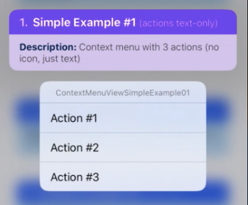

<br><br>

#### 4.1.2 `ContextMenuView` [Simple Example #2](https://github.com/dominicstop/react-native-ios-context-menu/blob/master/example/src/components/ContextMenuView/ContextMenuViewSimpleExample02.js)
A menu configured with 3 actions with "system" [SF Symbols](https://developer.apple.com/design/human-interface-guidelines/sf-symbols/overview/) icons.
* A `MenuConfig` or `MenuAction` object has an optional `icon` property. 
* To show an icon in the context menu, a [`icon`](#333-iconconfig-object) object must have a `iconType` property and a `iconValue` property.
* This example is demoed in this [gif](https://github.com/dominicstop/react-native-ios-context-menu/blob/master/assets/context-menu-view-gifs/ContextMenuView-SimpleExample-1-2-3-4.gif).

<br>

```jsx
<ContextMenuView
  menuConfig={{
    menuTitle: 'ContextMenuViewSimpleExample02',
    menuItems: [{
      // a menu action config item (i.e. a `MenuAction` object)
      actionKey  : 'key-01'   ,
      actionTitle: 'Action #1',
	   // a `IconConfig` object
      icon: {
        iconType : 'SYSTEM', // indicates that we want to use SF Symbols
        iconValue: 'folder', // the icon string of the SF Symbols icon
      }
    }, {
      // another `MenuAction` object item
      actionKey  : 'key-02'   ,
      actionTitle: 'Action #2',
      // another `IconConfig` object
      icon: {
        iconType : 'SYSTEM'   , // don't forget to add this property/key
        iconValue: 'dial.fill', // a SF symbol can have other variants
      }
    }, {
      // and another `MenuAction` object item
      actionKey  : 'key-03'   ,
      actionTitle: 'Action #3',
      // alternatively, as a shorthand, you can directly define `iconType`
      // and `iconValue` in a `MenuConfig` object
      iconType   : 'SYSTEM'         , // <- set `iconType` to "SYSTEM"
      iconValue  : 'archivebox.fill', // <- provide a SF Symbols icon string
    }],
  }}
/>
```

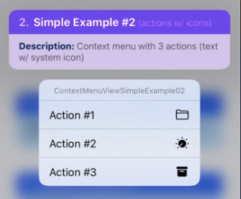

<br><br>

#### 4.1.3 `ContextMenuView` [Simple Example #3](https://github.com/dominicstop/react-native-ios-context-menu/blob/master/example/src/components/ContextMenuView/ContextMenuViewSimpleExample03.js)
A context menu  configured with 1 action, and a submenu (with 3 submenu actions)
* A  `MenuConfig` object has a property called `menuItems`. This property accepts an array of objects. Those objects can either be a  `MenuAction` item or another `MenuConfig` item.
* If you pass a `MenuConfig` object to `menuItems`, it will make a submenu. 
* This example is demoed in this [gif](https://github.com/dominicstop/react-native-ios-context-menu/blob/master/assets/context-menu-view-gifs/ContextMenuView-SimpleExample-1-2-3-4.gif).

<br>

```js
<ContextMenuView
  // `menuConfig` prop accepts a `MenuConfig` object
  menuConfig={{
    menuTitle: 'pContextMenuViewSimpleExample03', // title of our menu
    // a `MenuConfig` object has a `menuItems` property
    // it accepts an array of either a `MenuConfig` or `MenuAction` object
    // this property contains the items we want to show in our menu
    menuItems: [{
      // a menu action config item, i.e. a `MenuAction` object
      actionKey  : 'key-01',
      actionTitle: 'Action #1',
      icon: {
        iconType : 'SYSTEM',
        iconValue: 'folder',
      }
    }, {
      // If you want to show a submenu, just add a `MenuConfig` object.
      // The `menuItems` property can accept an array of `MenuAction`
      // or `MenuConfig` objects. If we pass a `MenuConfig` object, then
      // it means that we want to show another menu (i.e. a submenu)
      menuTitle: 'Submenu...', // <- the title of submenu
      // Since this is a `MenuConfig` object, it also has a `menuItems`
      // property. If you want another submenu, just pass another `MenuConfig`
      // object. You can have as many as you like.
      menuItems: [{
        // a menu action config item - `MenuAction` object
        actionKey  : 'key-01-01',
        actionTitle: 'Submenu Action #1',
        icon: {
          iconType : 'SYSTEM',
          iconValue: 'star',
        }
      }, {
        // another `MenuAction` object item
        actionKey  : 'key-01-02',
        actionTitle: 'Submenu Action #2',
        icon: {
          iconType : 'SYSTEM',
          iconValue: 'star.lefthalf.fill',
        }
      }, {
        // and another `MenuAction` object item
        actionKey  : 'key-01-03',
        actionTitle: 'Submenu Action #3',
        icon: {
          iconType : 'SYSTEM',
          iconValue: 'star.fill',
        }
      }]
    }],
  }}
/>
```

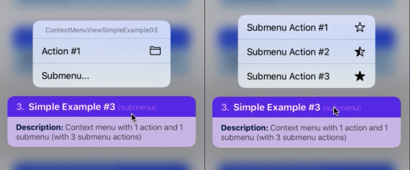

<br><br>

#### 4.1.4 `ContextMenuView` [Simple Example #4](https://github.com/dominicstop/react-native-ios-context-menu/blob/master/example/src/components/ContextMenuView/ContextMenuViewSimpleExample04.js)
A example context menu with a "*disabled*" action, a "*destructive*" action, a "*hidden*" action (which is not visible in the context menu), and a "*disabled + destructive*" action.
* A  `MenuAction` object can have an optional `menuAttributes` property. The `menuAttributes` property accepts an array of strings (i.e a `MenuAtrributes` item).
* This example is demoed in this [gif](https://github.com/dominicstop/react-native-ios-context-menu/blob/master/assets/context-menu-view-gifs/ContextMenuView-SimpleExample-1-2-3-4.gif).

<br>

```jsx
<ContextMenuView
  menuConfig={{
    menuTitle: 'ContextMenuViewSimpleExample04',
    menuItems: [{
      // a menu action config item (i.e. a `MenuAction` object)
      // but we set an optional property called `menuAttributes`.
      // we set the `menuAttributes` to `disabled` which will prevent
      // this menu action item from being selected/pressed
      actionKey     : 'key-01',
      actionTitle   : 'Disabled Action',
      menuAttributes: ['disabled'] // <- disable this menu action
      icon: {
        iconType : 'SYSTEM',
        iconValue: 'folder',
      }
    }, {
      // another `MenuAction` object item
      // but this time we make the action "destructive"
      // will tint the menu action item's text/icon bright red
      actionKey     : 'key-02'   ,
      actionTitle   : 'Destructive Action',
      menuAttributes: ['destructive'] // <- make menu action "destructive"
      icon: {
        iconType : 'SYSTEM',
        iconValue: 'trash',
      }
    }, {
      // and another `MenuAction` object item,
      // but this time we make the action "hidden"
      // will make the menu action item not appear in the menu
      actionKey     : 'key-03',
      actionTitle   : 'Hidden Action',
      menuAttributes: ['hidden'] // <- make menu action "hidden"
      icon: {
        iconType : 'SYSTEM',
        iconValue: 'trash',
      }
    }, {
      // and yet another `MenuAction` object item,
      // but this time we make the action both "hidden" and "disabled".
      // this looks the same as `menuAttributes: ['disabled']`
      actionKey     : 'key-04',
      actionTitle   : 'Disabled/Destructive',
      menuAttributes: ['disabled', 'destructive'] // <- set `menuAttributes`
      icon: {
        iconType : 'SYSTEM',
        iconValue: 'trash.fill',
      }
    }],
  }}
/>
```


<br><br>

#### 4.1.5 `ContextMenuView` [Simple Example #5](https://github.com/dominicstop/react-native-ios-context-menu/blob/master/example/src/components/ContextMenuView/ContextMenuViewSimpleExample05.js)
A context menu that has a "*displayInline*" submenu. This is the same as [Simple Example #3](https://github.com/dominicstop/react-native-ios-context-menu#413-contextmenuview-simple-example-3) but we set the `MenuConfig` object's optional `menuOptions` property to `["displayInline"]`. Visually, this creates a "section" in the parent menu (i.e it add top and bottom separators). This is great if you want to separate your menu actions.
* This example is demoed in this [gif](https://github.com/dominicstop/react-native-ios-context-menu/blob/master/assets/context-menu-view-gifs/ContextMenuView-SimpleExample-5-6-7-8.gif).

<br>

```jsx
<ContextMenuView
  // `menuConfig` prop accepts a `MenuConfig` object
  menuConfig={{
    menuTitle: 'ContextMenuViewSimpleExample05',
    menuItems: [{
      // a menu action config item (i.e. a `MenuAction` object)
      actionKey  : 'key-01',
      actionTitle: 'Action #1',
      icon: {
        iconType : 'SYSTEM',
        iconValue: 'folder',
      }
    }, {
      // a `MenuConfig` object, i.e. a submenu item,
      // but this time we make it an inline submenu.
      // A `MenuConfig` object has an optional `menuOptions` property.
      menuTitle: 'Submenu...',
      menuOptions: ['displayInline'], // <- set the `menuOptions` property
      menuItems: [{
        // a `MenuAction` object
        actionKey  : 'key-01-01',
        actionTitle: 'Submenu Action #1',
        icon: {
          iconType : 'SYSTEM',
          iconValue: 'star',
        }
      }, {
        // another `MenuAction` object
        actionKey  : 'key-01-02',
        actionTitle: 'Submenu Action #2',
        icon: {
          iconType : 'SYSTEM',
          iconValue: 'star.lefthalf.fill',
        }
      }, {
        // yet another `MenuAction` object
        actionKey  : 'key-01-03',
        actionTitle: 'Submenu Action #3',
        icon: {
          iconType : 'SYSTEM',
          iconValue: 'star.fill',
        }
      }]
    }]
  }}
/>
```


<br><br>

#### 4.1.6 `ContextMenuView` [Simple Example #6](https://github.com/dominicstop/react-native-ios-context-menu/blob/master/example/src/components/ContextMenuView/ContextMenuViewSimpleExample06.js)
A context menu that has a "*destructive*" submenu. This is the same as [Simple Example #3](#413-contextmenuview-simple-example-3) but we set the `MenuConfig` object's optional `menuOptions` property to `['destructive']`
* This example is demoed in this [gif](https://github.com/dominicstop/react-native-ios-context-menu/blob/master/assets/context-menu-view-gifs/ContextMenuView-SimpleExample-5-6-7-8.gif).

<br>

```jsx
<ContextMenuView
  menuConfig={{
    menuTitle: 'ContextMenuViewSimpleExample06',
    menuItems: [{
      // a `MenuAction` object
      actionKey  : 'key-01',
      actionTitle: 'Action #1',
      icon: {
        iconType : 'SYSTEM',
        iconValue: 'folder',
      }
    }, {
      // a `MenuConfig` object i.e a submenu
      menuTitle: 'Submenu...',
      menuOptions: ['destructive'], // <- set the `menuOptions` property
      menuItems: [{
        // a submenu action i.e `MenuAction` object
        actionKey  : 'key-01-01',
        actionTitle: 'Submenu Action #1',
        icon: {
          iconType : 'SYSTEM',
          iconValue: 'star',
        }
      }, {
        // another submenu `MenuAction` object
        actionKey  : 'key-01-02',
        actionTitle: 'Submenu Action #2',
        icon: {
          iconType : 'SYSTEM',
          iconValue: 'star.lefthalf.fill',
        }
      }, {
        // and another submenu `MenuAction` object
        actionKey  : 'key-01-03',
        actionTitle: 'Submenu Action #3',
        icon: {
          iconType : 'SYSTEM',
          iconValue: 'star.fill',
        }
      }]
    }],
  }}
/>
```


<br><br>

#### 4.1.7 `ContextMenuView` [Simple Example #7](https://github.com/dominicstop/react-native-ios-context-menu/blob/master/example/src/components/ContextMenuView/ContextMenuViewSimpleExample07.js)
A context menu that has a "*displayInline*" and "*destructive*" submenu. This is the same as [Simple Example #3](#413-contextmenuview-simple-example-3) but we set the `MenuConfig` object's optional `menuOptions` property to `['displayInline', 'destructive']`.
* **Note**: Visually, this looks the same as an "*displayInline*" submenu (i.e. [Example #5](#415-contextmenuview-simple-example-5)).
* This example is demoed in this [gif](https://github.com/dominicstop/react-native-ios-context-menu/blob/master/assets/context-menu-view-gifs/ContextMenuView-SimpleExample-5-6-7-8.gif).

<br>

```jsx
<ContextMenuView
  menuConfig={{
    menuTitle: 'ContextMenuViewSimpleExample07',
    menuItems: [{
      actionKey  : 'key-01',
      actionTitle: 'Action #1',
      icon: {
        iconType : 'SYSTEM',
        iconValue: 'folder',
      }
    }, {
      menuTitle: 'Submenu...',
	   // set the optional `menuOptions` property
      menuOptions: ['displayInline', 'destructive'], // <- set menu options
      menuItems: [{
        actionKey  : 'key-01-01',
        actionTitle: 'Submenu Action #1',
        icon: {
          iconType : 'SYSTEM',
          iconValue: 'star',
        }
      }, {
        actionKey  : 'key-01-02',
        actionTitle: 'Submenu Action #2',
        icon: {
          iconType : 'SYSTEM',
          iconValue: 'star.lefthalf.fill',
        }
      }, {
        actionKey  : 'key-01-03',
        actionTitle: 'Submenu Action #3',
        icon: {
          iconType : 'SYSTEM',
          iconValue: 'star.fill',
        }
      }]
    }],
  }}
/>
```


<br><br>

#### 4.1.8 `ContextMenuView` [Simple Example #8](https://github.com/dominicstop/react-native-ios-context-menu/blob/master/example/src/components/ContextMenuView/ContextMenuViewSimpleExample08.js)
A context menu with 3 actions that has "on", "off", and "mixed" `menuState`.
* A  `MenuAction` object can have an optional property called `menuState`.
* The `menuState` property accepts a string, i.e. a `MenuElementState` enum item: "*on*", "*off*" and "*mixed*".
* This example is demoed in this [gif](https://github.com/dominicstop/react-native-ios-context-menu/blob/master/assets/context-menu-view-gifs/ContextMenuView-SimpleExample-5-6-7-8.gif).

<br>

```jsx
<ContextMenuView
  menuConfig={{
    menuTitle: 'ContextMenuViewSimpleExample08',
    menuItems: [{
      // a menu action config item - `MenuAction` object
      // we set the optional `menuState` property to: "on"
      actionKey  : 'key-01',
      actionTitle: 'menuState: on',
      icon: {
        iconType : 'SYSTEM',
        iconValue: 'folder',
      }
      menuState  : 'on', // <- set the `menuState` property
    }, {
      // another `MenuAction` object
      // but this time we set the optional `menuState` property to: "off"
      actionKey  : 'key-02',
      actionTitle: 'menuState: off',
      menuState  : 'off', // <- set `menuState` property
      icon: {
        iconType : 'SYSTEM',
        iconValue: 'dial',
      }
    }, {
      // and another `MenuAction` object
      // but this time we set the optional `menuState` property to: "mixed"
      // note: visually, appears the same as `menuState: "on"`
      actionKey  : 'key-03',
      actionTitle: 'menuState: mixed',
      menuState  : 'mixed', // <- set `menuState` property
      icon: {
        iconType : 'SYSTEM',
        iconValue: 'archivebox',
      }
    }],
  }}
/>
```

<br>

**Left Image**: iOS 13, and **Right Image**: iOS 14
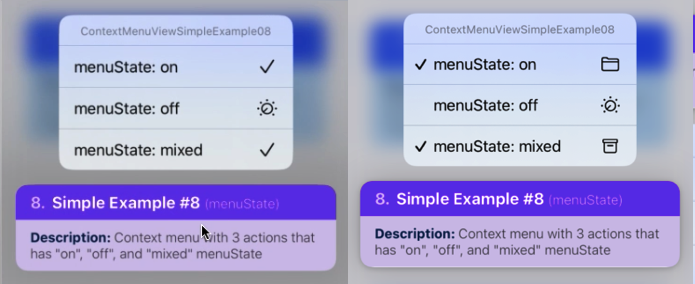

<br><br>

#### 4.1.9 `ContextMenuView` [Simple Example #9](https://github.com/dominicstop/react-native-ios-context-menu/blob/master/example/src/components/ContextMenuView/ContextMenuViewSimpleExample09.js)
A example context menu that uses the `ContextMenuView`'s `onPressMenuItem` and `onPressMenuPreview` event props.
* This example is demoed in this [gif](https://github.com/dominicstop/react-native-ios-context-menu/blob/master/assets/context-menu-view-gifs/ContextMenuView-SimpleExample-9-10.gif).

<br>

```jsx
<ContextMenuView
  onPressMenuItem={({nativeEvent}) => {
    switch (nativeEvent.actionKey) {
      case 'save':
        alert('saving...');
        break;

      case 'like':
        alert('liking...');
        break;

      case 'play':
        alert('playing...');
        break;
    };
  }}
  onPressMenuPreview={() => alert('onPressMenuPreview')}
  menuConfig={{
    menuTitle: 'ContextMenuViewSimpleExample09',
    menuItems: [{
      actionKey  : 'save',
      actionTitle: 'Save',
      icon: {
        iconType : 'SYSTEM',
        iconValue: 'square.and.arrow.down',
      }
    }, {
      actionKey  : 'like',
      actionTitle: 'Like',
      icon: {
        iconType : 'SYSTEM',
        iconValue: 'hand.thumbsup',
      }
    }, {
      actionKey  : 'play',
      actionTitle: 'Play',
      icon: {
        iconType : 'SYSTEM',
        iconValue: 'play',
      }
    }],
  }}
/>
```

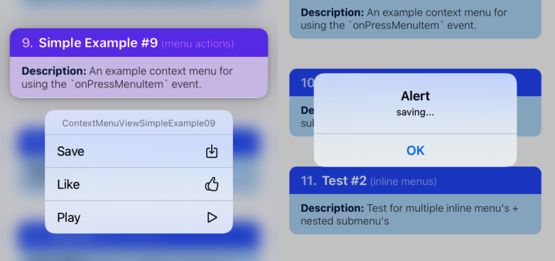

<br><br>

#### 4.1.10 `ContextMenuView` [Simple Example #10](https://github.com/dominicstop/react-native-ios-context-menu/blob/master/example/src/components/ContextMenuView/ContextMenuViewSimpleExample10.js)
On iOS 14 and above, you can update the menu while it's visible. You can update the menu by changing the `menuConfig` prop via state. This is a simple demo with a counter state incrementing every second when the menu is open.
* This example is demoed in this [gif](https://github.com/dominicstop/react-native-ios-context-menu/blob/master/assets/context-menu-view-gifs/ContextMenuView-SimpleExample-9-10.gif).

<br>

```jsx
function ContextMenuViewSimpleExample10(props) {
  const [timer, setTimer] = useState(0);
  const increment = useRef(null);

  const handleStart = () => {
    increment.current = setInterval(() => {
      setTimer((timer) => timer + 1);
    }, 1000);
  };

  const handleReset = () => {
    clearInterval(increment.current);
    setTimer(0);
  };

  return(
    <ContextMenuView
      onMenuDidShow={handleStart}
      onMenuDidHide={handleReset}
      menuConfig={{
        menuTitle: 'ContextMenuViewSimpleExample10',
        menuItems: [{
          actionKey  : 'key-00',
          actionTitle: `Static Action`,
          icon: {
            iconType : 'SYSTEM',
            iconValue: 'square.and.arrow.down',
          }
        }, {
          actionKey  : 'key-01',
          actionTitle: `timer: ${timer}`, // <- the action title should update
          icon: {
            iconType : 'SYSTEM',
            iconValue: ((timer % 2 == 0) // <- will show/hide
              ? 'heart'
              : 'heart.fill'
            ),
          }
        }, (timer % 3 == 0) && {
          actionKey  : 'key-02',
          actionTitle: `Dynamic Action`,
          icon: {
            iconType : 'SYSTEM',
            iconValue: 'scissors.badge.ellipsis',
          }
        }],
      }}
    />
  );
};
```

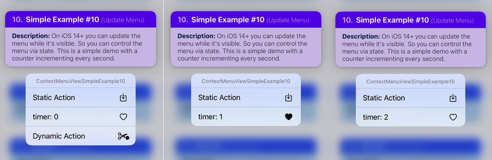

<br><br>

#### 4.1.11 `ContextMenuView` [Simple Example #11](https://github.com/dominicstop/react-native-ios-context-menu/blob/master/example/src/components/ContextMenuView/ContextMenuViewSimpleExample11.js)
A context menu configured to have a custom preview.
* To show a custom preview, we need to pass a `PreviewConfig` object to the `previewConfig` prop. You then set the optional `PreviewConfig.previewType` property to `CUSTOM`. Next, you then need to pass a "render" function in the `renderPreview` prop. 
	*  `PreviewConfig.previewType` property accepts a `PreviewType` value.
	* The `renderPreview` prop must return a react component.

* A `PreviewConfig` object has an optional property called `previewSize`. It accepts a string (a `PreviewSize` value). In this example we set it to `STRETCH` to fill the screen.
* The `PreviewConfig.backgroundColor` is set to `transparent` by default, so we set it to `white` in this example.
* **Note**: `UIContextMenu` will automatically resize/scale the preview to fit the screen.
* This example is demoed in this [gif](https://github.com/dominicstop/react-native-ios-context-menu/blob/master/assets/context-menu-view-gifs/ContextMenuView-SimpleExample-11-12-13-14.gif).

<br>

```jsx
function ContextMenuViewSimpleExample11(props) {
  return(
    <ContextMenuView
      previewConfig={{
        // To show a custom context menu preview set `previewType` to `CUSTOM`
        previewType: 'CUSTOM',
        // To take make the preview as big as possible, set `previewSize` to
        // STRETCH. By default, its set to `INHERIT`
        previewSize: 'STRETCH',
        // The preview is transparent by default, so let's set a bg color
        backgroundColor: 'white'
      }}
      renderPreview={() => (
        // Since we set `previewConfig.previewSize` to `STRETCH`, we need to
        // add `flex: 1` style to our preview so that it will fill the space
        <View style={{ flex: 1, alignItems: 'center', justifyContent: 'center' }}>
          <Text style={{fontSize: 32}}>
            Hello World
          </Text>
          <Text style={{fontSize: 32}}>
            Hello World
          </Text>
          <Text style={{fontSize: 32}}>
            Hello World
          </Text>
        </View>
      )}
      menuConfig={{
        // `menuItems` is optional if you have a custom preview
        menuTitle: 'ContextMenuViewSimpleExample11',
      }}
    />
  );
};
```

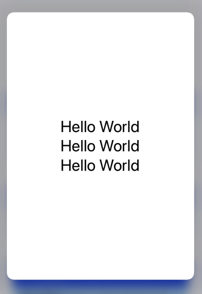

<br><br>

#### 4.1.12 `ContextMenuView` [Simple Example #12](https://github.com/dominicstop/react-native-ios-context-menu/blob/master/example/src/components/ContextMenuView/ContextMenuViewSimpleExample12.js)
Another context menu with custom preview example. This example shows a counter in the context menu preview that increments every half a second. The context menu is also configured with a menu action to add 100 to the counter, and an action to reset the counter.
* A `PreviewConfig` object has an optional property called `previewSize`. It accepts a string (a `PreviewSize` value).  The default value of `PreviewConfig.previewSize` is `INHERIT`, which means the size of the preview is the same as the view you returned in the `renderPreview` prop. So in this example, the size of the preview changes to fit the content.
* A `PreviewConfig` object has an optional `isResizeAnimated` boolean property, and its set to `true` by default. If you don't want the preview to animate whenever the size changes, set this property to `false`.
* This example is demoed in this [gif](https://github.com/dominicstop/react-native-ios-context-menu/blob/master/assets/context-menu-view-gifs/ContextMenuView-SimpleExample-11-12-13-14.gif).

<br>

```jsx
function ContextMenuViewSimpleExample12(props) {
  const [timer, setTimer] = useState(0);
  const increment = useRef(null);

  const handleStart = () => {
    increment.current = setInterval(() => {
      setTimer((timer) => timer + 1);
    }, 1000);
  };

  const handleStop = () => {
    clearInterval(increment.current);
  };

  const handleReset = () => {
    clearInterval(increment.current);
    setTimer(0);
  };

  return(
    <ContextMenuView
      // `ContextMenuView` Props
      previewConfig={{
        previewType: 'CUSTOM',
        backgroundColor: 'white'
      }}
      renderPreview={() => (
        <View style={{ padding: 20 }}>
          <Text style={{fontSize: 32}}>
            {`Counter: ${timer}`}
          </Text>
          <Text style={{fontSize: 32}}>
            {(timer % 2 == 0)? 'EVEN' : 'The number is: ODD'}
          </Text>
        </View>
      )}
      onMenuDidShow={() => handleStart()}
      onMenuDidHide={() => handleStop()}
      onPressMenuItem={({nativeEvent}) => {
        switch (nativeEvent.actionKey) {
          case 'add':
            setTimer((timer) => timer + 100);
            break;

          case 'reset':
            handleReset();
            break;
        };
      }}
      menuConfig={{
        menuTitle: 'ContextMenuViewSimpleExample12',
        menuItems: [{
          actionKey     : 'add',
          actionTitle   : `Add 100`,
          icon: {
            iconType : 'SYSTEM',
            iconValue: 'plus',
          }
        }, (timer > 0) && {
          actionKey     : 'reset',
          actionTitle   : `Reset Counter`,
          menuAttributes: ['destructive'],
          icon: {
            iconType : 'SYSTEM',
            iconValue: 'trash',
          }
        }],
      }}
    />
  );
};
```

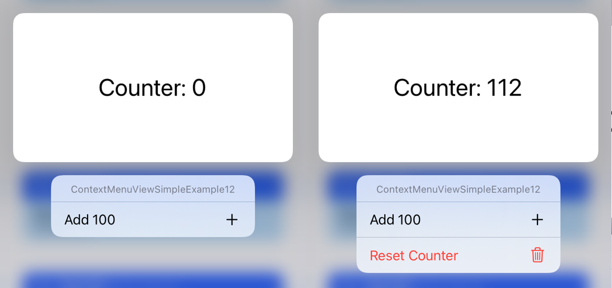

<br><br>

#### 4.1.13 `ContextMenuView` [Simple Example #13](https://github.com/dominicstop/react-native-ios-context-menu/blob/master/example/src/components/ContextMenuView/ContextMenuViewSimpleExample13.js)
A context menu configured with 3 menu actions with each having a `discoverabilityTitle` value. Visually, this will show 3 menu actions with subtitles below them.
* This example is demoed in this [gif](https://github.com/dominicstop/react-native-ios-context-menu/blob/master/assets/context-menu-view-gifs/ContextMenuView-SimpleExample-11-12-13-14.gif).

<br>

```jsx
<ContextMenuView
  menuConfig={{
    menuTitle: 'ContextMenuViewSimpleExample13',
    menuItems: [{
      actionKey  : 'key-01',
      actionTitle: 'Action #1',
      // set the optional `discoverabilityTitle` property to a string
      discoverabilityTitle: 'Action subtitle',
    }, {
      actionKey  : 'key-02'   ,
      actionTitle: 'Action #2',
      // if the string is long, it will be split into two lines
      discoverabilityTitle: 'Lorum ipsum sit amit dolor aspicing',
    }, {
      actionKey  : 'key-03'   ,
      actionTitle: 'Action #3',
      // and if the string is too long, it will be truncated...
      discoverabilityTitle: 'Very long `discoverabilityTitle` lorum ipsum sit amit',
    }],
  }}
/>
```

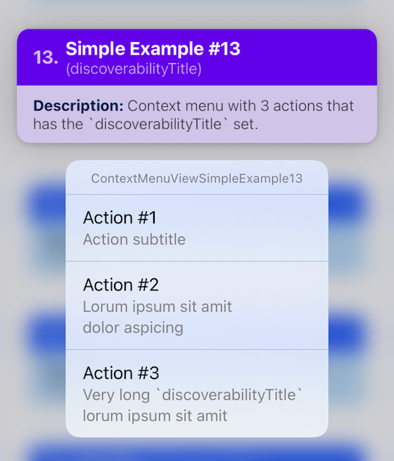

<br><br>

#### 4.1.14 `ContextMenuView` [Simple Example #14](https://github.com/dominicstop/react-native-ios-context-menu/blob/master/example/src/components/ContextMenuView/ContextMenuViewSimpleExample14.js)
A context menu configured to have a custom preview, and the optional  `PreviewConfig.preferredCommitStyle` property set to  `pop`. 
* The default value for `preferredCommitStyle` is `dismiss`, that's why when you tap the context menu preview, the preview will animate back to it's original position.
* If you set `preferredCommitStyle` to `pop`, when you tap the context menu preview, the preview will rapidly zoom in and fade out. This is great if you want to show something different when the preview is tapped.
* This example is demoed in this [gif](https://github.com/dominicstop/react-native-ios-context-menu/blob/master/assets/context-menu-view-gifs/ContextMenuView-SimpleExample-11-12-13-14.gif).

<br>

```jsx
function ContextMenuViewSimpleExample14(props) {
  return(
    <ContextMenuView
      previewConfig={{
        previewType: 'CUSTOM',
        previewSize: 'STRETCH',
        backgroundColor: 'rgba(255,255,255,0.75)',
        preferredCommitStyle: 'pop',
      }}
      renderPreview={() => (
        <View style={{ flex: 1, alignItems: 'center', justifyContent: 'center' }}>
          <Text style={{fontSize: 32}}>
            Hello World
          </Text>
          <Text style={{fontSize: 32}}>
            Hello World
          </Text>
          <Text style={{fontSize: 32}}>
            Hello World
          </Text>
        </View>
      )}
      menuConfig={{
        menuTitle: 'ContextMenuViewSimpleExample14',
      }}
    />
  );
};
```


<br><br>

#### 4.1.15 `ContextMenuView` [Simple Example #15](https://github.com/dominicstop/react-native-ios-context-menu/blob/master/example/src/components/ContextMenuView/ContextMenuViewSimpleExample15.js)
A example context menu configured with a "target view". The target view is the view where the context menu preview will transition in and out from. Essentially, instead of transitioning the entire `ContextMenuView`, you can specify a specific view.
* If you have a custom preview configured, then the "target view" will be used to transition your custom preview.
* If you don't have a custom preview configured (like this example), then the "target view" will become the context menu preview.
* The `previewConfig` prop accepts a `PreviewConfig` object. The `PreviewConfig` object has an optional property called `targetViewNode`. You can use this property to specify the "target view" you want to use.
	* The `targetViewNode` property accepts a number returned from the `findNodeHandle()` function. 
	* You can import the `findNodeHandle` function from the `react-native` package: `import { findNodeHandle } from 'react-native'`
* In order to specify a "target view" for your context menu, you first need a `ref` to that view. The second thing you need is a special value called a "node handle". 
	* A node handle is a number that corresponds to a specific native component instance in your app's view hierarchy.  In other words, native components (like `View`, `Text`, etc.) all have a corresponding node handle. You can use a node handle to uniquely refer to a specific native component. 
	* To get a native components's corresponding node handle, you can use the `findNodeHandle()` function. This functions accepts a ref to some native component (e.g. like a `<View>` component).
* This example is demoed in this [gif](https://github.com/dominicstop/react-native-ios-context-menu/blob/master/assets/context-menu-view-gifs/ContextMenuView-SimpleExample-15-16-17-18.gif).

<br>

```jsx
class ContextMenuViewSimpleExample15 extends React.PureComponent {
  constructor(props){
    super(props);

    this.state = {
      // store the node handle in state
      targetViewNode: null,
    };
  };

  componentDidMount(){
    this.setState({
      // once the comp. mounts, get the node handle of the target view node
      // and store it in state.
      targetViewNode: findNodeHandle(this.viewRef)
    });
  };

  render(){
    return(
      <ContextMenuView
        previewConfig={{
          // provide the node handle to your target view in the 
          // `previewConfig` prop.
          targetViewNode: this.state.targetViewNode,
        }}
        menuConfig={{
          menuTitle: 'ContextMenuViewSimpleExample15',
          menuItems: [{
            actionKey  : 'key-01',
            actionTitle: 'Action #1',
          }],
        }}
      >
        {/* save a ref to your target view */}
        <View ref={r => this.viewRef = r}>
          <Text style={styles.text}>
            {`Hello! Target Node: ${this.state.targetViewNode}`}
          </Text>
        </View>
      </ExampleContextMenuItem>
    );
  };
};
```

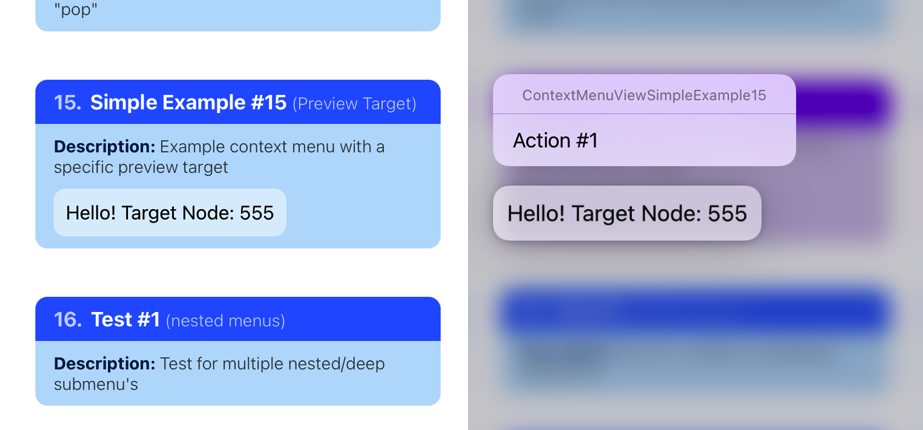

<br><br>

#### 4.1.16 `ContextMenuView` [Simple Example #16](https://github.com/dominicstop/react-native-ios-context-menu/blob/master/example/src/components/ContextMenuView/ContextMenuViewSimpleExample16.js)
A example context menu configured to have 3 menu actions. The first action has no icon, the second uses a `SYSTEM` SF Symbols icon, and the third uses a `ASSET` icon.
* If you are using an `ASSET` icon, then the string that you pass to the `iconValue` property must correspond to an image asset in your Xcode project's `xcasset` catalog.
* This example is demoed in this [gif](https://github.com/dominicstop/react-native-ios-context-menu/blob/master/assets/context-menu-view-gifs/ContextMenuView-SimpleExample-15-16-17-18.gif).

<br>

```jsx
<ContextMenuView
  menuConfig={{
    menuTitle: 'ContextMenuViewSimpleExample16',
    menuItems: [{
      actionKey  : 'key-01',
      actionTitle: 'Action #1',
      discoverabilityTitle: 'No Icon',
    }, {
      actionKey  : 'key-02'   ,
      actionTitle: 'Action #2',
      discoverabilityTitle: 'Use "SYSTEM" icon',
      icon: {
        iconType : 'SYSTEM',
        iconValue: 'dial.fill',
      }
    }, {
      actionKey  : 'key-03'   ,
      actionTitle: 'Action #3',
      discoverabilityTitle: 'Use "ASSET" icon',
      icon: {
        iconType : 'ASSET',
        iconValue: 'icon-rainbow-flag',
      }
    }],
  }}
/>
```


<br><br>

#### 4.1.17 `ContextMenuView` [Simple Example #17](https://github.com/dominicstop/react-native-ios-context-menu/blob/master/example/src/components/ContextMenuView/ContextMenuViewSimpleExample17.js)
A example context menu configured to have menu actions with custom colors. 
* A `MenuConfig` or `MenuAction` object has an optional `icon` property.  Aside from the`iconType` and `iconValue` properties, an `icon` object also has an optional `iconTint` property.
* The `IconConfig.iconTint` property accepts a color string. The color string can be an rgb, rgba, hex, or css color code format.
* This example is demoed in this [gif](https://github.com/dominicstop/react-native-ios-context-menu/blob/master/assets/context-menu-view-gifs/ContextMenuView-SimpleExample-15-16-17-18.gif).

<br>

```jsx
<ContextMenuView
  menuConfig={{
    menuTitle: 'ContextMenuViewSimpleExample17',
    menuItems: [{
      actionKey  : 'key-01',
      actionTitle: 'Action #1',
      discoverabilityTitle: 'Blue Icon',
      // a `IconConfig` object
      icon: {
        iconType : 'SYSTEM',
        iconValue: 'cloud.heavyrain.fill',
        iconTint : 'blue', // <- set the optional `iconTint` property
      },
    }, {
      actionKey  : 'key-02',
      actionTitle: 'Action #2',
      discoverabilityTitle: 'Orange Icon',
      // another `IconConfig` object
      icon: {
        iconType : 'SYSTEM',
        iconValue: 'exclamationmark.triangle.fill',
        iconTint : 'rgb(218,165,32)', // <- can be a css color/rgb/rgba...
      },
    }, {
      actionKey  : 'key-03',
      actionTitle: 'Action #3',
      discoverabilityTitle: 'Pink Icon',
      // and another `IconConfig` object
      icon: {
        iconType : 'SYSTEM',
        iconValue: 'heart.fill',
        iconTint : '#FF1493', // <- can be a hex/hex w/ alpha string
      },
    }, {
      actionKey  : 'key-04',
      actionTitle: 'Action #4',
      discoverabilityTitle: 'Green Icon',
      // and yet another `IconConfig` object
      icon: {
        iconType : 'SYSTEM',
        iconValue: 'bubble.right.fill',
        iconTint : 'rgba(124,252,0,0.5)', //  <- pass any valid color string
      },
    }]
  }}
/>
```


<br><br>

#### 4.1.18 `ContextMenuView` [Simple Example #18](https://github.com/dominicstop/react-native-ios-context-menu/blob/master/example/src/components/ContextMenuView/ContextMenuViewSimpleExample18.js)
A example context menu configured to have menu actions that uses a `REQUIRE` icon.
* Import the image component from react-native: `import { Image } from 'react-native';`
* The image component has a function called `Image.resolveAssetSource(souce)`. This function accepts a number returned from the `require()` function.
* In the `MenuConfig` or `MenuAction` object's optional `icon` property,  set the`IconConfig.iconType` property to `REQUIRE`, and then set the `IconConfig.iconValue` property to the object returned by the `Image.resolveAssetSource()` function.
* In other words, when we want to use a `REQUIRE` icon, i.e. an icon that is resolved via `require('directory/image.png')`, then the `iconValue` property accepts a `AssetSource` object. You can get an `AssetSource` object via the built-in`Image.resolveAssetSource` function.
* This example is demoed in this [gif](https://github.com/dominicstop/react-native-ios-context-menu/blob/master/assets/context-menu-view-gifs/ContextMenuView-SimpleExample-15-16-17-18.gif).

<br>

```jsx

const iconA = Image.resolveAssetSource(
  require('../../assets/emoji-pleading-face.png')
);

const iconB = Image.resolveAssetSource(
  require('../../assets/emoji-smiling-face-with-hearts.png')
);

const iconC = Image.resolveAssetSource(
  require('../../assets/emoji-sparkling-heart.png')
);

export function ContextMenuViewSimpleExample18(props) {
  return(
    <ContextMenuView
      menuConfig={{
        menuTitle: 'ContextMenuViewSimpleExample18',
        menuItems: [{
          actionKey  : 'key-01'   ,
          actionTitle: 'Action #1',
          discoverabilityTitle: 'Use "REQUIRE" icon',
          icon: {
            iconType : 'REQUIRE',
            iconValue: iconA,
          }
        }, {
          actionKey  : 'key-02'   ,
          actionTitle: 'Action #2',
          discoverabilityTitle: 'Use "REQUIRE" icon',
          icon: {
            iconType : 'REQUIRE',
            iconValue: iconB,
          }
        }, {
          actionKey  : 'key-03'   ,
          actionTitle: 'Action #3',
          discoverabilityTitle: 'Use "REQUIRE" icon',
          icon: {
            iconType : 'REQUIRE',
            iconValue: iconC,
          }
        }],
      }}
    />
  );
};
```

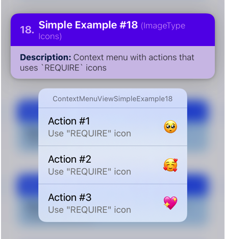

<br>

</details>

<br>


### 4.2 `ContextMenuButton` Examples
Most of the examples in the `ContextMenuView` section also applies here. The props in `ContextMenuView` (like the `menuConfig` and `useActionSheetFallback` props) as well as most of the events behave the same.

<details open>
  <summary>Show/Hide Section</summary>

<br>

#### 4.2.1 `ContextMenuButton` [Simple Example #1](https://github.com/dominicstop/react-native-ios-context-menu/blob/master/example/src/components/ContextMenuButton/ContextMenuButtonSimpleExample01.js)
A plain context menu button configured with 3 actions (no icons, just text). A long press on the `ContextMenuButton` component will show the context menu.

<br>

```jsx
<ContextMenuButton
  onPress={() => alert('TouchableOpacity - OnPress')}
  onPressMenuItem={({nativeEvent}) => {
    alert(`onPressMenuItem nativeEvent: ${JSON.stringify(nativeEvent)}`)
  }}
  menuConfig={{
    menuTitle: 'ContextMenuButtonSimpleExample01',
    menuItems: [{
      actionKey  : 'key-01',
      actionTitle: 'Action #1',
    }, {
      actionKey  : 'key-02'   ,
      actionTitle: 'Action #2',
    }, {
      actionKey  : 'key-03'   ,
      actionTitle: 'Action #3',
    }],
  }}
/>
```


<br><br>

#### 4.2.2 `ContextMenuButton` [Simple Example #2](https://github.com/dominicstop/react-native-ios-context-menu/blob/master/example/src/components/ContextMenuButton/ContextMenuButtonSimpleExample02.js)
A context menu button but we set the `isMenuPrimaryAction` prop to true. Instead of a long press, tapping on the `ContextMenuButton` component will now immediately show the context menu. 

<br>

```jsx
<ContextMenuButton
  onPressMenuItem={({nativeEvent}) => {
    alert(`onPressMenuItem nativeEvent: ${JSON.stringify(nativeEvent)}`);
  }}
  isMenuPrimaryAction={true} // <- set the prop to true
  menuConfig={{
    menuTitle: 'ContextMenuButtonSimpleExample02',
    menuItems: [{
      actionKey  : 'key-01' ,
      actionTitle: 'Action #1',
      icon: {
        iconType : 'SYSTEM',
        iconValue: 'folder',
      }
    }, {
      actionKey  : 'key-02'   ,
      actionTitle: 'Action #2',
      icon: {
        iconType : 'SYSTEM',
        iconValue: 'dial.fill',
      }
    }, {
      actionKey  : 'key-03'   ,
      actionTitle: 'Action #3',
      icon: {
        iconType : 'SYSTEM',
        iconValue: 'archivebox.fill',
      }
    }],
  }}
/>
```

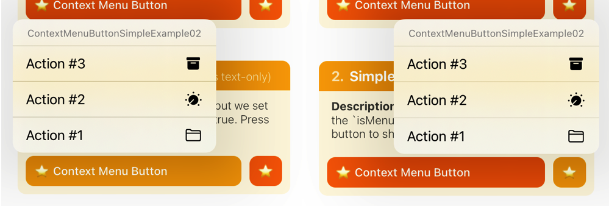

<br>

</details>

<br>

## License

MIT

<br>

## Links
* I'm [@DominicGo](https://twitter.com/GoDominic) on twitter if you have any questions ✨
* Other libraries: [react-native-ios-modal](https://github.com/dominicstop/react-native-ios-modal), [react-native-ios-popover](https://github.com/dominicstop/react-native-ios-popover#415-popoverview-example-5)
* This library was generated/made using [@react-native-community/bob](https://github.com/callstack/react-native-builder-bob)
