# react-native-ios-context-menu

A small component for using context menu's on iOS.


<br><br>

## 🚧⚠️ Notices ⚠️🚧

📝 **Hiatus Notice**: Unfortunately, i'm no longer doing OSS for the time being, so this library is in maintenance mode (if you're interested in sponsoring my work or picking up the project, please don't hesitate to [contact me](#misc-and-contact)).

<br>

📝 **Regarding Version `2.x`**: Hello, please note that versions `2.x` and below of this library are no longer supported; please do not submit an issue if the version you are using is below `3.x`. 

<br>

📝 **Regarding Documentation**: See [`TODO.md`](docs/TODO.md) for progress.
- The documentation is incomplete (some parts/sections are marked as **TBA** i.e. "to be added"). 
- Some of the links in the documentation are broken (i.e. the URL points to `PLACE_HOLDER_LINK`).
- Some of the gifs/images are old, or broken.
- For now, please see the [Usage And Examples](#e-usage-and-examples) section, and [Showcase, Tests and Demos](#F-Showcase-Tests-and-Demos) section for information on how to use this library.

<br><br>

| Notice                                                       |
| ------------------------------------------------------------ |
| 📝 **Note** #1: Version `3.x` is a rewrite of this library to support both fabric (the new architecture), and  offer backwards compatibility to paper (the old architecture).<br><br> Support for the new architecture (fabric), and backwards compatibility for the old architecture (paper) is handled via a peer via a peer dependency to [`react-native-ios-utilites@v5`](https://github.com/dominicstop/react-native-ios-utilities). |
| 📝 **Note** #2: The documentation + examples are currently being rewritten.<br><br>❤️ [`README-old-v1.md`](./README-old-v1.md) — Documentation for `v1.x`<br>🧡 [`README-old-v2.md`](./README-old-v2.md) — Documentation for `v2.x`<br>💛 [`example/src/examples`](./example/src/examples) — The typescript rewrite of the examples (WIP). |

 <br>

### Versions

<br>

| Library Version | Compatibility                                                |
| :-------------- | ------------------------------------------------------------ |
| `3.x`+          | Depends on `react-native-ios-utilities@5.x`<br/>Depends on `ContextMenuAuxiliaryPreview`<br/>iOS 13+<br/>Xcode 15+ |
| `2.1`           | Uses `Expo-Modules`<br/>Depends on `react-native-ios-utilities@4.x`<br/>Depends on `ContextMenuAuxiliaryPreview`<br>iOS 13+<br/>Xcode 15+ |
| `2.0.x`         | Uses `Expo-Modules`<br>Depends on `react-native-ios-utilities@4.x`<br>iOS 13+<br>Xcode 15+ |
| `1.6.2`         | iOS 10 to iOS 15<br>Xcode 12+                                |
| `1.4`           | iOS 10 to iOS 15<br>Xcode 13+                                |
| `1.3` and Below | iOS 10 to 14<br>Xcode 12+                                    |

<br><br>

## Table of Contents

| Sections and Links                                           |
| ------------------------------------------------------------ |
| [A. **Introduction**](#a-introduction)<br/><br/>• [Gifs and Demos](#gifs-and-demos)<br/>• [Features](#features) |
| [B. **Installation**](#b-installation)<br><br>• [Expo](#expo)<br/>• [Troubleshooting](#troubleshooting)<br>--• [Xcode Build Error (Swift)](#troubleshooting-xcode-build-error-(swift))<br>--• [Xcode Build Error (Undefined symbol)](#troubleshooting-xcode-build-error-(undefined-symbol)) |
| [C. **Basic Usage**](#c-basic-usage)                         |
| [D. **Documentation**](#d-documentation)<br/><br/>• [D.1. Components](#d1-components)<br/>--• [`ContextMenuView` Component](#contextmenuview-component)<br/>----• [Props](#contextmenuview-component-props)<br/>----• [Event Props](#contextmenuview-component-event-props)<br>----• [Properties/Methods](#contextmenuview-component-properties/methods)<br>----• [Experimental - Aux. Preview](#contextmenuview-component-experimental---auxiliary-preview)<br><br>--• [`ContextMenuButton` Component](#contextmenubutton-component)<br/>----• [Props](#contextmenubutton-component-props)<br/>----• [Event Props](#contextmenubutton-component-event-props)<br/>----• [Properties/Methods](#contextmenubutton-component-properties/methods)<br/><br/>• [D.2. Context](#d2-context)<br/>--• [`ContextMenuButtonContext`](#ContextMenuButtonContext-context)<br/>--• [`ContextMenuButtonContext`](#ContextMenuButtonContext-context)<br><br/>• [D.3. Hooks](#d3-hooks)<br/>--• [`useMenuContext`](#useMenuContext-hook)<br/>--• [`useMenuButtonContext`](#useMenuButtonContext-hook)<br><br>• [D.4. Objects and Types](#d4-objects-and-types)<br/>--• [`MenuConfig.ts`](#MenuConfigts)<br/>----• [Object Type: `MenuConfig`](#Object-Type-MenuConfig)<br/>----• [Object Type: `MenuActionConfig`](#Object-Type-MenuActionConfig)<br/>----• [Object Type: `DeferredMenuElementConfig`](#Object-Type-DeferredMenuElementConfig)<br/>----• [String Union: `MenuAttributes`](#String-Union-MenuAttributes)<br/>----• [String Union: `MenuState`](#String-Union-MenuState)<br/>----• [String Union: `UIMenuOptions`](#String-Union-UIMenuOptions)<br/><br>--• [`MenuPreviewConfig.ts`](#MenuPreviewConfigts)<br/>----• [Object Type: `MenuPreviewConfig`](#Object-Type-MenuPreviewConfig)<br/>----• [String Union: `ContextMenuInteractionCommitStyle`](#String-Union-ContextMenuInteractionCommitStyle)<br/>----• [String Union: `MenuPreviewSize`](#String-Union-MenuPreviewSize)<br/>----• [String Union: `MenuPreviewType`](#String-Union-MenuPreviewType)<br/><br>--• [`MenuAuxiliaryPreviewConfig.ts`](#MenuAuxiliaryPreviewConfigts)<br/>----• [Object Type: `MenuAuxiliaryPreviewConfig`](#Object-Type-MenuAuxiliaryPreviewConfig)<br/>----• [String Union Type: `MenuAuxiliaryPreviewAnchorPosition`](#String-Union-Type-MenuAuxiliaryPreviewAnchorPosition)<br/>----• [String Union Type: `MenuAuxiliaryPreviewHorizontalAlignment`](#String-Union-Type-MenuAuxiliaryPreviewHorizontalAlignment)<br/>----• [String Union Type: `UIViewAnimateOptions`](#String-Union-Type-UIViewAnimateOptions)<br/>----• [Object Type: `UIViewAnimateConfig`](#Object-Type-UIViewAnimateConfig)<br/>----• [Object Type: `MenuAuxiliaryPreviewBaseTransitionConfig`](#Object-Type-MenuAuxiliaryPreviewBaseTransitionConfig)<br/>----• [Object Union Type: `MenuAuxiliaryPreviewTransitionConfig`](#Object-Union-Type-`MenuAuxiliaryPreviewTransitionConfig`)<br/>----• [Mixed Union Type: `MenuAuxiliaryPreviewTransitionEntranceDelay`](#Mixed-Union-Type-MenuAuxiliaryPreviewTransitionEntranceDelay)<br/><br>--• [`MenuIconConfig.ts`](#MenuIconConfigts)<br/>--• [`ImageItemConfig.ts`](#ImageItemConfigts)<br/>----• [Object Type: `ImageItemConfig`](#Object-Type-ImageItemConfig)<br/>----• [Object Type: `ImageResolvedAssetSource`](#Object-Type-ImageResolvedAssetSource)<br/>----• [Object Type: `ImageRectConfig`](#Object-Type-ImageRectConfig)<br/>----• [Object Type: `ImageGradientConfig`](#Object-Type-ImageGradientConfig)<br/>----• [Object Type: `ImageSystemConfig`](#Object-Type-ImageSystemConfig)<br/><br>--• [Undocumented Types](#Undocumented-Types)<br><br>• [D.5. Constants](#d5-constants) |
| [E. **Usage And Examples**](#E-Usage-And-Examples)<br/>📝 **Note**: See [Example Index](#toc-examples-index) section for a complete list of examples + their descriptions. |
| [F. **Showcase, Tests and Demos**](#F-Showcase-Tests-and-Demos) |
| [G. **Meta**](#G-Meta)                                       |
| [H. **Licence**](#H-Licence)                                 |

<br>

### TOC: Examples Index

| Examples                                                     |
| ------------------------------------------------------------ |
| 📌 **[`ContextMenuView` Example 01](#ContextMenuView-Example-01)**<br/>💭 **Summary**:  A basic context menu that has 3 menu action items. |
| 📌 **[`ContextMenuView` Example 02](#ContextMenuView-Example-02)**<br/>💭 **Summary**: Icon Example — A basic context menu that has 3 menu action items, each with a different "SF Symbols" icon. This examples shows how to add a system icon in the context menu action. |
| 📌 **[`ContextMenuView` Example 03](#ContextMenuView-Example-03)**<br/>💭 **Summary**: Nested Menu — This example shows a context menu that has a submenu item inside its list of menu actions. |
| 📌 **[`ContextMenuView` Example 04](#ContextMenuView-Example-04)**<br/>💭 **Summary**: Menu Attributes — This example context menu showcases the `MenuActionConfig.menuAttributes` property. |
| 📌 **[`ContextMenuView` Example 05](#ContextMenuView-Example-05)**<br/>💭 **Summary**: Nested Menu + Menu Attributes — A context menu that has a in-line submenu. |
| 📌 **[`ContextMenuView` Example 06](#ContextMenuView-Example-06)**<br/>💭 **Summary**: Menu Options — A context menu that has a destructive submenu. |
| 📌 **[`ContextMenuView` Example 07](#ContextMenuView-Example-07)**<br/>💭 **Summary**: Menu Options — A context menu that set to be both "destructive" and "display in-line". |
| 📌 **[`ContextMenuView` Example 08](#ContextMenuView-Example-08)**<br/>💭 **Summary**: Menu State — A context menu with 3 actions that has `'on'`, `'off'`, and `'mixed'` `menuState`. |
| 📌 **[`ContextMenuView` Example 09](#ContextMenuView-Example-09)**<br/>💭 **Summary**: Events — An example for the `onPressMenuItem` event prop. |
| 📌 **[`ContextMenuView` Example 10](#ContextMenuView-Example-10)**<br/>💭 **Summary**: Dynamic Menu — An example showing how to dynamically update the context menu while it's visible. In this example, the menu action changes every time the counter increments every second. |
| 📌 **[`ContextMenuView` Example 11](#ContextMenuView-Example-11)**<br/>💭 **Summary**: Context Menu Previews — An example showing how to use a custom preview for the context menu. |
| 📌 **[`ContextMenuView` Example 12](#ContextMenuView-Example-12)**<br/>💭 **Summary**: Context Menu Previews — An example showing a custom context menu preview that dynamically changes its size due to its contents updating every second. |
| 📌 **[`ContextMenuView` Example 13](#ContextMenuView-Example-13)**<br/>💭 **Summary**: Menu Action — An example showing how to add a subtitle to menu action. |
| 📌 **[`ContextMenuView` Example 14](#ContextMenuView-Example-14)**<br/>💭 **Summary**: Context Menu Previews — An example that changes the exit transition of the context menu preview when its tapped using the `preferredCommitStyle ` config. |
| 📌 **[`ContextMenuView` Example 15](#ContextMenuView-Example-15)**<br/>💭 **Summary**: Context Menu Previews — An example showing how to configure a context menu that uses targeted previews. |
| 📌 **[`ContextMenuView` Example 15-02](#ContextMenuView-Example-15-02)**<br/>💭 **Summary**: Context Menu Previews (Cont). — An example showing how to configure a context menu that uses targeted previews + `WrapperView`. |
| 📌 **[`ContextMenuView` Example 16](#ContextMenuView-Example-16)**<br/>💭 **Summary**: Icon Example — An example showing a context menu with an action that uses a `'IMAGE_ASSET'` image for its icon. |
| 📌 **[`ContextMenuView` Example 17](#ContextMenuView-Example-17)**<br/>💭 **Summary**: Icon Example — An example showing a context menu with action items that have different colored icons. |
| 📌 **[`ContextMenuView` Example 18](#ContextMenuView-Example-18)**<br/>💭 **Summary**: Icon Example — An example showing a context menu with action items that has icons that uses local image assets imported via `require(...)`. |
| 📌 **[`ContextMenuView` Example 19](#ContextMenuView-Example-19)**<br/>💭 **Summary**: Dynamic Menu — An example showing a context menu that has a loading indicator using deferred menu elements. |
| 📌 **[`ContextMenuView` Example 20](#ContextMenuView-Example-20)**<br/>💭 **Summary**: Dynamic Menu — An example showing a state-controlled context menu that shows a loading indicator using deferred menu elements. |
| 📌 **[`ContextMenuView` Example 21](#ContextMenuView-Example-21)**<br/>💭 **Summary**: Menu Element Size — TBA |
| 📌 **[`ContextMenuView` Example 22](#ContextMenuView-Example-22)**<br/>💭 **Summary**: Menu Element Size — TBA |
| 📌 **[`ContextMenuView` Example 23](#ContextMenuView-Example-23)**<br/>💭 **Summary**: Menu Element Size — TBA |
| 📌 **[`ContextMenuView` Example 24](#ContextMenuView-Example-24)**<br/>💭 **Summary**: Menu Attributes — `keepsMenuPresented` |
| 📌 **[`ContextMenuView` Example 25](#ContextMenuView-Example-25)**<br/>💭 **Summary**: Icon Example — Advanced customization (E.g. `scale`, `weight`, `paletteColors`, `hierarchicalColor`). |
| 📌 **[`ContextMenuView` Example 26](#ContextMenuView-Example-26)**<br/>💭 **Summary**: Icon Example — Network/Remote images as icons. |
| 📌 **[`ContextMenuView` Example 27](#ContextMenuView-Example-27)**<br/>💭 **Summary**: Icon Example — Network/Remote images as icons + fallback image. |
| 📌 **[`ContextMenuView` Example 28](#ContextMenuView-Example-28)**<br/>💭 **Summary**: Programmatically shows the context menu. |
| 📌 **[`ContextMenuView` Auxiliary Preview - Example 01](#ContextMenuView-Auxiliary-Preview---Example-01)**<br/>💭 **Summary**: TBA |
| 📌 **[`ContextMenuView` Auxiliary Preview - Example 02](#ContextMenuView-Auxiliary-Preview---Example-02)**<br/>💭 **Summary**: TBA |
| 📌 **[`ContextMenuView` Auxiliary Preview - Example 03](#ContextMenuView-Auxiliary-Preview---Example-03)**<br/>💭 **Summary**: TBA |
| 📌 **[`ContextMenuView` Auxiliary Preview - Example 04](#ContextMenuView-Auxiliary-Preview---Example-04)**<br/>💭 **Summary**: TBA |
| 📌 **[`ContextMenuView` Auxiliary Preview - Example 05](#ContextMenuView-Auxiliary-Preview---Example-05)**<br/>💭 **Summary**: TBA |
| 📌 **[`ContextMenuView` Auxiliary Preview - Example 06](#ContextMenuView-Auxiliary-Preview---Example-06)**<br/>💭 **Summary**: TBA |
| 📌 **[`ContextMenuView` Auxiliary Preview - Example 07](#ContextMenuView-Auxiliary-Preview---Example-07)**<br/>💭 **Summary**: TBA |
| 📌 **[`ContextMenuView` Auxiliary Preview - Example 08](#ContextMenuView-Auxiliary-Preview---Example-08)**<br/>💭 **Summary**: TBA |
| 📌 **[`ContextMenuView` Auxiliary Preview - Example 09](#ContextMenuView-Auxiliary-Preview---Example-09)**<br/>💭 **Summary**: TBA |
| 📌 **[`ContextMenuView` Auxiliary Preview - Example 10](#ContextMenuView-Auxiliary-Preview---Example-10)**<br/>💭 **Summary**: TBA |
| 📌 **[`ContextMenuView` Auxiliary Preview - Example 11](#ContextMenuView-Auxiliary-Preview---Example-11)**<br/>💭 **Summary**: TBA |
| 📌 **[`ContextMenuView` Auxiliary Preview - Example 12](#ContextMenuView-Auxiliary-Preview---Example-12)**<br/>💭 **Summary**: TBA |
| 📌 **[`ContextMenuView` Auxiliary Preview - Example 13](#ContextMenuView-Auxiliary-Preview---Example-13)**<br/>💭 **Summary**: TBA |
| 📌 **[`ContextMenuView` Auxiliary Preview - Example 14](#ContextMenuView-Auxiliary-Preview---Example-14)**<br/>💭 **Summary**: TBA |
| 📌 **[`ContextMenuView` Auxiliary Preview - Example 15](#ContextMenuView-Auxiliary-Preview---Example-15)**<br/>💭 **Summary**: TBA |
| 📌 **[`ContextMenuView` Auxiliary Preview - Example 16](#ContextMenuView-Auxiliary-Preview---Example-16)**<br/>💭 **Summary**: Programmatically shows the auxiliary preview as a popover (w/o showing the context menu). |
| 📌 **[`ContextMenuButton` Example 01](#ContextMenuButton-Example-01)**<br/>💭 **Summary**: TBA |
| 📌 **[`ContextMenuButton` Example 02](#ContextMenuButton-Example-02)**<br/>💭 **Summary**: TBA |

<br><br>

### Acknowledgements

Development and maintenance of this library was generously sponsored by [beatgig](https://beatgig.com/) from `11/15/2023` to ` 04/30/2024` at `$1,535`/month (totaling ≈ `$9,100` over the course of 6 months) 🥁🎸

<br>

The initial fabric rewrite (i.e. version `3.x`) was made possible through a generous `$3,750` sponsorship by [natew](https://github.com/natew) + [tamagui](https://github.com/tamagui/tamagui) over the course of 4 months (from: `05/27/24` to `09/30/24`) 🐦✨

<br>

very special thanks to: [junzhengca](https://github.com/junzhengca), [brentvatne](https://github.com/brentvatne), [expo](https://github.com/expo), [EvanBacon](https://github.com/EvanBacon), [corasan](https://github.com/corasan), [lauridskern](https://github.com/lauridskern), [ronintechnologies](https://github.com/ronintechnologies), and [gerzonc](https://github.com/gerzonc) for becoming a monthly sponsor, and thank you [fobos531](https://github.com/fobos531) for being a one time sponsor 🥺 (if you have the means to do so, please considering sponsoring [here](https://github.com/sponsors/dominicstop))

<br><br>

## A. Introduction

A react native component to use [`UIMenu`](https://developer.apple.com/documentation/uikit/uimenu) on iOS 13 and later.

<br>

### Gifs and Demos

📝 **Note**: These gifs are from an older version of the library running on iOS 13 (see [Usage And Examples](#e-usage-and-examples) section for updated example gifs).<br>

`ContextMenuView` Examples, **Left**: [Example 1](#ContextMenuView-Example-01), [Example 2](#ContextMenuView-Example-02), and **Right**: [Example 3](#ContextMenuView-Example-03), [Example 4](#ContextMenuView-Example-04)


`ContextMenuView` examples, **Left**: [Example 5](#ContextMenuView-Example-05), [Example 6](#ContextMenuView-Example-06), and **Right**: [Example 7](#ContextMenuView-Example-07), [Example 8](#ContextMenuView-Example-08)


`ContextMenuView` example, **Left**: [Example 9](#ContextMenuView-Example-09), and **Right**: [Example 10](#ContextMenuView-Example-10)


`ContextMenuView` examples, **Left**: [Example 11](#ContextMenuView-Example-11), [Example 12](#ContextMenuView-Example-12), and **Right**: [Example 13](#ContextMenuView-Example-13), [	Example 14](#ContextMenuView-Example-14)


`ContextMenuView` examples, **Left**: [Example 15](#ContextMenuView-Example-15), [Example 16](#ContextMenuView-Example-16), and **Right**: [Example 17](#ContextMenuView-Example-17), [Example 18](#ContextMenuView-Example-18)


`ContextMenuView` tests, **Left**: [Test 1](PLACE_HOLDER_LINK), and **Right**: [Test 2](PLACE_HOLDER_LINK)


`ContextMenuView` tests, **Left**: [Test 3](PLACE_HOLDER_LINK), and **Right**: [Test 4](PLACE_HOLDER_LINK)


`ContextMenuView` tests, **Left**: [Test 5](PLACE_HOLDER_LINK), and **Right**: [Test 6](PLACE_HOLDER_LINK)


`ContextMenuView` tests, **Left/Right:** [Test 7](PLACE_HOLDER_LINK)


`ContextMenuView` `ActionSheetIOS` fallback for simple example 1 to 9


`ContextMenuView` `ActionSheetIOS` fallback for context menu view test 1 to 6 (removed in `v3.x`+).


`ContextMenuButton` examples, **Left**: [Example 1](#ContextMenuButton-Example-01), and **Right**: [Example 2](#ContextMenuButton-Example-02)


<br>

### Features

* Support for creating menu actions and submenus (i.e. nested and in-line menus).
* Support for customizing the menu icons (i.e. support for SF Symbols, `require(image)`, and `xcasset` icons, icon tint, etc).
* Extensive support for SF Symbols configuration (e.g. `pointSize`, `weight`, `scale`, `hierarchicalColor`, `paletteColors`).
* Support for iOS 14 functionality (like the `UIButton` context menu, dynamically updating the menu while it's visible, etc).
* Support for setting (almost) all of the native [`UIMenu`](https://developer.apple.com/documentation/uikit/uimenu) and [`UIAction`](https://developer.apple.com/documentation/uikit/uiaction) properties (e.g. `UIMenuElementState`,  `MenuElementAtrributes`, `discoverabilityTitle`, etc.)
* Basic `ActionSheetIOS` menu fallback for iOS 12 and below (removed in `v3.x`+).
* Support for creating custom context menu previews (with support for dynamic or fixed preview sizes, setting the [`UIPreviewParameters`](https://developer.apple.com/documentation/uikit/uipreviewparameters), specifying a [`UITargetedPreview`](https://developer.apple.com/documentation/uikit/uitargetedpreview), etc).
* Support for custom auxiliary previews (experimental).
* Support for deferred context menu items.

<br><br>

## B. Installation

```sh
# 1. install library + dependencies
npm install react-native-ios-utilities@next
npm install react-native-ios-context-menu@next

# 2. then run pod install (uses auto-linking)
cd ios && pod install
```

<br>

📝 **Note A**: You might encounter some build errors since this library is written in swift, so there's some extra step involved to use this library (see table below for reference).

<br>📝 **Note B**: If you want to use an older or different version of this library, please refer to [versions section](#versions)'s compatibility table.

| Additional Steps                                             |
| :----------------------------------------------------------- |
| 1️⃣ [Add an empty swift file to your project](#troubleshooting-xcode-build-error-swift) |
| 2️⃣ [Update the project's "Library Search Paths" build settings](#troubleshooting-xcode-build-error-undefined-symbol) |

<br>

### Updating

This library has cocoapods dependency to [`ContextMenuAuxiliaryPreview`](https://github.com/dominicstop/ContextMenuAuxiliaryPreview) and [`DGSwiftUtilities`](https://github.com/dominicstop/DGSwiftUtilities), so you may need to update them separately (as needed).

```sh
# A. Either update this specific pod...
pod update ContextMenuAuxiliaryPreview DGSwiftUtilities
pod install --repo-update

# B. Or update all the pods
pod update
```

<br>

### Expo

- ✅ You can use this library with [Development Builds](https://docs.expo.dev/development/introduction/). No config plugin is required.
- ❌ This library can't be used in the "Expo Go" app because it [requires custom native code](https://docs.expo.dev/workflow/customizing/).

<br>

###  Versions and Dependencies

| Library Version | Dependencies + Versions                                      |
| --------------- | ------------------------------------------------------------ |
| `2.0.x`         | `react-native-ios-utilities` - `4.x`                         |
| `2.1.x`         | `react-native-ios-utilities` - `4.x`<br>`ContextMenuAuxiliaryPreview` - `0.1.x` |
| `2.2.x`         | `react-native-ios-utilities` - `4.x`<br/>`ContextMenuAuxiliaryPreview` - `0.2.x` |

<br>

### Troubleshooting

If you encounter any errors/bugs while using this library, or want a particular feature implemented, please create an issue (my inbox is a mess, please feel free to tag me). ✨

<br>

#### Troubleshooting: Xcode Build Error (Swift)

📝 **Note**: This library is written in swift. If you are having trouble building your app after installing this library, try adding an empty swift file to your project:

1. Open up your `ios/project.xcworkspace` project
2. On the project navigator panel (located on the right side of Xcode), right click on your project group (or another folder/group i.e the blue or yellow icons) and select the "*New File...*" option
3. In the popup sheet, select "Swift" as the template and then click the "*Next*" button
4. A "*Save As*" popup sheet should appear and then click "*Create*" (you can rename the file first if you want to)
5. If Xcode asks you to create a "*Objective-C Bridging Header*" choose *"Create Objective-C Bridging Header"*

<br>

#### Troubleshooting: Xcode Build Error (Undefined symbol)

When installing this library on Xcode 12+, you'll get the following error in Xcode:

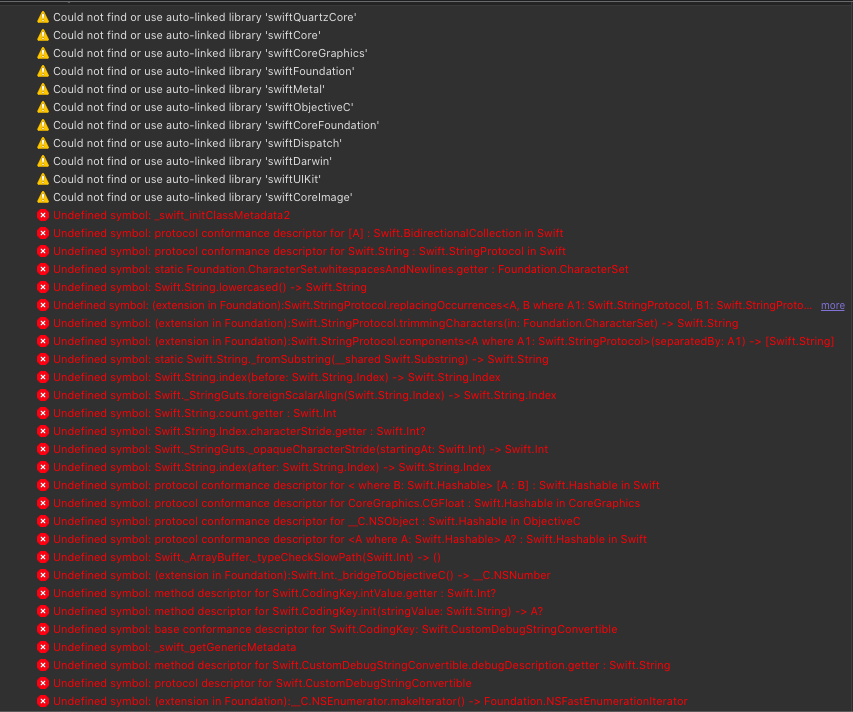

```
Undefined symbol: (extension in UIKit):
__C.UIMenu.init(title: Swift.String, image: __C.UIImage?, identifier: __C.UIMenuIdentifier?, options: __C.UIMenuOptions, children: [__C.UIMenuElement]) -> __C.UIMenu

Undefined symbol: (extension in UIKit):
__C.UIAction.init(title: Swift.String, image: __C.UIImage?, identifier: __C.UIActionIdentifier?, discoverabilityTitle: Swift.String?, attributes: __C.UIMenuElementAttributes, state: __C.UIMenuElementState, handler: (__C.UIAction) -> ()) -> __C.UIAction
```

<br>

To fix this, see screenshot + follow the steps below:


<br>

1. Open your `ios/project.xcworkspace` project.
2. In the project navigator panel (located on the right side of Xcode), select your project group (i.e. the item with the blueprint icon).
3. The Xcode project editor should appear. In the left panel, under the "Project" section, select your project (if it isn't already selected).
4. In the project section's top tab bar, select the "Build Settings" tab (also make sure the "All" and "Combined" tabs are selected).
5. In the project navigator list, under the "Search Path" section, there should be a "Library Search Paths" setting (alternatively, you can search for "Library Search Paths" in the search bar).
6.  According to this [issue comment](https://github.com/facebook/react-native/issues/29246#issuecomment-667518920), you can clear all the items listed in the "Library Search Paths" setting by selecting the items in the list, and pressing the "-" button in the popover. 
	* **TLDR**: Xcode automatically manages this setting, and the RN template hardcodes it to use Swift 5.0.
	* Alternatively, you can change the entry `"$(TOOLCHAIN_DIR)/usr/lib/swift-5.0/$(PLATFORM_NAME)"` to `"$(TOOLCHAIN_DIR)/usr/lib/swift-5.3/$(PLATFORM_NAME)"` i.e. change `swift-5.0` to `swift-5.3`, or whatever the newest version of swift that comes with your Xcode installation (to show the popup dialog, double click the value/item).
7. If you haven't already, make sure to create an empty swift file. Then clean the build folder (the option is in the menu bar under: "Product" -> "Clean Build Folder") and try building your project again.
8. If you are still having problems building the app, try the following and build your project again:
  * Try clearing out Xcode's `derivedData` directory: `rm -rf ~/Library/Developer/Xcode/DerivedData/*` (check out this [gist](https://gist.github.com/maciekish/66b6deaa7bc979d0a16c50784e16d697) for instructions on how to clean up Xcode)
  * Try clearing out the `Cocoapods` cache: `rm -rf "${HOME}/Library/Caches/CocoaPods"` (and then try running `pod install` again).

<br>

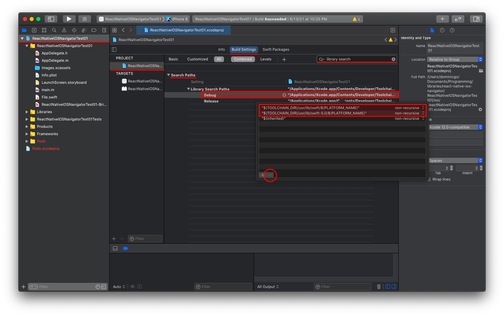

<br>

**Explanation**: Some versions of the react-native template hard codes the swift library search paths to use swift `5.0` (which causes the linker to mismatch the swift system libraries bundled with your Xcode + iOS/Simulator installation).

Here are some related issues in the RN repo: [Issue 30202](https://github.com/facebook/react-native/pull/30202) and [Issue 29178](https://github.com/facebook/react-native/pull/29178). 

<br><br>

## C. Basic Usage

For more examples, check out the [Usage And Examples](#e-usage-and-examples) section.

<br>

[🔗 Full Example](example/src/examples/BasicUsageExample01.tsx)

```jsx
import * as React from 'react';
import { StyleSheet, Text } from 'react-native';

import { ContextMenuView } from 'react-native-ios-context-menu';

export function BasicUsageExample01() {
  return (
    <ContextMenuView
      style={styles.container}
      menuConfig={{
        menuTitle: 'BasicUsageExample01',
        menuItems: [{
          actionKey  : 'key-01',
          actionTitle: 'Action #1',
        }, {
          actionKey  : 'key-02'   ,
          actionTitle: 'Action #2',
        }, {
          actionKey  : 'key-03'   ,
          actionTitle: 'Action #3',
        }],
      }}
    >
      <Text style={styles.text}>
        Press And Hold To Show Context Menu
      </Text>
    </ContextMenuView>
  );
};

const styles = StyleSheet.create({
  container: {
    margin: 10,
    padding: 10,
  },
  text: {
    fontSize: 16,
  },
});
```

<br><br>

## D. Documentation

💡 **Tip**: Most of the time, when a type or component is mentioned, you can click it to jump to that item in the README (or its declaration in the source code).

<br>

### D.1. Components

#### `ContextMenuView` Component

##### `ContextMenuView` Component: Props

| Prop Name and Type                                           | Description                                                  |
| :----------------------------------------------------------- | :----------------------------------------------------------- |
| ⚛️ `ViewProps`                                                | This component supports all the standard props from a `<View/>` component. |
| 🔤  `menuConfig`<br/><br/>⚛️ [`MenuConfig`](PLACE_HOLDER_LINK) | This prop configures the context menu, along with what menu actions to show.<br><br>This prop accepts a `MenuConfig` object. This object is used to configure various aspects of the context menu. Here are some relevant properties:<br><br>1️⃣  `MenuConfig.menuTitle`: the context menu title (required) — if you don't want to show the menu title, pass in an empty string.<br><br/>2️⃣  `MenuConfig.menuItems`: the actions to show (e.g. the title, icons, subtitle, etc) — accepts either an array of `MenuActionConfig` or `MenuConfig` objects.<br><br/>3️⃣  `MenuConfig.menuOptions`: the attributes of the context menu (e.g. destructive) — accepts an array of  `UIMenuOptions` string items, and any nested menus or submenus to show (see "**Note A**"). <br><br>📝 **Note A**: Passing a `MenuConfig` object inside of the `MenuConfig.menuItems` property will result in a nested context menu (i.e. a submenu).<br><br>In this scenario, the `MenuConfig.menuOptions` and `MenuConfig.icon` can be used to configure the appearance of the submenu.<br><br>For usage examples regarding nested menus, see [Example 06](contextmenuview-example06).<br><br>📝 **Note B**: Passing a value of `null` (or `undefined`) to this prop will not disable the context menu. Instead, please use the `isContextMenuEnabled` prop to disable the context menu. <br><br/>📝 **Note C**: You can put `MenuConfig` in state if you want to dynamically change the menu configuration (this will allow you to add/remove submenu items, or update the current menu options).<br><br>If the context menu is currently visible, changing/updating the `MenuConfig` value passed to this prop will cause the context menu to change in real-time. This behavior is only supported on iOS 14+.<br><br>📌 Some example links to get you started:<br>• For basic usage examples regarding `MenuConfig`, see: [Example 1](#contextmenuview-example-06),<br><br/>• For examples on creating + configuring the menu action items (i.e `MenuActionConfig`), see: [Example 2](#contextmenuview-example-02),<br><br/>• For menu action attributes + menu state, and action subtitles, see: [Example 4](#contextmenuview-example-04), [Example 8](#contextmenuview-example-08), and [Example 13](#contextmenuview-example-13),<br><br/>• For examples regarding the usage of icons (i.e `ImageItemConfig`), see: [Example 16](#contextmenuview-example-16), [Example 17](#contextmenuview-example-17), and [Example 18](#contextmenuview-example-18). |
| 🔤  `previewConfig`<br/><br/>⚛️ [`MenuPreviewConfig`](PLACE_HOLDER_LINK) | Configures the context menu's preview.<br><br>If no configuration is provided then it will default to using the context menu component itself as the preview.<br/><br/>📝 **Note**: If you do not want to show a preview (i.e. only show the context menu itself), consider using a [`ContextMenuButton`](PLACE_HOLDER_LINK) component instead.<br/><br/>📌 Some example links to get you started:<br/>• For examples regarding the configuration of the context menu preview (e.g. custom previews), see: [Example 11](#contextmenuview-example-11), [Example 12](#contextmenuview-example-12), [Example 14](#contextmenuview-example-14), and [Example 15](#contextmenuview-example-15). |
| 🔤  `shouldUseDiscoverability`<br>`TitleAsFallbackValueForSubtitle`<br/><br>⚛️ `boolean`<br/><br/>✳️ **Default**: `true` | On iOS 15+, the value passed to the  `MenuActionConfig.discoverabilityTitle` property is no longer displayed as a subtitle under the menu action.<br><br>Instead you need to set a different property called `MenuActionConfig.subtitle`.<br><br>The `discoverabilityTitle` property is now used for the "discoverability heads-up display" (e.g when an app supports keyboard shortcuts, holding down the command key presents a list of shortcuts; the `discoverabilityTitle` is then used as the title for the shortcut).<br><br>If this prop is set to true, it will then use the value passed on to the `discoverabilityTitle` value as the subtitle for the menu action, preserving the old behavior. In other words, this prop exists for backwards-compatibility reasons.<br><br>📝 **Note**: This prop is set to `true` by default; set this to `false` if you don't want this automatic behaviour to happen. |
| 🔤  `shouldWaitForMenuToHide`<br/>`BeforeFiringOnPressMenuItem`<br/><br/>⚛️ `boolean`<br/><br/>✳️ **Default**: `true` | If set to `true` (which it is by default), the `onPressMenuItem` event will be triggered after the context menu has been hidden (i.e. after `onMenuDidHide` event is triggered).<br><br>Set this to `false` if you want `onPressMenuItem` to trigger as soon as an item has been pressed in the context menu.<br><br>📝 **Note**: Layout updates while the context menu is transitioning from it's open to hidden state might cause layout flickering (e.g. [Issue #43](https://github.com/dominicstop/react-native-ios-context-menu/issues/43)). |
| 🔤  `isContextMenuEnabled`<br/><br/>⚛️ `boolean`<br/><br/>✳️ **Default**: `true` | Enables or disables the context menu. Useful if you want to temporarily disable the context menu. |
| 🔤  `lazyPreview`<br/><br/>⚛️ `boolean`<br><br>✳️ **Default**: `true` | If set to `true` (which it is by default), the custom context menu preview (i.e. the component returned from the `ContextMenuView.renderPreview` prop) and the  auxiliary preview (i.e. the component returned from the `ContextMenuView.renderAuxillaryPreview` prop) are only mounted/rendered when the context menu is visible.<br><br>Set this to `false` if you want the preview content to be always mounted. |
| 🔤  `renderPreview`<br/><br/>⚛️ [`() => React.ReactElement`](PLACE_HOLDER_LINK) | This prop is a "render" prop, i.e it accepts a function that returns a react component.<br><br>The returned component will displayed in the context menu preview. |
| 🔤  `isAuxiliaryPreviewEnabled`<br/><br/>⚛️ `boolean`<br/><br/>✳️ **Default**: `false` | ⚠️ **Experimental**: Please see [Auxiliary Preview](#contextmenuview-component-experimental---auxiliary-preview) section.<br/><br/>TBA |
| 🔤  `auxiliaryPreviewConfig`<br/><br/>⚛️ `MenuAuxiliaryPreviewConfig` | ⚠️ **Experimental**: Please see [Auxiliary Preview](#contextmenuview-component-experimental---auxiliary-preview) section.<br/><br/>TBA |
| 🔤  `renderAuxillaryPreview`<br/><br/>⚛️ `() => React.ReactElement` | ⚠️ **Experimental**: Please see [Auxiliary Preview](#contextmenuview-component-experimental---auxiliary-preview) section.<br/><br/>TBA |

<br><br>

##### `ContextMenuView` Component: Event Props

| Prop Name and Type                                           | Description                                                  |
| :----------------------------------------------------------- | :----------------------------------------------------------- |
| 🔤  `onMenuWillShow`<br/><br/>⚛️ [`OnMenuWillShowEvent`](./src/types/MenuEvents.ts) | Event that gets called **before** the context menu is shown, i.e this event is immediately invoked when the menu is <u>about to become visible</u>. |
| 🔤  `onMenuDidShow`<br/><br/>⚛️ [`OnMenuDidShowEvent`](./src/types/MenuEvents.ts) | Event that gets called **after** the context menu is shown, i.e this event is invoked <u>after the menu entrance animation</u> is finished. |
| 🔤  `onMenuWillHide`<br/><br/>⚛️ [`OnMenuWillHideEvent`](./src/types/MenuEvents.ts) | Event that gets called **before** the context menu is  hidden, i.e this event is immediately invoked when the menu is <u>about to become hidden</u>. |
| 🔤  `onMenuDidHide`<br/><br/>⚛️ [`OnMenuDidHideEvent`](./src/types/MenuEvents.ts) | Event that gets called **after** the context menu is hidden, i.e this event is invoked <u>after the menu exit animation</u> is finished. |
| 🔤  `onMenuWillCancel`<br/><br/>⚛️ [`OnMenuWillCancelEvent`](./src/types/MenuEvents.ts) | Event that gets called when the menu is **cancelled and about to be hidden**, i.e this event is immediately invoked when the context menu interaction is cancelled. |
| 🔤  `onMenuDidCancel`<br/><br/>⚛️ [`OnMenuDidCancelEvent`](./src/types/MenuEvents.ts) | Event that gets called when the menu is **cancelled and hidden**, i.e. this event is invoked when the context menu is cancelled, and the menu exit transition is finished. |
| 🔤  `onPressMenuItem`<br/><br/>⚛️ [`OnPressMenuItemEvent`](./src/types/MenuEvents.ts) | Event that gets called when a menu action is pressed.<br><br/> You can identify which action was pressed via `nativeEvent.actionKey ` property in the `nativeEvent` object. <br/><br/>Check out [Example 1](#contextmenuview-example-01), and [Example 9](#contextmenuview-example-09) for examples regarding the `onPressMenuItem` event prop.<br><br> 📝 **Note**: If `shouldWaitForMenuToHide`<br/>`BeforeFiringOnPressMenuItem` prop is set to `true` (which it is by default), then this event will fire after `onMenuDidHide` is triggered. |
| 🔤  `onPressMenuPreview`<br/><br/>⚛️ [`OnPressMenuPreviewEvent`](./src/types/MenuEvents.ts) | Event that gets called when the menu's preview is pressed.   |
| 🔤  `onMenuAuxiliaryPreviewWillShow`<br/><br/>⚛️ [`OnMenuAuxiliaryPreviewWillShowEvent`](./src/types/MenuEvents.ts) | ⚠️ **Experimental**: Please see [Auxiliary Preview](#contextmenuview-component-experimental---auxiliary-preview) section.<br/><br/>TBA |
| 🔤  `onMenuAuxiliaryPreviewDidShow`<br/><br/>⚛️ [`OnMenuAuxiliaryPreviewDidShowEvent`](./src/types/MenuEvents.ts) | ⚠️ **Experimental**: Please see [Auxiliary Preview](#contextmenuview-component-experimental---auxiliary-preview) section.<br/><br/>TBA |
| 🔤  `onMenuAuxiliaryPreviewDidShow`<br/><br/>⚛️ [`DeferredElementProvider`](./src/components/ContextMenuView/ContextMenuViewTypes) i.e. <br>`(deferredID, completion) => void` | This event gets called whenever a `UIDeferredMenuElement` needs to be loaded. A deferred menu element can be created via a `DeferredMenuElementConfig` object.<br><br>A deferred menu is a context menu is basically a placeholder — i.e. it appears as a loading indicator in the context menu.<br><br> When you pass in a `DeferredMenuElementConfig` object to `MenuConfig.menuItems`, it means you want to load and add additional menu items once the context menu is opened.<br><br>This event will provide a `completion` callback — use this to provide the additional context menu items you want to load.<br><br>📝 **Note A**: Deferred menu elements only work on iOS 14+.<br><br>📝 **Note B**: You can dynamically update the context menu items without using the prop — the difference is that deferred menu items will show a placeholder loading indicator when the additional menu items haven't been loaded yet.<br/><br/>📝 **Note C**: It is possible to have multiple deferred menu elements (e.g. deferred elements can also provide deferred elements, and so on).<br><br>Just be sure to use a unique `deferredID` so you can tell them apart.<br/><br/>📌 **Example Usage**:<br/>• [`ContextMenuViewExample19`](#ContextMenuView-Example-19). |

<br>

##### `ContextMenuView` Component: Properties/Methods

| Prop Name and Type                                           | Description                                                  |
| :----------------------------------------------------------- | :----------------------------------------------------------- |
| 🔤  `dismissMenu`<br/><br/>⚛️ `Promise<Void>`                  | Allows you to  programmatically dismiss the context menu. Only available on iOS 14 and above. |
| 🔤  `presentMenu`<br/><br/>⚛️ `Promise<Void>`                  | Allows you to  programmatically show the context menu.       |
| 🔤  `showAuxiliaryPreviewAsPopover`<br/><br/>⚛️ `Promise<Void>` | Allows you to  programmatically show the auxiliary preview as a popover. |

<br>

##### `ContextMenuView` Component: Experimental - Auxiliary Preview

The context menu auxiliary preview is an experimental feature, and is not officially part of `UIKit`'s "Menu and Shortcuts" API. 

This is just a feature that I've implemented myself and added to the library — as such official support is limited and might break in a future iOS version. Please use at your own risk.

<br>

#### `ContextMenuButton` Component

For basic usage, please see [Example 1](#contextmenubutton-example-01) section.

* The `ContextMenuButton` component is almost the same as the `ContextMenuView` component (It supports the same kind of props and events). <br>

* The only difference between them is that the `ContextMenuButton` component does not have a preview, and it can be immediately shown when its tapped instead of having to do a long press. See [Example 2](#422-contextmenubutton-simple-example-2) for more details.<br>

* Note that `ContextMenuButton` is only available on iOS 14 and above. On iOS 13, it will use a `ContextMenuButton`,<br>

* If you want to add additional touch events, you can wrap this component inside a button component (e.g. `TouchableOpacity`). <br>
	* When wrapping this component inside a button, please make sure to set the `useActionSheetFallback` prop to `false`.

<br>

##### `ContextMenuButton` Component: Props

| Prop Name and Type                                           | Description                                                  |
| :----------------------------------------------------------- | :----------------------------------------------------------- |
| ⚛️ `ViewProps`                                                | This component supports all the standard props from a `<View/>` component. |
| 🔤  `menuConfig`<br/><br/>⚛️ [`MenuConfig`](PLACE_HOLDER_LINK) | Same as `ContextMenuView.menuConfig` prop.                   |
| 🔤  `isMenuPrimaryAction`<br/><br/>⚛️ `boolean`                | When set to true, the context menu will be shown when its tapped instead of a long press. |
| 🔤  `shouldUseDiscoverability`<br>`TitleAsFallbackValueForSubtitle`<br/><br/>⚛️ `boolean`<br/><br/>✳️ **Default**: `true` | TBA / Not Implented                                          |
| 🔤  `enableContextMenu`<br/><br/>⚛️ `boolean`<br/><br/>✳️ **Default**: `true` | Same as `ContextMenuView.enableContextMenu` prop.            |
| 🔤  `useActionSheetFallback`<br/><br/>⚛️ `boolean`<br/><br/>✳️ **Default**: `true` | Same as `ContextMenuView.useActionSheetFallback` prop.       |

<br>

##### `ContextMenuButton` Component: Event Props

| Prop Name and Type                                           | Description                                       |
| :----------------------------------------------------------- | :------------------------------------------------ |
| 🔤  `onMenuWillShow`<br/><br/>⚛️ [`OnMenuWillShowEvent`](./src/types/MenuEvents.ts) | Same as `ContextMenuView.onMenuWillShow` event.   |
| 🔤  `onMenuDidShow`<br/><br/>⚛️ [`OnMenuDidShowEvent`](./src/types/MenuEvents.ts) | Same as `ContextMenuView.onMenuDidShow` event.    |
| 🔤  `onMenuWillHide`<br/><br/>⚛️ [`OnMenuWillHideEvent`](./src/types/MenuEvents.ts) | Same as `ContextMenuView.onMenuWillHide` event.   |
| 🔤  `onMenuDidHide`<br/><br/>⚛️ [`OnMenuDidHideEvent`](./src/types/MenuEvents.ts) | Same as `ContextMenuView.onMenuDidHide` event.    |
| 🔤  `onMenuWillCancel`<br/><br/>⚛️ [`OnMenuWillCancelEvent`](./src/types/MenuEvents.ts) | Same as `ContextMenuView.onMenuWillCancel` event. |
| 🔤  `onMenuDidCancel`<br/><br/>⚛️ [`OnMenuDidCancelEvent`](./src/types/MenuEvents.ts) | Same as `ContextMenuView.onMenuDidCancel` event.  |
| 🔤  `onMenuWillCreate`<br/><br/>⚛️ [`OnMenuWillCreateEvent`](./src/types/MenuEvents.ts) | Same as `ContextMenuView.onMenuWillCreate` event. |
| 🔤  `onPressMenuItem`<br/><br/>⚛️ [`OnPressMenuItemEvent`](./src/types/MenuEvents.ts) | Same as `ContextMenuView.onPressMenuItem` event.  |

<br>

##### `ContextMenuButton` Component: Properties/Methods

| Prop Name and Type                          | Description                                   |
| :------------------------------------------ | :-------------------------------------------- |
| 🔤  `dismissMenu`<br/><br/>⚛️ `Promise<Void>` | Same as `ContextMenuView.dismissMenu` method. |

<br>

### D.2. Context

#### `ContextMenuViewContext` Context

TBA

| Property                                                     | Description |
| ------------------------------------------------------------ | ----------- |
| 🔤  `isMenuVisible`<br/><br/>⚛️ `boolean`                      | TBA         |
| 🔤  `getRefToContextMenuView`<br/><br/>⚛️ `() => ContextMenuView`<br>📌 [`ContextMenuView`](PLACE_HOLDER_LINK) | TBA         |

<br>

#### `ContextMenuButtonContext` Context

TBA

| Property                                                     | Description |
| ------------------------------------------------------------ | ----------- |
| 🔤  `isMenuVisible`<br/><br/>⚛️ `boolean`                      | TBA         |
| 🔤  `getRefToContextMenuButton`<br/><br/>⚛️ `() => ContextMenuView`<br>📌 [`ContextMenuButton`](PLACE_HOLDER_LINK) | TBA         |

<br>

### D.3. Hooks

####  `useMenuContext` Hook

A hook to use the `ContextMenuViewContext` context.

TBA

<br>

####  `useMenuButtonContext` Hook

A hook to use the `ContextMenuButtonContext` context.

TBA

<br>

### D.4. Objects and Types

####  `MenuConfig.ts`

* 📌 **Declaration**: [`MenuConfig.ts`](src/types/MenuConfig.ts)

##### Object Type: `MenuConfig`

> A container for grouping related menu elements in an app menu or contextual menu.

An object that is used to create and configure a context menu. Internally, this object is used to create a `UIMenu` instance (see [apple docs](https://developer.apple.com/documentation/uikit/uimenu/) for more information).

<br>

| Name and Type                                                | Description                                                  |
| :----------------------------------------------------------- | :----------------------------------------------------------- |
| 🔤  `type`<br/><br/>⚛️ `string`, i.e`"menu"`                   | TBA                                                          |
| 🔤  `menuTitle`<br/><br/>⚛️ `string`                           | TBA<br><br>📝 **Note**: If you don't want a menu title to appear for your context menu, just pass in an empty string to this property. |
| 🔤  `menuSubtitle`<br/><br/>⚛️ `string`                        | TBA<br/><br/>📝 **Note**: Requires iOS 15+.                   |
| 🔤  `menuOptions`<br/><br/>⚛️ `Array<UIMenuOptions>`<br>📌 [`UIMenuOptions`](PLACE_HOLDER_LINK) | TBA                                                          |
| 🔤  `menuPreferredElementSize`<br/><br/>⚛️ `MenuElementSize`   | TBA                                                          |
| 🔤  `menuItems`<br/><br/>⚛️ `MenuElementConfig[]` i.e. <br/>`MenuConfig ¦ MenuActionConfig`<br/>`¦ DeferredMenuElementConfig`<br><br/>📌 [`MenuConfig`](PLACE_HOLDER_LINK)<br/>📌 [`MenuActionConfig`](PLACE_HOLDER_LINK)<br/>📌 [`DeferredMenuElementConfig`](PLACE_HOLDER_LINK) | TBA                                                          |
| 🔤  `icon`<br/><br/>⚛️ `IconConfig ¦ ImageItemConfig`<br/>📌 [`IconConfig`](PLACE_HOLDER_LINK) (deprecated)<br/>📌 [`ImageItemConfig`](PLACE_HOLDER_LINK) | TBA                                                          |

<br>

##### Object Type: `MenuActionConfig`

An object that is used to create a menu action item in the context menu. Internally, this object is used to create a `UIAction` instance (see [apple docs](https://developer.apple.com/documentation/uikit/uiaction) for more information),

<br>

| Name and Type                                                | Description |
| :----------------------------------------------------------- | :---------- |
| 🔤  `type`<br/><br/>⚛️ `string`, i.e `"action"`                | TBA         |
| 🔤 **Required**: `actionKey`<br/><br/>⚛️ `string`              | TBA         |
| 🔤 **Required**:  `actionTitle`<br/><br/>⚛️ `string`           | TBA         |
| 🔤  `actionSubtitle`<br/><br/>⚛️ `string`                      | TBA         |
| 🔤  `menuState`<br/><br/>⚛️ [`MenuState`](PLACE_HOLDER_LINK)   | TBA         |
| 🔤  `menuAttributes`<br/><br/>⚛️ `Array<MenuAttributes>`<br>📌 [`MenuAtrributes`](PLACE_HOLDER_LINK) | TBA         |
| 🔤  `discoverabilityTitle`<br/><br/>⚛️ `string`                | TBA         |
| 🔤  `icon`<br/><br/>⚛️ `IconConfig ¦ ImageItemConfig`<br/>📌 [`IconConfig`](PLACE_HOLDER_LINK) (deprecated)<br/>📌 [`ImageItemConfig`](PLACE_HOLDER_LINK) | TBA         |

<br>

##### Object Type: `DeferredMenuElementConfig`

An object that is used to create a deferred menu element. Internally, this object is used to create a `UIDeferredMenuElement` instance (see [apple docs](https://developer.apple.com/documentation/uikit/uideferredmenuelement) for more information),

| Name and Type                                               | Description |
| ----------------------------------------------------------- | ----------- |
| 🔤 **Required**: `type`<br/><br/>⚛️ `string` i.e. `deferred`. | TBA         |
| 🔤 **Required**: `deferredID`<br/><br/>⚛️ `string`            | TBA         |
| 🔤: `shouldCache`<br/><br/>⚛️ `boolean`                       | TBA         |

<br>

##### String Union: `MenuAttributes`

> Attributes that determine the style of the menu element.

A union string type that maps to `UIMenuElement.Attributes` enum (see [apple docs](https://developer.apple.com/documentation/uikit/uimenuelement/attributes) for more information).

<br>

| Type                    | Description |
| :---------------------- | :---------- |
| ⚛️  `hidden`             | TBA         |
| ⚛️  `disabled`           | TBA         |
| ⚛️  `destructive`        | TBA         |
| ⚛️  `keepsMenuPresented` | TBA         |

<br>

##### String Union: `MenuState`

> Constants that indicate the state of an action- or command-based menu element.

A union string type that maps to `UIMenuElement.State` enum (see [apple docs](https://developer.apple.com/documentation/uikit/uimenuelement/state) for more information).

<br>

| Type       | Description |
| :--------- | :---------- |
| ⚛️  `on`    | TBA         |
| ⚛️  `off`   | TBA         |
| ⚛️  `mixed` | TBA         |

<br>

##### String Union: `UIMenuOptions`

> Options for configuring a menu's appearance. 

A union string type that maps to `UIMenu.Options` option set (see [apple docs](https://developer.apple.com/documentation/uikit/uimenu/options/) for more information).

<br>

| Type               | Description |
| :----------------- | :---------- |
| ⚛️  `destructive`   | TBA         |
| ⚛️  `displayInline` | TBA         |

<br>

##### String Union: `MenuElementSize`

> Constants that determine the size of an element in a menu.

A union string type that maps to `UIMenu.ElementSize` enum (see [apple docs](https://developer.apple.com/documentation/uikit/uimenu/elementsize) for more information).

<br>

| Type        | Description |
| :---------- | :---------- |
| ⚛️  `small`  | TBA         |
| ⚛️  `medium` | TBA         |
| ⚛️  `large`  | TBA         |

<br>

#### `MenuPreviewConfig.ts`

* 📌 **Declaration**: [`MenuPreviewConfig.ts`](src/types/MenuPreviewConfig.ts)

##### Object Type: `MenuPreviewConfig`

| Name and Type                                                | Description |
| :----------------------------------------------------------- | :---------- |
| 🔤  `previewType`<br/><br/>⚛️ [`MenuPreviewType`](PLACE_HOLDER_LINK)<br/><br/>✳️ **Default**: `DEFAULT` | TBA         |
| 🔤  `previewSize`<br/><br/>⚛️ [`MenuPreviewSize`](PLACE_HOLDER_LINK)<br/><br/>✳️ **Default**: `INHERIT` | TBA         |
| 🔤  `isResizeAnimated`<br/><br/>⚛️ `boolean`<br/><br/>✳️ **Default**: `true` | TBA         |
| 🔤  `borderRadius`<br/><br/>⚛️ `number`                        | TBA         |
| 🔤  `backgroundColor`<br/><br/>⚛️ `DynamicColor ¦ string`<br>📌 [`DynamicColor`](PLACE_HOLDER_LINK) | TBA         |
| 🔤  `previewSize`<br/><br/>⚛️ [`ContextMenuInteractionCommitStyle`](PLACE_HOLDER_LINK)<br/><br/>✳️ **Default**: `dismiss` | TBA         |
| 🔤  `targetViewNode`<br/><br/>⚛️ `number`                      | TBA         |

<br>

##### String Union: `ContextMenuInteractionCommitStyle`

| Name and Type | Description |
| :------------ | :---------- |
| ⚛️  `dismiss`  | TBA         |
| ⚛️  `pop`      | TBA         |

<br>

##### String Union: `MenuPreviewSize`

| Name and Type | Description |
| :------------ | :---------- |
| ⚛️  `INHERIT`  | TBA         |
| ⚛️  `STRETCH`  | TBA         |

<br>

##### String Union: `MenuPreviewType`

| Name and Type | Description |
| :------------ | :---------- |
| ⚛️  `DEFAULT`  | TBA         |
| ⚛️  `CUSTOM`   | TBA         |

<br>

#### `MenuAuxiliaryPreviewConfig.ts`

* 📌 **Declaration**: [`MenuAuxiliaryPreviewConfig.ts`](src/types/MenuAuxiliaryPreviewConfig.ts)

<br>

##### Object Type: `MenuAuxiliaryPreviewConfig`

| Name and Type                                                | Description |
| :----------------------------------------------------------- | ----------- |
| 🔤  `height`<br/><br/>⚛️ `number`                              | TBA         |
| 🔤  `anchorPosition`<br/><br/>⚛️ `MenuAuxiliaryPreviewAnchorPosition`<br/><br/>✳️ **Default**: `automatic` | TBA         |
| 🔤  `alignmentHorizontal`<br/><br/>⚛️ `MenuAuxiliaryPreviewHorizontalAlignment`<br/><br/>✳️ **Default**: `stretchPreview` | TBA         |
| 🔤  `marginPreview`<br/><br/>⚛️ `number`                       | TBA         |
| 🔤  `marginAuxiliaryPreview`<br/><br/>⚛️ `number`              | TBA         |
| 🔤  `transitionConfigEntrance`<br/><br/>⚛️ `MenuAuxiliaryPreviewTransitionConfig` | TBA         |
| 🔤  `transitionEntranceDelay`<br/><br/>⚛️ `MenuAuxiliaryPreviewTransitionEntranceDelay` | TBA         |

<br>

##### String Union Type: `MenuAuxiliaryPreviewAnchorPosition`

| Name and Type  | Description |
| :------------- | ----------- |
| ⚛️  `top`       | TBA         |
| ⚛️  `bottom`    | TBA         |
| ⚛️  `automatic` | TBA         |

<br>

##### String Union Type: `MenuAuxiliaryPreviewHorizontalAlignment`

| Name and Type        | Description |
| -------------------- | ----------- |
| ⚛️  `stretchScreen`   | TBA         |
| ⚛️  `stretchPreview`  | TBA         |
| ⚛️  `previewLeading`  | TBA         |
| ⚛️  `previewTrailing` | TBA         |
| ⚛️  `previewCenter`   | TBA         |

<br>

##### String Union Type: `UIViewAnimateOptions`

| Name and Type       | Description |
| :------------------ | ----------- |
| ⚛️  `curveEaseIn`    | TBA         |
| ⚛️  `curveEaseOut`   | TBA         |
| ⚛️  `curveEaseInOut` | TBA         |
| ⚛️  `curveLinear`    | TBA         |

<br>

##### Object Type: `UIViewAnimateConfig`

| Name and Type                                    | Description |
| :----------------------------------------------- | ----------- |
| 🔤  `duration`<br/><br/>⚛️ `number`                | TBA         |
| 🔤  `delay`<br/><br/>⚛️ `number`                   | TBA         |
| 🔤  `options`<br/><br/>⚛️ `UIViewAnimateOptions[]` | TBA         |

<br>

##### Object Type: `MenuAuxiliaryPreviewBaseTransitionConfig`

This type is an object tagged union type, with the `transition` property being the tag that separates the unions. 

The table below defines the possible valid values that can be assigned to the `type` property (the subsequent tables are the different possible unions).

| Name and Type                                                | Description |
| :----------------------------------------------------------- | ----------- |
| 🔤  `transition `<br/><br/>⚛️ `string` i.e. `'none' ¦  'fade'`<br>`'slide' ¦ 'zoom' ¦ 'zoomAndSlide'` | TBA         |

<br>

| Name and Type                                   | Description |
| :---------------------------------------------- | ----------- |
| 🔤  `transition`<br/><br/>⚛️ `string` i.e. `none` | TBA         |

<br>

| Name and Type                                   | Description |
| :---------------------------------------------- | ----------- |
| 🔤  `transition`<br/><br/>⚛️ `string` i.e. `fade` | TBA         |

<br>

| Name and Type                                    | Description |
| :----------------------------------------------- | ----------- |
| 🔤  `transition`<br/><br/>⚛️ `string` i.e. `slide` | TBA         |
| 🔤  `slideOffset`<br/><br/>⚛️ `number`             | TBA         |

<br>

| Name and Type                                   | Description |
| :---------------------------------------------- | ----------- |
| 🔤  `transition`<br/><br/>⚛️ `string` i.e. `zoom` | TBA         |
| 🔤  `zoomOffset`<br/><br/>⚛️ `number`             | TBA         |

<br>

| Name and Type                                           | Description |
| :------------------------------------------------------ | ----------- |
| 🔤  `transition`<br/><br/>⚛️ `string` i.e. `zoomAndSlide` | TBA         |
| 🔤  `slideOffset`<br/><br/>⚛️ `number`                    | TBA         |
| 🔤  `zoomOffset`<br/><br/>⚛️ `number`                     | TBA         |

<br>

##### Object Union Type: `MenuAuxiliaryPreviewTransitionConfig`

This type is a union between the `UIViewAnimateConfig` object type, and the `MenuAuxiliaryPreviewBaseTransitionConfig` object type.

```typescript
export type MenuAuxiliaryPreviewTransitionConfig = 
  | UIViewAnimateConfig
  | MenuAuxiliaryPreviewBaseTransitionConfig;
```

<br>

##### Mixed Union Type: `MenuAuxiliaryPreviewTransitionEntranceDelay`.

| Name and Type     | Description |
| :---------------- | ----------- |
| ⚛️ `number`        | TBA         |
| ⚛️ `RECOMMENDED`   | TBA         |
| ⚛️ `AFTER_PREVIEW` | TBA         |

<br>

#### `MenuIconConfig.ts`

* 📌 **Declaration**: [`MenuIconConfig.ts`](src/types/MenuIconConfig.ts)

<br>

##### Object Type: `IconConfig`

This has been deprecated and will be removed in a future version. Use [`ImageItemConfig`](PLACE_HOLDER_LINK) instead. For documentation regarding `IconConfig`, please see the documentation in the [old README](./README-old-v1.md).

<br>

#### `ImageItemConfig.ts`

* 📌 **Declaration**: [`ImageItemConfig.ts`](src/types/ImageItemConfig.ts)

<br>

##### Object Type: `ImageItemConfig`

This type is an object tagged union type, with the `type` property being the tag that separates the unions. The table below defines the possible valid values that can be assigned to the `type` property.

| Name and Type                                                | Description |
| :----------------------------------------------------------- | ----------- |
| 🔤  **Required**: `type`<br/><br/>⚛️  `ImageItemConfigType` string union, i.e. `'IMAGE_ASSET' ¦ 'IMAGE_SYSTEM' ¦ 'IMAGE_REQUIRE'`<br>` ¦ 'IMAGE_EMPTY' ¦ 'IMAGE_RECT' ¦ 'IMAGE_GRADIENT' `<br>`¦ 'IMAGE_REMOTE_URL'` | TBA         |

<br>

###### `ImageItemConfig`: `IMAGE_ASSET`

| Name and Type                                                | Description                                                  |
| :----------------------------------------------------------- | ------------------------------------------------------------ |
| 🔤  **Required**: `type`<br/><br/>⚛️  `string` i.e `'IMAGE_ASSET' ` | TBA<br/><br/>📌 Maps to [`UIImage.init(named:)`](https://developer.apple.com/documentation/uikit/uiimage/1624146-init) constructor in the apple docs. |
| 🔤  **Required**: `imageValue`<br/><br/>⚛️  `string`           | TBA                                                          |
| 🔤  `imageOptions?`<br/><br/>⚛️  [`ImageOptions`](PLACE_HOLDER_LINK) | TBA                                                          |

<br>

###### `ImageItemConfig`: `IMAGE_SYSTEM`

| Name and Type                                                | Description                                                  |
| :----------------------------------------------------------- | ------------------------------------------------------------ |
| 🔤  **Required**: `type`<br/><br/>⚛️  `string` i.e `'IMAGE_SYSTEM' ` | TBA<br/><br/>📌 Maps to [`UIImage.init(systemName:withConfiguration:)`](https://developer.apple.com/documentation/uikit/uiimage/3294234-init) constructor in the apple docs. |
| 🔤  **Required**:  `imageValue`<br/><br/>⚛️  [`ImageSystemConfig`](PLACE_HOLDER_LINK) | TBA<br/><br/>📌 Maps to the `withConfiguration` argument label in the  [`UIImage.init(systemName:withConfiguration:)`](https://developer.apple.com/documentation/uikit/uiimage/3294234-init) constructor in the apple docs. |
| `imageOptions`<br/><br/>⚛️  [`ImageOptions`](PLACE_HOLDER_LINK) | TBA                                                          |
| 🔤  `imageLoadingConfig`<br/><br/>⚛️  [`ImageLoadingConfig`](PLACE_HOLDER_LINK) | TBA                                                          |

<br>

###### `ImageItemConfig`: `IMAGE_EMPTY`

| Name and Type                                                | Description |
| :----------------------------------------------------------- | ----------- |
| 🔤  **Required**: `type`<br/><br/>⚛️  `string` i.e `'IMAGE_EMPTY' ` | TBA         |

<br>

###### `ImageItemConfig`: `IMAGE_RECT`

| Name and Type                                                | Description                                                  |
| :----------------------------------------------------------- | ------------------------------------------------------------ |
| 🔤  **Required**: `type`<br/><br/>⚛️  `string` i.e `'IMAGE_RECT' ` | TBA<br/><br/>📝 **Note**: Programmatically creates an image using [`UIGraphicsImageRenderer`](https://developer.apple.com/documentation/uikit/uigraphicsrenderer). |
| 🔤  **Required**: `imageValue`<br/><br/>⚛️  [`ImageRectConfig`](PLACE_HOLDER_LINK) | TBA                                                          |

<br>

###### `ImageItemConfig`: `IMAGE_GRADIENT`

| Name and Type                                                | Description                                                  |
| :----------------------------------------------------------- | ------------------------------------------------------------ |
| 🔤  **Required**: `type`<br/><br/>⚛️  `string` i.e `'IMAGE_GRADIENT' ` | TBA<br/><br/>📝 **Note**: Programmatically creates an image using [`UIGraphicsImageRenderer`](https://developer.apple.com/documentation/uikit/uigraphicsrenderer). |
| 🔤  `imageValue`<br/><br/>⚛️  [`ImageGradientConfig`](PLACE_HOLDER_LINK) | TBA                                                          |
| `imageOptions`<br/><br/>⚛️  [`ImageOptions`](PLACE_HOLDER_LINK) | TBA                                                          |

<br>

###### `ImageItemConfig`: `IMAGE_REMOTE_URL`

| Name and Type                                                | Description |
| :----------------------------------------------------------- | ----------- |
| 🔤  **Required**: `type`<br/><br/>⚛️  `string` i.e `'IMAGE_REMOTE_URL' ` | TBA         |
| 🔤  `imageValue`<br/><br/>⚛️  [`ImageRemoteUrlConfig`](PLACE_HOLDER_LINK) | TBA         |
| 🔤  `imageLoadingConfig`<br/><br/>⚛️  [`ImageLoadingConfig`](PLACE_HOLDER_LINK) | TBA         |
| `imageOptions`<br/><br/>⚛️  [`ImageOptions`](PLACE_HOLDER_LINK) | TBA         |

<br>

#####  Object Type: `ImageResolvedAssetSource`

TBA

| Name and Type                    | Description |
| :------------------------------- | ----------- |
| 🔤  `height`<br/><br/>⚛️  `number` | TBA         |
| 🔤  `width`<br/><br/>⚛️  `number`  | TBA         |
| 🔤  `scale`<br/><br/>⚛️  `number`  | TBA         |
| 🔤  `uri`<br/><br/>⚛️  `string`    | TBA         |

<br>

#####  Object Type: `ImageRectConfig`

TBA

| Name and Type                                    | Description |
| :----------------------------------------------- | ----------- |
| 🔤 **Required**:  `width`<br/><br/>⚛️  `number`    | TBA         |
| 🔤 **Required**: `height`<br/><br/>⚛️  `number`    | TBA         |
| 🔤 **Required**: `fillColor`<br/><br/>⚛️  `string` | TBA         |
| 🔤  `borderRadius?`<br/><br/>⚛️  `number`          | TBA         |

<br>

#####  Object Type: `ImageGradientConfig`

TBA

| Name and Type                                                | Description                                                  |
| :----------------------------------------------------------- | ------------------------------------------------------------ |
| 🔤 **Required**:  `width`<br/><br/>⚛️  `number`                | TBA                                                          |
| 🔤 **Required**: `height`<br/><br/>⚛️  `number`                | TBA                                                          |
| 🔤  `borderRadius?`<br/><br/>⚛️  `number`                      | TBA                                                          |
| 🔤  **Required**:  `colors`<br/><br/>⚛️  `Array<string>`       | TBA<br/><br/>📌 Maps to [`CAGradientLayer.colors`](https://developer.apple.com/documentation/quartzcore/cagradientlayer/1462403-colors) property in the apple docs. |
| 🔤  `locations?`<br/><br/>⚛️  `Array<number>`                  | TBA<br/><br/>📌 Maps to [`CAGradientLayer.locations`](https://developer.apple.com/documentation/quartzcore/cagradientlayer/1462410-locations) property in the apple docs. |
| 🔤  `startPoint?`<br/><br/>⚛️  `Point ¦ PointPreset`<br><br>📌 [`Point`](PLACE_HOLDER_LINK)<br>📌 [`PointPreset`](PLACE_HOLDER_LINK) | TBA<br/><br/>📌 Maps to [`CAGradientLayer.startPoint`](https://developer.apple.com/documentation/quartzcore/cagradientlayer/1462408-startpoint) property in the apple docs. |
| 🔤  `endPoint?`<br/><br/>⚛️  `Point ¦ PointPreset`<br>📌 [`Point`](PLACE_HOLDER_LINK)<br/>📌 [`PointPreset`](PLACE_HOLDER_LINK) | TBA<br/><br/>📌 Maps to [`CAGradientLayer.endPoint`](https://developer.apple.com/documentation/quartzcore/cagradientlayer/1462412-endpoint) property in the apple docs. |
| 🔤  `type?`<br/><br/>⚛️  `string` i.e `'axial' ¦ 'conic' ¦ 'radial'` | TBA<br/><br/>📌 Maps to [`CAGradientLayer.type`](https://developer.apple.com/documentation/quartzcore/cagradientlayer/1462413-type) property in the apple docs. |

<br>

#####  Object Type: `ImageSystemConfig`

TBA

| Name and Type                                                | Description                                                  |
| :----------------------------------------------------------- | ------------------------------------------------------------ |
| 🔤 **Required**:  `systemName`<br/><br/>⚛️  `string`           | TBA<br/><br/>📌 Maps to the `systemName` argument label in the [`UIImage.init(systemName:withConfiguration:)`](https://developer.apple.com/documentation/uikit/uiimage/3294234-init) constructor in the apple docs. |
| 🔤 `pointSize?`<br/><br/>⚛️  `number`                          | TBA<br/><br/>📌 Maps to [`UIImage.SymbolConfiguration.init(pointSize:)`](https://developer.apple.com/documentation/uikit/uiimage/symbolconfiguration/3294241-init) constructor in the apple docs. |
| 🔤  `weight?`<br/><br/>⚛️  [`ImageSymbolWeight`](PLACE_HOLDER_LINK) | TBA<br/><br/>📌 Maps to [`UIImage.SymbolConfiguration.init(weight:)`](https://developer.apple.com/documentation/uikit/uiimage/symbolconfiguration/3294247-init) constructor in the apple docs. |
| 🔤  `scale?`<br/><br/>⚛️  [`ImageSymbolScale`](PLACE_HOLDER_LINK) | TBA<br/><br/>📌 Maps to [`UIImage.SymbolConfiguration.init(scale:)`](https://developer.apple.com/documentation/uikit/uiimage/symbolconfiguration/3294244-init) constructor in the apple docs. |
| 🔤  `hierarchicalColor?`<br/><br/>⚛️  `Array<string>`          | TBA<br/><br/>📝 **Note A**: Cannot be used at the same time with `paletteColors`  (it's either one or the other).<br><br>📝 **Note B**: Requires iOS 15+.<br/><br/>📌 Maps to [`UIImage.SymbolConfiguration.init(hierarchicalColor:)`](https://developer.apple.com/documentation/uikit/uiimage/symbolconfiguration/3810053-init) constructor in the apple docs. |
| 🔤  `paletteColors?`<br/><br/>⚛️  `string`                     | TBA<br/><br/>📝 **Note A**: Cannot be used at the same time with `hierarchicalColor`  (it's either one or the other).<br/><br/>📝 **Note B**: Requires iOS 15+.<br/><br/>📌 Maps to [`UIImage.SymbolConfiguration.init(paletteColors:)`](https://developer.apple.com/documentation/uikit/uiimage/symbolconfiguration/3810054-init) constructor in the apple docs. |

<br>

##### Object Type: `UIImageConfig`

TBA

| Name and Type                                        | Description |
| :--------------------------------------------------- | ----------- |
| 🔤  `tint`<br/><br/>⚛️  `string ¦ DynamicColor`        | TBA         |
| 🔤  `renderingMode`<br/><br/>⚛️  `ImageRenderingModes` | TBA         |

<br>

##### Object Union Type: `ImageOptions`

This type is a unioned with `UIImageConfig` object type, so it inherits its properties.

| Name and Type                          | Description |
| :------------------------------------- | ----------- |
| 🔤  `cornerRadius`<br/><br/>⚛️  `number` | TBA         |

<br>

#####  Object Type: `ImageRemoteUrlConfig`

TBA

| Name and Type                               | Description |
| :------------------------------------------ | ----------- |
| 🔤 **Required**:  `url`<br/><br/>⚛️  `string` | TBA         |

<br>

#####  Object Type: `ImageLoadingConfig`

TBA

| Name and Type                             | Description |
| :---------------------------------------- | ----------- |
| 🔤  `shouldCache`<br/><br/>⚛️  `boolean`    | TBA         |
| 🔤  `shouldLazyLoad`<br/><br/>⚛️  `boolean` | TBA         |

<br>

#### Undocumented Types

TBA

| Type                                                         | Description                                                  |
| :----------------------------------------------------------- | ------------------------------------------------------------ |
| 📌 **Declaration**: [`MenuEvents`](src/types/MenuEvents.ts)   | This file contains all the menu-related events and event objects. |
| 📌 **Declaration**: [`MiscTypes.ts`](src/types/MiscTypes.ts)  | This file contains a bunch of types that haven't been categorized yet.<br><br>Contains: `PointPreset`, `Point`, `DynamicColor`, etc. |
| 📌 **Declaration**: [`RNICleanupMode.ts`](src/types/RNICleanupMode.ts) | TBA                                                          |

<br>

### D.5. Constants

#### Object: `LIB_ENV`

TBA

<br>

| Type                                                    | Description |
| :------------------------------------------------------ | :---------- |
| 🔤  `isContextMenuButtonSupported`<br/><br/>⚛️  `boolean` | TBA         |
| 🔤  `isContextMenuViewSupported`<br/><br/>⚛️  `boolean`   | TBA         |

<br><br>

## E. Usage And Examples

### `ContextMenuView` Example 01

**Summary**: A basic context menu that has 3 menu action items (e.g. "Action #1", "Action #2", and "Action #3").

<br>

| Notes                                                        |
| :----------------------------------------------------------- |
| 1️⃣ — The `ContextMenuView.menuConfig` prop accepts an optional `MenuConfig` object. <br/>This object will be used to create and configure the context menu. |
| 2️⃣ — You can set the context menu title via passing a string value to the `MenuConfig.menuTitle` property.<br><br>📝 **Note**: You can pass an empty string if you don't want a title to appear on top your context menu. |
| 3️⃣ — To populate the context menu with action items, you can pass a `MenuActionConfig` object in the `MenuConfig.menuItems` property.<br><br>📝 **Note A**: The `MenuConfig.menuItems` property can accept an array of a `MenuElementConfig` union type.<br><br>To be more specific, the `menuItems` property can accept an array containing any of the following object types:  `MenuConfig` object, `MenuActionConfig`, and `DeferredMenuElementConfig`.<br/><br/>📝 **Note B**: If you pass in a `MenuConfig` object in the  `MenuConfig.menuItems` property, it means that you want to create a submenu. See [`ContextMenuView` Example 03](#ContextMenuView-Example-03) for more details.<br/><br/>📝 **Note C**: If you pass in a `DeferredMenuElementConfig` object in the  `MenuConfig.menuItems` property, it means that you want to create a deferred menu item (i.e. a menu item that has a loading indicator). See [`ContextMenuView` Example 19](#ContextMenuView-Example-19) for more details. |
| 4️⃣ — A `MenuActionConfig` object represents an action item in the context menu (e.g. copy, paste, delete, etc).<br><br>As such, if you pass in a `MenuActionConfig` object to `MenuConfig.menuItems`, it means that you want to create a context menu action.<br/><br/>📝 **Note A**: The `MenuActionConfig.actionKey` property serves as a unique identifier for your menu action. If you have multiple menu actions, the `actionKey` will help you differentiate them.<br><br>📝 **Note B**: You will receive the value you passed in `MenuActionConfig.actionKey` in the `ContextMenuView.onPressMenuItem` event (i.e. via the  `nativeEvent` object). |
| 5️⃣ — You can use the `ContextMenuView.onPressMenuItem` event prop to get notified whenever a menu action item has been selected.<br><br>The function you pass to the `onPressMenuItem` prop will receive a `OnPressMenuItemEventObject` object.<br/><br/>📝 **Note A**: Details about the selected menu action item can be accessed via the `OnPressMenuItemEventObject.nativeEvent` object.<br><br>E.g. `OnPressMenuItemEventObject``.nativeEvent.actionKey`.<br/><br/>📝 **Note B**: If `ContextMenuView.shouldWaitForMenuToHide`<br/>`BeforeFiringOnPressMenuItem` prop is set to `true` (which it is by default), then this event will fire after the `onMenuDidHide` event is triggered. |

<br>

[🔗 Full Example](./example/srcexamples/ContextMenuViewExample01.tsx)

```jsx
// 📝 Note: for the sake of brevity, some of the code is omitted...
import { ContextMenuView } from 'react-native-ios-context-menu';

export function ContextMenuViewExample01(props) {
  return (
    <ContextMenuView
      menuConfig={{
        // Note: If you don't want a menu title to appear for your
        // context menu, you can just pass in an empty string
        menuTitle: 'ContextMenuViewExample01',
        menuItems: [{
          actionKey  : 'key-01',
          actionTitle: 'Action #1',
        }, {
          actionKey  : 'key-02'   ,
          actionTitle: 'Action #2',
        }, {
          actionKey  : 'key-03'   ,
          actionTitle: 'Action #3',
        }],
      }}
      onPressMenuItem={({nativeEvent}) => {
        Alert.alert(
          'onPressMenuItem Event',
          `actionKey: ${nativeEvent.actionKey} - actionTitle: ${nativeEvent.actionTitle}`
        );
      }}
    >
      {/** Components */}
    </ContextMenuView>
  );
};
```


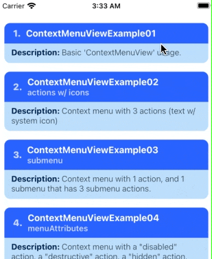

<br>

### `ContextMenuView` Example 02

**Summary**: Icon Example — This examples shows how to add a system icon in the context menu action.

<br>

| Notes                                                        |
| ------------------------------------------------------------ |
| 1️⃣ — A menu action (i.e. `MenuActionConfig` object) can be configured to show an icon via its `MenuActionConfig.icon` property.<br><br>📝 **Note A**: The `icon` property accepts a `ImageItemConfig` object.<br/><br/>📝 **Note B**: A `ImageItemConfig` object is used to describe images/assets (e.g. SF Symbols icons, images, xcasset images, programmatic images, etc). |
| 2️⃣ — In this example, we want to use a "SF Symbols" icon for the menu action.<br/><br>In order to do this, the `ImageItemConfig.type` property must be set to `"IMAGE_SYSTEM"`.<br><br>📝 **Note A**: Passing in a value of `"IMAGE_SYSTEM"` to the `type` property means that we want to create a "SF Symbols" system icon.<br/><br/>📝 **Note B**: Using a "SF Symbols" icon requires iOS 13+.<br/><br/> 📝 **Note C**: Via the `ImageItemConfig` object, you can also configure the context menu action to use other icons (e.g. `xcasset` items, images, gradients, solid colors, etc).<br/><br/>📝 **Note D**: You can apply a tint to the icon via the `ImageItemConfig.imageOptions` property using the `UIImageConfig.tint` and `UIImageConfig.renderingMode` property. See [`ContextMenuView` Example 17](#ContextMenuView-Example-17) for more details. |
| 3️⃣ — In order to configure what kind of "SF Symbols" icon we want to use for the menu action, we need to pass in a `ImageSystemConfig` object to the  `ImageItemConfig.imageValue` property.<br/><br/>We can set what kind of icon to use via passing a string value to the `ImageSystemConfig.systemName` property.<br/><br/>📝 **Note A**: An `ImageSystemConfig` object is used to generate a "SF Symbols" image. Using this configuration object, we can optionally customize the "SF Symbols" icon further via the following properties:  `pointSize`, `weight`, `scale`, `hierarchicalColor`, `paletteColors`, etc.<br><br>📝 **Note B**: The string value passed to the `ImageSystemConfig.systemName` property must be a valid SF Symbols name.<br/><br/>📝 **Note C**: To view the list of SF Symbols icons (along with their corresponding icon names), you'll need to download the SF Symbols Mac app from [this page](https://developer.apple.com/design/human-interface-guidelines/sf-symbols/overview/). |

<br>

[🔗 Full Example](./example/srcexamples/ContextMenuViewExample02.tsx)

```jsx
// 📝 Note: for the sake of brevity, some of the code is omitted...
import { ContextMenuView } from 'react-native-ios-context-menu';

export function ContextMenuViewExample02(props) {
  return (
    <ContextMenuView
      menuConfig={{
        menuTitle: 'ContextMenuViewExample02',
        menuItems: [{
          actionKey  : 'key-01',
          actionTitle: 'Action #1',
          icon: {
            type: 'IMAGE_SYSTEM',
            imageValue: {
              systemName: 'folder',
            },
          }
        }, {
          actionKey  : 'key-02'   ,
          actionTitle: 'Action #2',
          icon: {
            type: 'IMAGE_SYSTEM',
            imageValue: {
              systemName: 'dial.fill',
            },
          }
        }, {
          actionKey  : 'key-03'   ,
          actionTitle: 'Action #3',
          icon: {
            type: 'IMAGE_SYSTEM',
            imageValue: {
              systemName: 'archivebox.fill',
            },
          }
        }],
      }}
    >
      {/** Components */}
    </ContextMenuView>
  );
};
```


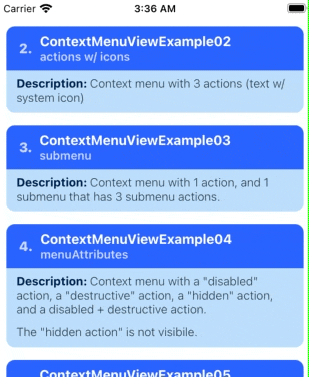

<br>

### `ContextMenuView` Example 03

**Summary**: Nested Menu — This example shows a context menu that has a submenu item inside its list of menu actions.

<br>

| Notes                                                        |
| ------------------------------------------------------------ |
| 1️⃣ — A context menu supports having nested menu's (i.e. submenu's).<br><br>A submenu is basically just another menu with it's own separate list of menu actions. Tapping it will show another context menu (visually this is similar to a dropdown menu). |
| 2️⃣ — As mentioned in the earlier examples, the `MenuConfig.menuItems` property can accept a `MenuActionConfig` object, or a `MenuConfig` object.<br/><br/>Passing in a `MenuActionConfig` object to `MenuConfig.menuItems` makes a menu action, conversely passing in a  `MenuConfig` object will create a submenu item.<br/><br/>In other words, to make a submenu, you just need to pass a `MenuConfig` item in the `MenuConfig.menuItems` property.<br/><br/>📝 **Note**: You can nest as many submenu's you want (but just remember that having more than 3 nested submenus is considered bad UX). |

<br>

[🔗 Full Example](./example/srcexamples/ContextMenuViewExample03.tsx)

```jsx
 // 📝 Note: for the sake of brevity, some of the code is omitted...
import { ContextMenuView } from 'react-native-ios-context-menu';

export function ContextMenuViewExample03(props) {
  return (
    <ContextMenuView
      menuConfig={{
        menuTitle: 'ContextMenuViewExample03',
        menuItems: [{
          actionKey  : 'key-01',
          actionTitle: 'Action #1',
          icon: {
            type: 'IMAGE_SYSTEM',
            imageValue: {
              systemName: 'folder',
            },
          }
        }, {
          menuTitle: 'Submenu...',
          menuItems: [{
            actionKey  : 'key-01-01',
            actionTitle: 'Submenu Action #1',
            icon: {
              type: 'IMAGE_SYSTEM',
              imageValue: {
                systemName: 'star',
              },
            }
          }, {
            actionKey  : 'key-01-02',
            actionTitle: 'Submenu Action #2',
            icon: {
              type: 'IMAGE_SYSTEM',
              imageValue: {
                systemName: 'star.lefthalf.fill',
              },
            }
          }, {
            actionKey  : 'key-01-03',
            actionTitle: 'Submenu Action #3',
            icon: {
              type: 'IMAGE_SYSTEM',
              imageValue: {
                systemName: 'star.fill',
              },
            }
          }]
        }],
      }}
    >
      {/** Components */}
    </ContextMenuView>
  );
};
```


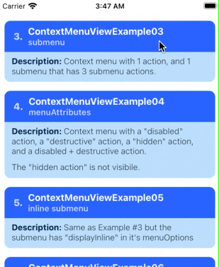

<br>

### `ContextMenuView` Example 04

**Summary**: Menu Attributes — This example context menu showcases the `MenuActionConfig.menuAttributes` property.

<br>

| Notes                                                        |
| ------------------------------------------------------------ |
| 1️⃣ — The `MenuActionConfig.menuAttributes` property accepts an array of strings (i.e. an array of `MenuAttributes` items).<br><br>In this example, the context menu has 3 actions, each with a different menu attribute assigned to it.<br/><br/>The first menu action is a "disabled" action, i.e. it has it's `menuAttributes` set to `['disabled']`, causing the action title text and icon becomes greyed out. |
| 2️⃣ — The second menu action is a destructive action.<br><br>It has it's `menuAttributes` set to `['destructive']`, causing the action title text and icon becomes red. |
| 3️⃣ — The third menu action is a "hidden" action. It has it's `menuAttributes` set to `['hidden']`.<br/><br/>The menu action is not visible in the menu's list of actions. This is useful for temporarily hiding a menu action item. |
| 4️⃣ — The fourth menu action is a "disabled" + "destructive"  action.<br>Visually, it looks very similar to an action that has the `['disabled']`  attribute. |

<br>

[🔗 Full Example](./example/srcexamples/ContextMenuViewExample04.tsx)

```jsx
 // 📝 Note: for the sake of brevity, some of the code is omitted...
import { ContextMenuView } from 'react-native-ios-context-menu';

export function ContextMenuViewExample04(props) {
  return (
    <ContextMenuView
      menuConfig={{
        menuTitle: 'ContextMenuViewExample04',
        menuItems: [{
          actionKey     : 'key-01',
          actionTitle   : 'Disabled Action',
          menuAttributes: ['disabled'],
          icon: {
            type: 'IMAGE_SYSTEM',
            imageValue: {
              systemName: 'folder',
            },
          }
        }, {
          actionKey     : 'key-02'   ,
          actionTitle   : 'Destructive Action',
          menuAttributes: ['destructive'],
          icon: {
            type: 'IMAGE_SYSTEM',
            imageValue: {
              systemName: 'trash',
            },
          }
        }, {
          actionKey     : 'key-03'   ,
          actionTitle   : 'Hidden Action',
          menuAttributes: ['hidden'],
          icon: {
            type: 'IMAGE_SYSTEM',
            imageValue: {
              systemName: 'trash',
            },
          }
        }, {
          actionKey     : 'key-04'   ,
          actionTitle   : 'Disabled/Destructive',
          menuAttributes: ['disabled', 'destructive'],
          icon: {
            type: 'IMAGE_SYSTEM',
            imageValue: {
              systemName: 'trash.fill',
            },
          }
        }],
      }}
    >
      {/** Components */}
    </ContextMenuView>
  );
};
```


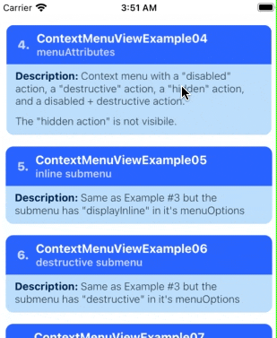

<br>

### `ContextMenuView` Example 05

**Summary**: Nested Menu + Menu Attributes — A context menu that has a in-line submenu.

<br>

| Notes                                                        |
| ------------------------------------------------------------ |
| You can set the menu options via the `MenuConfig.menuOptions` property. It accepts an array of `UIMenuOptions` strings (e.g. `'destructive'`, `'displayInline'`).<br><br>If you pass in `['displayInline']` to `menuOptions`, the submenu will be added/combined to its parent menu, but with a small separator between them. |

<br>

[🔗 Full Example](./example/srcexamples/ContextMenuViewExample05.tsx)

```jsx
 // 📝 Note: for the sake of brevity, some of the code is omitted...
import { ContextMenuView } from 'react-native-ios-context-menu';

export function ContextMenuViewExample05(props) {
  return (
    <ContextMenuView
      menuConfig={{
        menuTitle: 'ContextMenuViewExample03',
        menuItems: [{
          actionKey  : 'key-01',
          actionTitle: 'Action #1',
          // ...
        }, {
          menuTitle: 'Submenu...',
          // Create an "Inline submenu" by adding `displayInline`
          // in the menu options...
          menuOptions: ['displayInline'],
          menuItems: [{
            actionKey  : 'key-01-01',
            actionTitle: 'Submenu Action #1',
            // ...
          }, {
            actionKey  : 'key-01-02',
            actionTitle: 'Submenu Action #2',
            // ...
          }, {
            actionKey  : 'key-01-03',
            actionTitle: 'Submenu Action #3',
            // ...
          }]
        }],
      }}
    >
      {/** Components */}
    </ContextMenuView>
  );
};
```

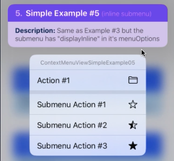

![Gif]](./assets/example-ContextMenuViewExample05.gif)

<br>

### `ContextMenuView` Example 06

**Summary**: Menu Options — A context menu that has a destructive submenu.

<br>

| Notes                                                        |
| ------------------------------------------------------------ |
| You can set the menu options via the `MenuConfig.menuOptions` property. It accepts an array of `UIMenuOptions` strings (e.g. `destructive`, `displayInline`).<br><br>If you pass in `['destructive']` to `menuOptions`, it will tint the submenu to red (but it's menu items won't be affected). |

<br>

[🔗 Full Example](./example/srcexamples/ContextMenuViewExample06.tsx)

```jsx
 // 📝 Note: for the sake of brevity, some of the code is omitted...
import { ContextMenuView } from 'react-native-ios-context-menu';

export function ContextMenuViewExample06(props) {
  return (
    <ContextMenuView
      menuConfig={{
        menuTitle: 'ContextMenuViewExample06',
        menuItems: [{
          actionKey  : 'key-01',
          actionTitle: 'Action #1',
          // ...
        }, {
          menuTitle: 'Submenu...',
          // Create an "destructive" submenu by adding
          // `destructive` in the menu options...
          menuOptions: ['destructive'],
          menuItems: [{
            actionKey  : 'key-01-01',
            actionTitle: 'Submenu Action #1',
            // ...
          }, {
            actionKey  : 'key-01-02',
            actionTitle: 'Submenu Action #2',
            // ...
          }, {
            actionKey  : 'key-01-03',
            actionTitle: 'Submenu Action #3',
            // ...
          }]
        }],
      }}
    >
      {/** Components */}
    </ContextMenuView>
  );
};
```


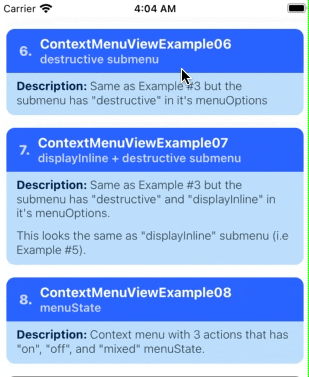

<br>

### `ContextMenuView` Example 07

**Summary**: Menu Options — A context menu that set to be both "destructive" and "display in-line".

<br>

| Notes                                                        |
| ------------------------------------------------------------ |
| You can set the menu options via the `MenuConfig.menuOptions` property. It accepts an array of `UIMenuOptions` strings (e.g. `destructive`, `displayInline`).<br><br>Passing in `['destructive', 'displayInline']` to `menuOptions`, is functionally the same as passing in `['displayInline']`. |

<br>

[🔗 Full Example](./example/srcexamples/ContextMenuViewExample07.tsx)

```jsx
 // 📝 Note: for the sake of brevity, some of the code is omitted...
import { ContextMenuView } from 'react-native-ios-context-menu';

export function ContextMenuViewExample07(props) {
  return (
    <ContextMenuView
      menuConfig={{
        menuTitle: 'ContextMenuViewExample07',
        menuItems: [{
          actionKey  : 'key-01',
          actionTitle: 'Action #1',
          // ...
        }, {
          menuTitle: 'Submenu...',
          // Make the submenu both `'displayInline'` and
          // `'destructive'`.
          //
          // Visually, this is just the same as passing in 
          // 'displayInline'.
          menuOptions: ['displayInline', 'destructive'],
          menuItems: [{
            actionKey  : 'key-01-01',
            actionTitle: 'Submenu Action #1',
            // ...
          }, {
            actionKey  : 'key-01-02',
            actionTitle: 'Submenu Action #2',
            // ...
          }, {
            actionKey  : 'key-01-03',
            actionTitle: 'Submenu Action #3',
            // ...
          }]
        }],
      }}
    >
      {/** Components */}
    </ContextMenuView>
  );
};
```


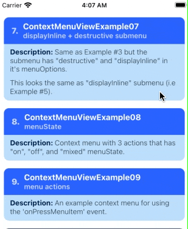

<br>

### `ContextMenuView` Example 08

**Summary**: Menu State — A context menu with 3 actions that has `'on'`, `'off'`, and `'mixed'` `menuState`.

<br>

| Notes                                                        |
| ------------------------------------------------------------ |
| You can set an menu action item's the menu state via the `MenuActionConfig.menuState` property.<br><br>📝 **Note**: On iOS 13, an action item's menu state is indicated via changing it's icon to a checkmark. However on later version of iOS this behavior has been changed to showing a checkmark besides the action title (see gifs/screenshots below). |

<br>

[🔗 Full Example](./example/srcexamples/ContextMenuViewExample08.tsx)

```jsx
 // 📝 Note: for the sake of brevity, some of the code is omitted...
import { ContextMenuView } from 'react-native-ios-context-menu';

export function ContextMenuViewExample08(props) {
  return (
    <ContextMenuView
      menuConfig={{
        menuTitle: 'ContextMenuViewExample08',
        menuItems: [{
          actionKey  : 'key-01',
          actionTitle: 'menuState: on',
          // show a checkmark
          menuState: 'on',
          // ...
        }, {
          actionKey  : 'key-02'   ,
          actionTitle: 'menuState: off',
          // no checkmark
          menuState: 'off',
          // ...
        }, {
          actionKey  : 'key-03'   ,
          actionTitle: 'menuState: mixed',
          // visually this is the same as 'on'
          menuState: 'mixed',
          // ...
        }],
      }}
    >
      {/** Components */}
    </ContextMenuView>
  );
};
```


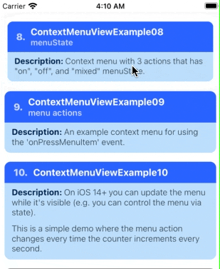

<br>

### `ContextMenuView` Example 09

**Summary**: Events — An example for the `onPressMenuItem` event prop.

| Notes                                                        |
| ------------------------------------------------------------ |
| The `onPressMenuItem` event prop allows you to know which menu item was pressed via the `nativeEvent.actionKey` property in the event object.<br><br>📝 **Note A**: The entire menu action config (i.e. `MenuActionConfig`) object of the selected item can be accessed via the `nativeEvent` object (e.g. `nativeEvent.actionTitle`, `nativeEvent.menuState`, etc).<br><br>📝 **Note B**: For the full type declaration for all the events, see: [`MenuEvents.ts`](./src/types/MenuEvents.ts). |

<br>

[🔗 Full Example](./example/srcexamples/ContextMenuViewExample09.tsx)

```jsx
 // 📝 Note: for the sake of brevity, some of the code is omitted...
import { ContextMenuView } from 'react-native-ios-context-menu';

export function ContextMenuViewExample09(props) {
  return (
    <ContextMenuView
      menuConfig={{
        menuTitle: 'ContextMenuViewExample09',
        menuItems: [{
          actionKey  : 'save',
          actionTitle: 'Save',
          // ...
        }, {
          actionKey  : 'like',
          actionTitle: 'Like',
          // ...
        }, {
          actionKey  : 'play',
          actionTitle: 'Play',
          // ...
        }],
      }}
      // Use `actionKey` to identify which menu action was
      // pressed....
      onPressMenuItem={({nativeEvent}) => {
        switch (nativeEvent.actionKey) {
          case 'save':
            Alert.alert('saving...');
            break;

          case 'like':
            Alert.alert('liking...');
            break;

          case 'play':
            Alert.alert('playing...');
            break;
        };
      }}
    >
      {/** Components */}
    </ContextMenuView>
  );
};
```


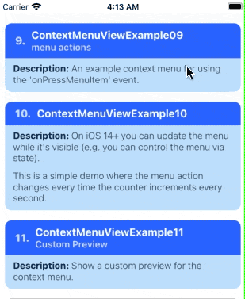

<br>

### `ContextMenuView` Example 10

**Summary**: Dynamic Menu — An example showing how to dynamically update the context menu while it's visible. In this example, the menu action changes every time the counter increments every second.

<br>

| Notes                                                        |
| ------------------------------------------------------------ |
| On iOS 14+ you can update the menu while it's visible, e.g. like adding and removing items in the context menu, or changing the action title, etc.<br><br>You can control the context menu config using state, and dynamically change it as shown in the example below.<br><br>📝 **Note A**: On iOS 13 the context menu will not update while it's visible.<br/><br/>📝 **Note B**: On iOS 15+, all changes to the context menu config are applied using a fade/crossfade transition. |

<br>

[🔗 Full Example](./example/srcexamples/ContextMenuViewExample10.tsx)

```jsx
 // 📝 Note: for the sake of brevity, some of the code is omitted...
export function ContextMenuViewExample10(props) {
  // `timer` will increment every second... 
  const [timer, setTimer] = React.useState(0);

  // ...
  return (
    <ContextMenuView
      // ...
      menuConfig={{
        menuTitle: 'ContextMenuViewExample10',
        menuItems: [{
          actionKey  : 'key-00',
          actionTitle: `Static Action`,
          // ...
        }, {
          actionKey  : 'key-01',
          // update the action title every second...
          actionTitle: `timer: ${timer}`,
          icon: {
            type: 'IMAGE_SYSTEM',
            imageValue: {
               // update the icon every second...
              systemName: ((timer % 2 === 0)
                ? 'heart'
                : 'heart.fill'
              ),
            },
          }
        }, 
        // this item will be added and removed...
        (timer % 3 === 0) && {
          actionKey  : 'key-02',
          actionTitle: `Dynamic Action`,
          // ...
        }],
      }}
    >
      {/** Components */}
    </ContextMenuView>
  );
};
```


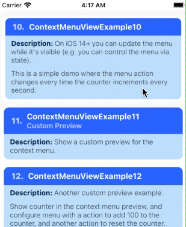

<br>

### `ContextMenuView` Example 11

**Summary**: Context Menu Previews — An example showing how to use a custom preview for the context menu.

<br>

| Notes                                                        |
| ------------------------------------------------------------ |
| 1️⃣ — The `ContextMenuView.renderPreview` render prop allows you show a custom preview when the context menu appears.<br><br>📝 **Note**: The `renderPreview` prop accepts a function that returns an element. The returned element will be shown inside the context menu preview. |
| 2️⃣ — The `ContextMenuView.previewConfig` is used to control the behavior and appearance of the custom context menu preview.<br/><br/>In order to show the custom context menu preview, we must first set `MenuPreviewConfig.previewType` to `'CUSTOM'`. By default, this property is set to `'DEFAULT'`, which means that you do not want to use a custom preview.<br/><br/>📝 **Note A**: The `previewConfig` prop accepts a `MenuPreviewConfig` object.<br/><br/>📝 **Note B**: The `previewType` property accepts a `MenuPreviewType` string. You can set this to `'DEFAULT'` if you want to quickly disable the custom preview. |
| 3️⃣ — In this example, we want the custom preview to be as big as possible, so we set the `MenuPreviewConfig.previewSize` property to `'STRETCH'`.<br/><br/>📝 **Note**: The `previewSize` property accepts a `MenuPreviewSize` string. By default, this prop is set to `'INHERIT'`, which means to just match the size of the root view returned from `renderPreview`. |

<br>

[🔗 Full Example](./example/srcexamples/ContextMenuViewExample11.tsx)

```jsx
 // 📝 Note: for the sake of brevity, some of the code is omitted...
import { ContextMenuView } from 'react-native-ios-context-menu';

export function ContextMenuViewExample11(props) {
  return (
    <ContextMenuView
      previewConfig={{
        previewType: 'CUSTOM',
        previewSize: 'STRETCH',
        backgroundColor: 'white'
      }}
      renderPreview={() => (
        <View>
          <Text>
            Hello World
          </Text>
          <Text>
            Hello World
          </Text>
          <Text>
            Hello World
          </Text>
        </View>
      )}
      onPressMenuPreview={() => {
        Alert.alert(
          'onPressMenuPreview Event',
          `Menu preview was pressed...`
        );
      }}
    >
      {/** Components */}
    </ContextMenuView>
  );
};
```


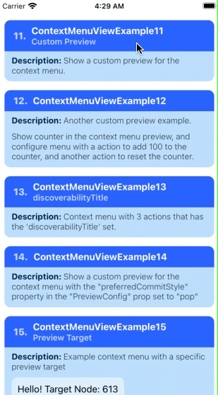

<br>

### `ContextMenuView` Example 12

**Summary**: Context Menu Previews — An example showing a custom context menu preview that dynamically changes its size due to its contents updating every second.

<br>

| Notes                                                        |
| ------------------------------------------------------------ |
| 📝 **Note**: By default, custom preview will animate to its new size. If you want to disable this behavior, set `MenuPreviewConfig.isResizeAnimated` property to `false`. |

<br>

[🔗 Full Example](./example/srcexamples/ContextMenuViewExample12.tsx)

```jsx
 // 📝 Note: for the sake of brevity, some of the code is omitted...

export function ContextMenuViewExample12(props) {
  // increments every second...
  const [timer, setTimer] = React.useState(0);

	// ...
  return (
    <ContextMenuView
      menuConfig={{
        menuTitle: 'ContextMenuViewExample12',
        menuItems: [{
          // ...
        }],
      }}
      previewConfig={{
        previewType: 'CUSTOM',
        backgroundColor: 'white'
      }}
      // The context menu preview grows and shrinks due to the labels/
      // text changing every second...
      renderPreview={() => (
        <View>
          <Text>
            {`Counter: ${timer}`}
          </Text>
          <Text>
            {(timer % 2 === 0)? 'EVEN' : 'The number is: ODD'}
          </Text>
        </View>
      )}
      // ...
    >
      {/** Components */}
    </ContextMenuView>
  );
};
```


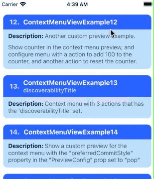

<br>

### `ContextMenuView` Example 13

**Summary**: Menu Action — An example showing how to add a subtitle to menu action.

<br>

| Notes                                                        |
| ------------------------------------------------------------ |
| You can add a subtitle to a menu action via passing a string value to the `MenuActionConfig.actionSubtitle` property.<br><br>📝 **Note A**: On iOS 13/14, you add subtitles to the menu action via the `MenuActionConfig.discoverabilityTitle` property, but on iOS 15+ this property is now used for the "discoverability heads-up display" UI.<br/><br/>📝 **Note B**: For backwards compatibility, the string value you passed to `discoverabilityTitle` will also be used to set `actionSubtitle` on iOS 15+.<br><br>To disable this automatic behavior, set the `ContextMenuView.shouldUseDiscoverability` `TitleAsFallbackValueForSubtitle` prop to `false`. |

<br>

[🔗 Full Example](./example/srcexamples/ContextMenuViewExample13.tsx)

```jsx
 // 📝 Note: for the sake of brevity, some of the code is omitted...
import { ContextMenuView } from 'react-native-ios-context-menu';

export function ContextMenuViewExample13(props) {
  return (
    <ContextMenuView
      menuConfig={{
        menuTitle: 'ContextMenuViewExample13',
        menuItems: [{
          actionKey: 'key-01',
          actionTitle: 'Action #1',
          // old way of adding a subtitle...
          // iOS 13 to 14 (still works on iOS 15+)
          discoverabilityTitle: 'Action subtitle',
        }, {
          actionKey: 'key-02'   ,
          actionTitle: 'Action #2',
          // new way of adding a subtitle...
          // iOS 15+ only, but is automatically backwards compatible w/
          // iOS 13/14...
          actionSubtitle: 'Lorum ipsum sit amit dolor aspicing',
        }, {
          actionKey: 'key-03'   ,
          actionTitle: 'Action #3',
          actionSubtitle: 'Very long `discoverabilityTitle` lorum ipsum sit amit',
        }],
      }}
    >
      {/** Components */}
    </ContextMenuView>
  );
};
```


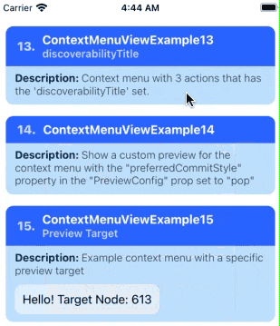

<br>

### `ContextMenuView` Example 14

**Summary**: Context Menu Previews — An example that changes the exit transition of the context menu preview when its tapped using the `preferredCommitStyle ` config.

<br>

| Notes                                                        |
| ------------------------------------------------------------ |
| The `MenuPreviewConfig.preferredCommitStyle` allows you to configure what preset exit transition to use when the context menu preview is pressed.<br><br>📝 **Note A**: By default, `MenuPreviewConfig.preferredCommitStyle` is set to `'dismiss'`.<br><br>📝 **Note B**:  A `preferredCommitStyle` of `'pop'`' is usually used when navigating to another screen (i.e. a view controller is pushed without the normal push transition). |

<br>

[🔗 Full Example](./example/srcexamples/ContextMenuViewExample14.tsx)

```jsx
 // 📝 Note: for the sake of brevity, some of the code is omitted...
export function ContextMenuViewExample14(props) {
  return (
    <ContextMenuView
      previewConfig={{
        previewType: 'CUSTOM',
        previewSize: 'STRETCH',
        backgroundColor: 'rgba(255,255,255,0.75)',
	      // change the exit transition that occurs when the 
        // context menu preview is pressed.
        preferredCommitStyle: 'pop',
      }}
      renderPreview={() => (
        {/** ... */}
      )}
    >
      {/** Components */}
    </ContextMenuView>
  );
};
```

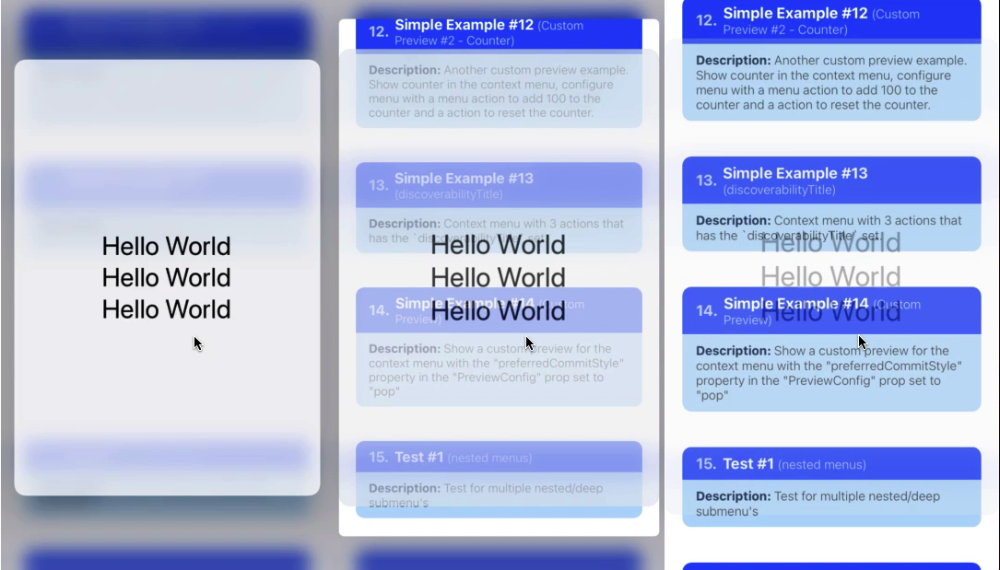

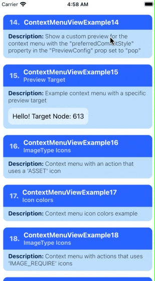

<br>

### `ContextMenuView` Example 15

**Summary**: Context Menu Previews — An example showing how to configure a context menu that uses targeted previews.

<br>

| Notes                                                        |
| ------------------------------------------------------------ |
| By default, the child elements you render inside the `ContextMenuView` component will be used as the preview when the context menu interaction is triggered.<br><br>Targeted previews allows you to specify which specific view to use for the context menu preview, so that when the context menu interaction begins, a different view will be used for the preview (including the initial transition, see the gif below the example code).<br><br>📝 **Note A**: The context menu interaction will still be triggered by long pressing on the child elements in the `ContextMenuView` component.<br><br>As such, if the view that you are using for the targeted preview is not a child of `ContextMenuView`, then holding down on that view will not trigger the context menu interaction.<br/><br/>📝 **Note B**: Targeted previews is different from setting a [custom context menu preview](#ContextMenuView-Example-11) via the `renderPreview` prop.<br><br>A custom preview will replace the contents of the context menu preview entirely with your custom view component once the menu is opened.<br><br>A targeted preview on the other hand will change which view to use for the context menu entrance/exit transition (as well as what view to show in the preview if you do not have a custom preview). |

<br>

[🔗 Full Example](./example/srcexamples/ContextMenuViewExample15.tsx)

```jsx
 // 📝 Note: for the sake of brevity, some of the code is omitted...
import { ContextMenuView } from 'react-native-ios-context-menu';

export function ContextMenuViewExample15(props) {
  const [targetViewNode, setTargetViewNode] = React.useState();
  
  React.useEffect(() => {
    // please note that when a view unmounts and remounts (e.g.
    // when you have a view inside a list comp)., you need to
    // get the new associated `reactTag` for that view
    //
    // otherwise the `reactTag` value you provide to the 
    // `previewConfig` will be stale...
    //
    // this is why we have to set `targetViewNode` back to 
    // `udefined` when the component unmounts
    return () => {
      setTargetViewNode(undefined);
    }
  }, []);

  return (
    <ContextMenuView
      menuConfig={{
        // ...
      }}
      previewConfig={{
        // specify which view to use as the preview target
        targetViewNode: targetViewNode,
      }}
    >
      <View
        style={styles.targetContainer}
        // we need to get the `reactTag` of the view; one way is
        // to get it from the `onLayout` event
        //
        // alternatively, you can also obtain the `reactTag` of a  
        // a view via: `nativeViewRef?.nativeTag`
        //
        // the `reactTag` for a given view is the same across re-renders,
        // so we only really need to get it once when the view mounts...
        //
        onLayout={!targetViewNode && (({nativeEvent}) => {
          setTargetViewNode(nativeEvent.target)
        })}
      >
        <Text style={styles.text}>
          {`Hello! Target Node: ${targetViewNode}`}
        </Text>
      </View>
    </ContextMenuView>
  );
};
```


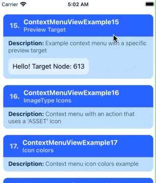

<br>

### `ContextMenuView` Example 15-02

**Summary**: Context Menu Previews (Cont). — An example showing how to configure a context menu that uses targeted previews + `WrapperView`.

<br>

[🔗 Full Example](./example/srcexamples/ContextMenuViewExample15_02.tsx)

```jsx
// 📝 Note: for the sake of brevity, some of the code is omitted...
import { ContextMenuView } from 'react-native-ios-context-menu';
import { WrapperView } from 'react-native-ios-utilities';

export function ContextMenuViewExample15_02(props) {
  // save a ref. to the `WrapperView` element containing the preview target you 
  // want to use for the context menu.
  //
  // you can then call `getNativeReactTag` to get the associated `reactTag`
  // for that view. 
  const wrapperViewRef = React.useRef();

  return (
    <ContextMenuView
      menuConfig={{
        // ...
      }}
      previewConfig={{
        // get the associated `reactTag` of the view element you want use as the 
        // preview target
        targetViewNode: wrapperViewRef.current?.getNativeReactTag(),
      }}
    >
      <WrapperView
        ref={wrapperViewRef}
        style={styles.targetContainer}
      >
        <Text style={styles.text}>
          {`Hello inside: WrapperView\nTarget Node: ${wrapperViewRef.current?.getNativeReactTag()}`}
        </Text>
      </WrapperView>
    </ContextMenuView>
  );
};
```

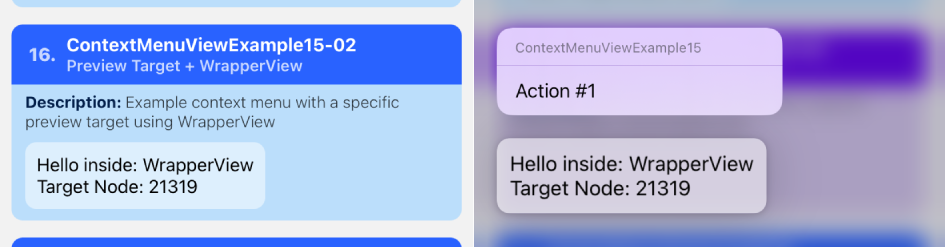

<br>

### `ContextMenuView` Example 16

**Summary**: Icon Example — An example showing a context menu with an action that uses a `'IMAGE_ASSET'` image for its icon.

<br>

| Notes                                                        |
| ------------------------------------------------------------ |
| A config of `ImageItemConfig.type` set to `'IMAGE_ASSET'` means that you want to use a `xcasset` image asset.<br/><br/>📝 **Note**: The string value you pass to the `ImageItemConfig.imageValue` must match the corresponding asset that you want to use in your project's `xcasset` catalog. |

<br>

[🔗 Full Example](./example/srcexamples/ContextMenuViewExample16.tsx)

```jsx
 // 📝 Note: for the sake of brevity, some of the code is omitted...
import { ContextMenuView } from 'react-native-ios-context-menu';

export function ContextMenuViewExample16(props) {
  return (
    <ContextMenuView
      menuConfig={{
        menuTitle: 'ContextMenuViewExample16',
        menuItems: [{
          actionKey: 'key-01',
          actionTitle: 'Action #1',
          // ...
        }, {
          actionKey: 'key-02'   ,
          actionTitle: 'Action #2',
          // ...
        }, {
          actionKey  : 'key-03'   ,
          actionTitle: 'Action #3',
          discoverabilityTitle: 'Use "ASSET" icon',
          icon: {
            // specify that you want to use an asset icon
            type: 'IMAGE_ASSET',
            // pass the name of the asset
            imageValue: 'icon-rainbow-flag',
          }
        }],
      }}
    >
      {/** Components */}
    </ContextMenuView>
  );
};
```

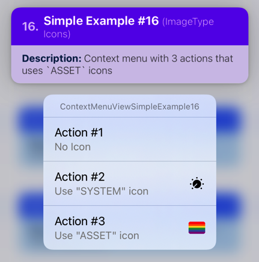

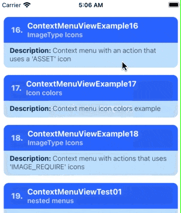

<br>

### `ContextMenuView` Example 17

**Summary**: Icon Example — An example showing a context menu with action items that have different colored icons.

<br>

| Notes                                                        |
| ------------------------------------------------------------ |
| A `ImageItemConfig` object has an optional called `imageOptions`. This property accepts a `UIImageConfig` object.<br><br>You can tint the image to a specified color using the `UIImageConfig.tint` property. This property accepts a color string in either `rgb`, `rgba`, or `hex` format.<br><br>You can also choose to provide a dynamic color config if you want to use a specific color for light/dark mode.<br><br>📝 **Note A**: Any image can be tinted to a specific color, not just `'IMAGE_SYSTEM'` images.<br/><br/>📝 **Note B**: In order for the tint to take effect, set `UIImageConfig.renderingMode` to `alwaysOriginal`. |

<br>

[🔗 Full Example](./example/srcexamples/ContextMenuViewExample17.tsx)

```jsx
 // 📝 Note: for the sake of brevity, some of the code is omitted...
import { ContextMenuView } from 'react-native-ios-context-menu';

export function ContextMenuViewExample17(props) {
  return (
    <ContextMenuView
      menuConfig={{
        menuTitle: 'ContextMenuViewExample17',
        menuItems: [{
          actionKey  : 'key-01',
          actionTitle: 'Action #1',
          icon: {
            type: 'IMAGE_SYSTEM',
            imageValue: {
              systemName: 'cloud.heavyrain.fill',
            },
            // blue icon
            imageOptions: {
              tint: 'blue',
              renderingMode: 'alwaysOriginal',
            },
          },
        }, {
          actionKey  : 'key-02',
          actionTitle: 'Action #2',
          icon: {
            // ...
            // orange icon
            imageOptions: {
              tint: 'rgb(218,165,32)',
              renderingMode: 'alwaysOriginal',
            },
          },
        }, {
          actionKey  : 'key-03',
          actionTitle: 'Action #3',
          icon: {
            // ...
            // pink icon
            imageOptions: {
              tint: '#FF1493',
              renderingMode: 'alwaysOriginal',
            },
          },
        }, {
          actionKey  : 'key-04',
          actionTitle: 'Action #4',
          icon: {
            // ...
            // green icon
            imageOptions: {
              tint: 'rgba(124,252,0,0.5)',
              renderingMode: 'alwaysOriginal',
            },
          },
        }]
      }}
    >
      {/** Components */}
    </ContextMenuView>
  );
};
```

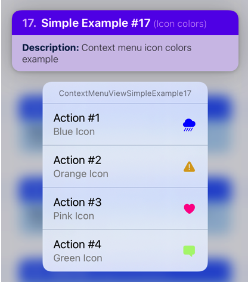

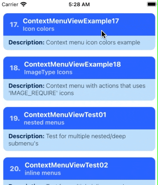

<br>

### `ContextMenuView` Example 18

**Summary**: Icon Example — An example showing a context menu with action items that has icons that uses local image assets imported via `require(...)`.

<br>

| Notes                                                        |
| ------------------------------------------------------------ |
| 1️⃣ — The first step that we need to do is to generate a `ImageResolvedAssetSource` object of the local image asset we want to use. This object contains metadata about the image as well as its URI in the file system.<br><br> The `Image.resolveAssetSource` function returns a `ImageResolvedAssetSource` that corresponds to the source argument you pass into it. Give this function the return value of `require(path/to/image.png)`. |
| 2️⃣ — A config of `ImageItemConfig.type` set to `'IMAGE_REQUIRE'` means that we want to use a local image asset imported via the `require(...)` function.<br/><br/>The `ImageItemConfig.imageValue` property accepts a `ImageResolvedAssetSource` object that corresponds to the image asset that you want to use. |

<br>

[🔗 Full Example](./example/srcexamples/ContextMenuViewExample18.tsx)

```jsx
 // 📝 Note: for the sake of brevity, some of the code is omitted...
import { ContextMenuView } from 'react-native-ios-context-menu';

// Generate a `ImageResolvedAssetSource` object based on the
// image assets...

const iconA = Image.resolveAssetSource(
  require('../assets/emoji-pleading-face.png')
);

const iconB = Image.resolveAssetSource(
  require('../assets/emoji-smiling-face-with-hearts.png')
);

const iconC = Image.resolveAssetSource(
  require('../assets/emoji-sparkling-heart.png')
);

export function ContextMenuViewExample18(props) {
  return (
    <ContextMenuView
      menuConfig={{
        menuTitle: 'ContextMenuViewExample18',
        menuItems: [{
          actionKey  : 'key-01'   ,
          actionTitle: 'Action #1',
          discoverabilityTitle: 'Use "REQUIRE" icon',
          // `IconConfig` has been deprecated, please use 
          // `ImageItemConfig` instead (but it'll still work 
          // for now).
          // 
          // The other two menu actions in this example 
          // uses `ImageItemConfig` to set the menu action icons. 
          icon: {
            iconType: 'REQUIRE',
            iconValue: iconA,
          }
        }, {
          actionKey: 'key-02'   ,
          actionTitle: 'Action #2',
          
          // Set config to use images via `require`
          type: 'IMAGE_REQUIRE',
          
          // Pass in the corresponding
          // `ImageResolvedAssetSource` object of the image
          // that you want to use as the icon...
          imageValue: iconB,
        }, {
          actionKey: 'key-03'   ,
          actionTitle: 'Action #3',
          icon: {
            type: 'IMAGE_REQUIRE',
            imageValue: iconC,
          }
        }],
      }}
    >
      {/** Components */}
    </ContextMenuView>
  );
};
```


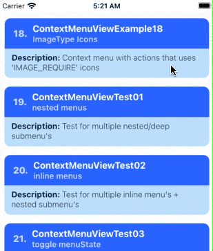

<br>

### `ContextMenuView` Example 19

**Summary**: Dynamic Menu — An example showing a context menu that shows a loading indicator using deferred menu elements.

<br>

| Notes                                                        |
| ------------------------------------------------------------ |
| 1️⃣ — If you control your `ContextMenuView.menuConfig` via state, then you can already dynamically add menu items while the context menu is visible (See [`ContextMenuView` Example 10](#ContextMenuView-Example-10)). However, there is no indication in the UI that items are currently being loaded.<br><br>You can use a "deferred element" in order to add an action item that has a loading indicator. Once you are done loading the content, then you can replace the deferred element with the actual menu items that you want to add.<br/><br/>📝 **Note**: Deferred elements are only available on iOS 14 and above. |
| 2️⃣ —  As mentioned in the previous examples, the `MenuConfig.menuItems` property can accept an array of `MenuElementConfig` union type. This means that it can accept an array containing any of the following object types:  `MenuConfig` object, `MenuActionConfig`, and `DeferredMenuElementConfig`.<br/><br/>If we pass in a `DeferredMenuElementConfig` to `menuItems`, it means that we want to create "deferred element" item. |
| 3️⃣ — To create a deferred element, we just need to create a "config" object that has a property containing both `type` and `deferredID`.<br><br>The `DeferredMenuElementConfig.type` property must be set to a string value of `'deferred'`. This indicates that we want to create a deferred element.<br/><br/>The `DeferredMenuElementConfig.deferredID` property must be set to a unique string value. Since we can have multiple deferred elements, the value you pass into this property will be used to identify which deferred element will be replaced with the menu items you want to add when the loading is complete. |
| 4️⃣ — Once the context menu is open, any deferred menu items in `MenuConfig.menuItems` will trigger the `ContextMenuView.onRequestDeferredElement` event to fire. Via the event, you will receive two arguments: `deferredID` string and `provider` callback function.<br><br>The `deferredID` string corresponds to which deferred element that we need to load, while the `provider` callback function is used to provide the menu items that we want to add and replace the deferred element with. |
| 5️⃣ — The `provider` callback function accepts an array of `MenuElementConfig` items.<br/><br/>To replace the deferred element with the menu items you want add, simply call the `provider` callback function with the array of  `MenuConfig`, `MenuActionConfig`, or `DeferredMenuElementConfig` objects.<br/><br/>📝 **Note A**: Since the deferred elements were loaded/replaced using the `onRequestDeferredElement` event, there are now two sources of truths for the context menu config: One provided via the `ContextMenuView.menuConfig` prop, and the other via the `onRequestDeferredElement` event.<br><br>If you are using a state-controlled menu config, see: [`ContextMenuView` Example 20](#ContextMenuView-Example-20).<br><br>📝 **Note B**: It is recommended that you cache the items you have loaded, and then combine them with the existing `menuConfig` once the menu has been closed. |

<br>

[🔗 Full Example](./example/srcexamples/ContextMenuViewExample19.tsx)

```jsx
// 📝 Note: for the sake of brevity, some of the code is omitted...
export function ContextMenuViewExample19(props) {
  return (
    <ContextMenuView
      menuConfig={{
        menuTitle: 'ContextMenuViewExample19',
        menuItems: [{
          actionKey  : 'key-01',
          actionTitle: 'Action #1',
          actionSubtitle: 'Dummy action'
        }, {
          // Create a deferred menu item... 
          // this will act as a placeholder and will be replaced
          // with the actual menu items later
          type: 'deferred',
          
          // if we have multiple deferred items, you can use 
          // the `deferredID` to distinguish between them
          deferredID: 'deferred-01'
        }],
      }}
      
      // this event will fire when a deferred menu item 
      // is present...
      onRequestDeferredElement={async (deferredID, provider) => {
        switch(deferredID) {
          case 'deferred-01':
            // dummy delay, wait for 1 second...
            await Helpers.timeout(1000);

            // provide the items to add to the context menu...
            provider([{
              type: 'action',
              actionKey: 'action-02',
              actionTitle: 'Deferred Item 02',
              actionSubtitle: 'Deferred item...'
            }, {
              type: 'action',
              actionKey: 'action-03',
              actionTitle: 'Deferred Item 03',
              actionSubtitle: 'Deferred item...'
            }]);
            break;
        };
      }}
    >
      {/** ... */}
    </ContextMenuView>
  );
};
```

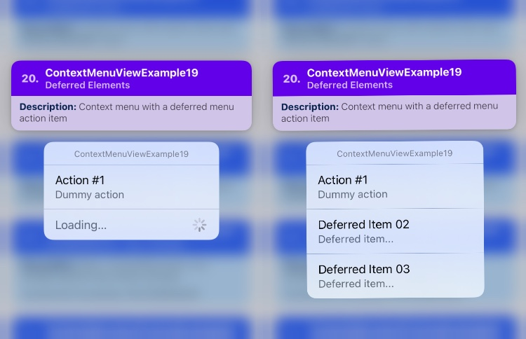

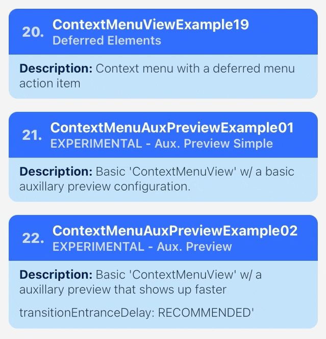

<br>

### `ContextMenuView` Example 20

**Summary**: Dynamic Menu — An example showing a state-controlled context menu that shows a loading indicator using deferred menu elements.

<br>

| Notes |
| ----- |
| TBA   |

<br>

[🔗 Full Example](./example/srcexamples/ContextMenuViewExample20.tsx)

```jsx
// 📝 Note: for the sake of brevity, some of the code is omitted...
export function ContextMenuViewExample20(props) {
  const [extraMenuItems, setExtraMenuItems] = React.useState([]);

  const [isLoading, setIsLoading] = React.useState(true);
  const [didLoadItems, setDidLoadItems] = React.useState(false);

  return (
    <ContextMenuView
      menuConfig={{
        menuTitle: 'ContextMenuViewExample20',
        menuItems: [{
          actionKey  : 'key-01',
          actionTitle: 'Action #1',
          actionSubtitle: 'Dummy action'
        },

        // add deferred item so that the loading indicator
        // appears...
        isLoading && ({
          type: 'deferred',
          deferredID: 'deferred-01'
        }), 

        // add the extra menu items...
        ...extraMenuItems,

        didLoadItems && ({
          type: 'menu',
          menuTitle: '',
          menuOptions: ['displayInline'],
          menuItems: [{
            type: 'action',
            actionKey: 'clear_cache',
            actionTitle: 'Clear Cache',
            actionSubtitle: 'Remove loaded items...',
            menuAttributes: ['destructive'],
          }]
        })],
      }}
      // this event will fire when a deferred menu item is present...
      onMenuWillShow={async () => {
        if(didLoadItems) return;

        // for the purposes of this example, let's add a delay
        // before showing the loading indicator...
        // 
        // this way, we can see the context menu updating and
        // showing the loading indicator.
        // 
        // Ideally, `isLoading` should already be set to `true`
        // before the context menu is shown...
        await Helpers.timeout(750);
        setIsLoading(true);

        // loading...
        // dummy delay, wait for 2 second...
        await Helpers.timeout(2000);
        setDidLoadItems(true);

        // add extra menu items
        setExtraMenuItems([{
          type: 'action',
          actionKey: 'action-02',
          actionTitle: 'Deferred Item 02',
          actionSubtitle: 'Deferred item...'
        }, {
          type: 'action',
          actionKey: 'action-03',
          actionTitle: 'Deferred Item 03',
          actionSubtitle: 'Deferred item...'
        }]);

        // hide the loading indicator
        setIsLoading(false);
      }}
    >
      {/** ... */}
    </ContextMenuView>
  );
};
```

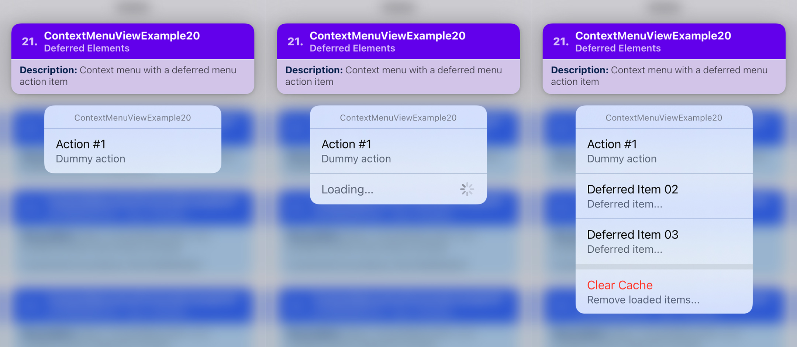

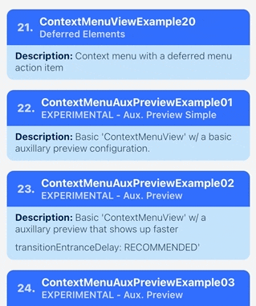

<br>

### `ContextMenuView` Example 21

**Summary**: Menu Element Size — TBA

<br>

| Notes |
| ----- |
| TBA   |

<br>

[🔗 Full Example](./example/srcexamples/ContextMenuViewExample21.tsx)

```jsx
// 📝 Note: for the sake of brevity, some of the code is omitted...
export function ContextMenuViewExample21(props) {

  return (
    <ContextMenuView
      menuConfig={{
        menuTitle: 'ContextMenuViewExample21',
        menuPreferredElementSize: 'medium',
        menuItems: [{
          actionKey: 'key-01',
          actionTitle: 'Action #1',
          // ...
        }, {
          actionKey: 'key-02'   ,
          actionTitle: 'Action #2',
          // ...

        }, {
          actionKey  : 'key-03'   ,
          actionTitle: 'Action #3',
          // ...
        }],
      }}
    >
      {/** ... */}
    </ContextMenuView>
  );
};
```

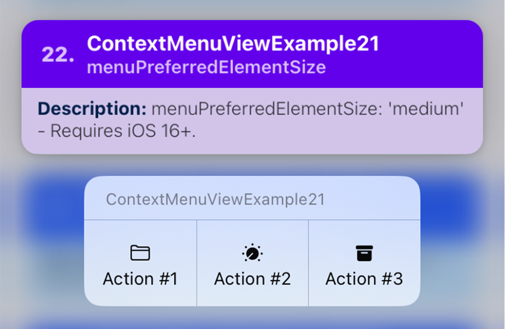


<br>

### `ContextMenuView` Example 22

**Summary**: Menu Element Size — TBA

<br>

| Notes |
| ----- |
| TBA   |

<br>

[🔗 Full Example](./example/srcexamples/ContextMenuViewExample22.tsx)

```jsx
// 📝 Note: for the sake of brevity, some of the code is omitted...
export function ContextMenuViewExample22(props) {

  return (
    <ContextMenuView
      menuConfig={{
        menuTitle: '',
        menuPreferredElementSize: 'small',
        menuItems: [{
          actionKey: 'key-01',
          actionTitle: '',
          // ...
        }, {
          actionKey: 'key-02'   ,
          actionTitle: '',
          // ...
          }
        }, {
          actionKey: 'key-03',
          actionTitle: '',
          // ...
        }],
      }}
    >
      {/** ... */}
    </ContextMenuView>
  );
};
```

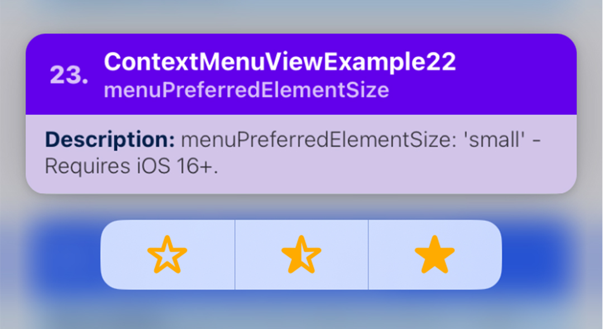


<br>

### `ContextMenuView` Example 23

**Summary**: Menu Element Size — TBA

<br>

| Notes |
| ----- |
|       |

<br>

[🔗 Full Example](./example/srcexamples/ContextMenuViewExample23.tsx)

```jsx
// 📝 Note: for the sake of brevity, some of the code is omitted...
export function ContextMenuViewExample23(props) {

  return (
    <ContextMenuView
      menuConfig={{
        menuTitle: '',
        menuItems: [{
          type: 'action',
          actionKey: 'remove-rating',
          menuAttributes: ['destructive'],
          actionTitle: 'Remove Rating',
           icon: { /** ... */ }
        }, {
          type: 'action',
          actionKey: 'info',
          actionTitle: 'Information',
           icon: { /** ... */ }
        }, {
          type: 'menu',
          menuTitle: '',
          menuOptions: ['displayInline'],
          menuPreferredElementSize: 'small',
          menuItems: [{
            actionKey: 'key-01-01',
            actionTitle: '',
            icon: { /** ... */ }
          }, {
            actionKey: 'key-01-02',
            actionTitle: '',
            icon: { /** ... */ }
          }, {
            actionKey: 'key-01-03',
            actionTitle: '',
            icon: { /** ... */ }
          }],
        }, {
          type: 'menu',
          menuTitle: '',
          menuOptions: ['displayInline'],
          menuPreferredElementSize: 'small',
          menuItems: [{
            actionKey: 'key-02-01',
            actionTitle: '',
            icon: { /** ... */ }
          }, {
            actionKey: 'key-02-02',
            actionTitle: '',
            icon: { /** ... */ }
          }, {
            actionKey: 'key-02-03',
            actionTitle: '',
            icon: { /** ... */ }
          }],
        }]
      }}
    >
      { /** ... */ }
    </ContextMenuView>
  );
};
```

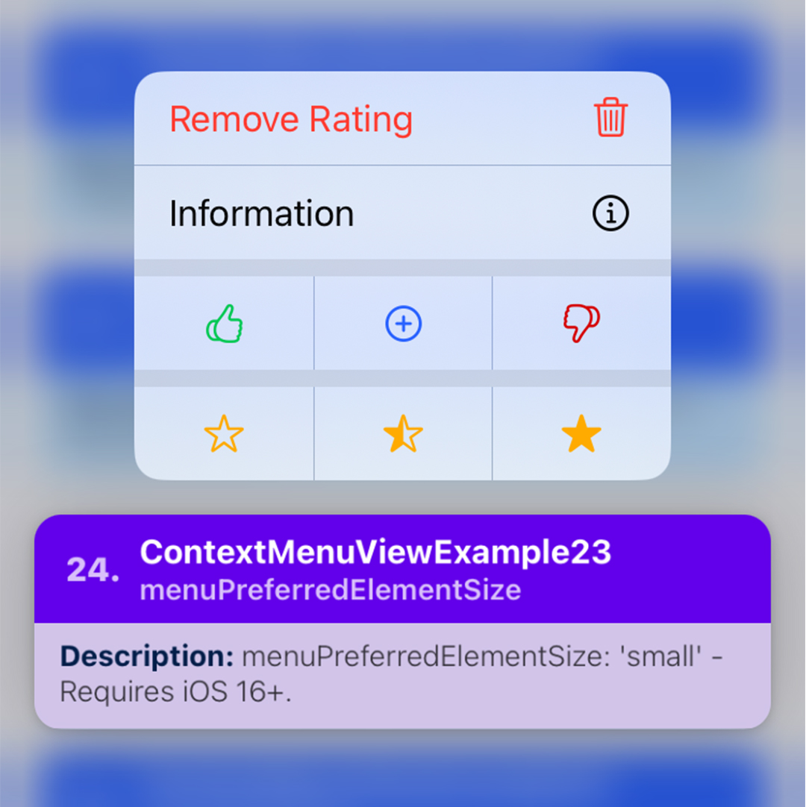


<br>

### `ContextMenuView` Example 24

**Summary**: Menu Attributes — `keepsMenuPresented`

<br>

| Notes |
| ----- |
| TBA   |

<br>

[🔗 Full Example](./example/srcexamples/ContextMenuViewExample24.tsx)

```jsx
// 📝 Note: for the sake of brevity, some of the code is omitted...
export function ContextMenuViewExample24(props) {
  const [actionState1, setActionState1] = React.useState(false);
  const [actionState2, setActionState2] = React.useState(false);
  const [actionState3, setActionState3] = React.useState(false);

  const isResetEnabled = (
    actionState1 ||
    actionState2 ||
    actionState3 
  );

  const handleOnPressMenuItem = ({nativeEvent}) => {
    // ...
  };

  return (
    <ContextMenuView
      style={props.style}
      onPressMenuItem={handleOnPressMenuItem}
      menuConfig={{
        menuTitle: 'ContextMenuViewExample24',
        menuItems: [{
          actionKey: 'key-01',
          actionTitle: `Action 1: ${actionState1? 'on' : 'off'}`,
          menuState: (actionState1? 'on' : 'off'),
          menuAttributes: ['keepsMenuPresented'],
          icon: { /** ... */ }
        }, {
          actionKey  : 'key-02',
          actionTitle: `Action 2: ${actionState2? 'on' : 'off'}`,
          menuState  : (actionState2? 'on' : 'off'),
          menuAttributes: ['keepsMenuPresented'],
          icon: { /** ... */ }
        }, {
          actionKey: 'key-03',
          actionTitle: `Action 3: ${actionState3? 'on' : 'off'}`,
          menuState: (actionState3? 'on' : 'off'),
          menuAttributes: ['keepsMenuPresented'],
          icon: { /** ... */ }
        }, {
          actionKey: 'key-04',
          actionTitle: `Reset All`,
          menuAttributes: [
            'keepsMenuPresented',
            isResetEnabled? 'destructive' : 'hidden',
          ],
          icon: { /** ... */ }
        }]
      }}
    >
      { /** ... */ }
    </ContextMenuView>
  );
};
```

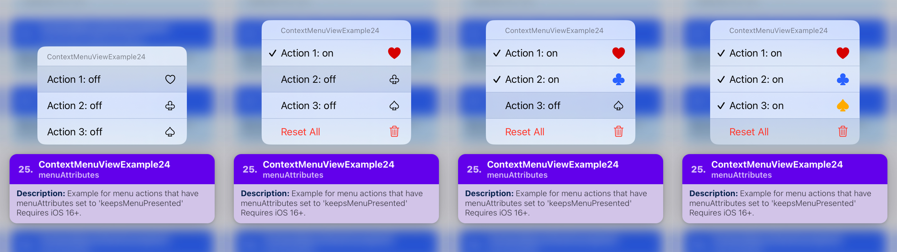


<br>

### `ContextMenuView` Example 25

**Summary**:  Icon Example — Advanced customization (e.g. `scale`, `weight`, `paletteColors`, `hierarchicalColor`).

<br>

| Notes |
| ----- |
| TBA   |

<br>

[🔗 Full Example](./example/srcexamples/ContextMenuViewExample25.tsx)

```jsx
// 📝 Note: for the sake of brevity, some of the code is omitted...
export function ContextMenuViewExample25(props) {
  return (
    <ContextMenuView
      style={props.style}
      menuConfig={{
        menuTitle: 'ContextMenuViewExample25',
        menuItems: [{
          type: 'menu',
          menuTitle: '',
          menuOptions: ['displayInline'],
          menuItems: [{
            actionKey: 'key-01-01',
            actionTitle: 'small',
            icon: {
              type: 'IMAGE_SYSTEM',
              imageValue: {
                systemName: 'heart',
                scale: 'small',
              },
            }
          }, {
            actionKey: 'key-01-02',
            actionTitle: 'medium',
            icon: {
              type: 'IMAGE_SYSTEM',
              imageValue: {
                systemName: 'heart',
                scale: 'medium',
              },
            }
          }, {
            actionKey: 'key-01-03',
            actionTitle: 'large',
            icon: {
              type: 'IMAGE_SYSTEM',
              imageValue: {
                systemName: 'heart',
                scale: 'large',
              },
            }
          }],
        }, {
          type: 'menu',
          menuTitle: '',
          menuOptions: ['displayInline'],
          menuItems: [{
            actionKey: 'key-02-01',
            actionTitle: 'ultraLight',
            icon: {
              type: 'IMAGE_SYSTEM',
              imageValue: {
                systemName: 'heart',
                weight: 'ultraLight',
              },
            }
          }, {
            actionKey: 'key-02-02',
            actionTitle: 'semibold',
            icon: {
              type: 'IMAGE_SYSTEM',
              imageValue: {
                systemName: 'heart',
                weight: 'semibold',
              },
            }
          }, {
            actionKey: 'key-02-03',
            actionTitle: 'black',
            icon: {
              type: 'IMAGE_SYSTEM',
              imageValue: {
                systemName: 'heart',
                weight: 'black',
              },
            }
          }],
        },  {
          type: 'menu',
          menuTitle: '',
          menuOptions: ['displayInline'],
          menuItems: [{
            actionKey: 'key-03-01',
            actionTitle: 'paletteColors',
            icon: {
              type: 'IMAGE_SYSTEM',
              imageValue: {
                systemName: 'delete.left.fill',
                paletteColors: ['red', 'blue']
              },
            }
          }, {
            actionKey: 'key-03-02',
            actionTitle: 'semibold',
            icon: {
              type: 'IMAGE_SYSTEM',
              imageValue: {
                systemName: 'delete.left.fill',
                hierarchicalColor: 'red',
              },
            }
          }, {
            actionKey: 'key-03-03',
            actionTitle: 'paletteColors',
            icon: {
              type: 'IMAGE_SYSTEM',
              imageValue: {
                systemName: 'folder.fill.badge.plus',
                paletteColors: ['blue', 'red']
              },
            }
          },  {
            actionKey: 'key-03-04',
            actionTitle: 'hierarchicalColor',
            icon: {
              type: 'IMAGE_SYSTEM',
              imageValue: {
                systemName: 'folder.fill.badge.plus',
                hierarchicalColor: 'blue',
              },
            }
          }],
        }],
      }}
    >
      {/** .... */}
    </ContextMenuView>
  );
};
```


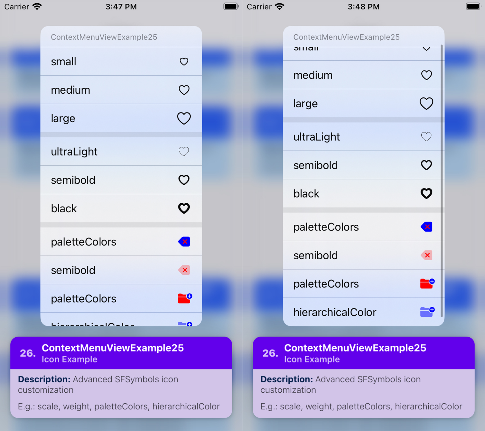


<br>

### `ContextMenuView` Example 26

**Summary**:  Icon Example — Network/Remote images as icons.

<br>

| Notes |
| ----- |
| TBA   |

<br>

[🔗 Full Example](./example/srcexamples/ContextMenuViewExample26.tsx)

```jsx

// 📝 Note: for the sake of brevity, some of the code is omitted...
export function ContextMenuViewExample26(props) {
  return (
    <ContextMenuView
      menuConfig={{
        menuTitle: 'ContextMenuViewExample26',
        menuItems: [{
          actionKey  : 'key-01'   ,
          actionTitle: 'Action #1',
          menuSubtitle: 'Use "IMAGE_REMOTE_URL" icon',
          icon: {
            type: 'IMAGE_REMOTE_URL',
            imageValue: {
              url: 'https://picsum.photos/id/1/100'
            },
          }
        }, {
          actionKey  : 'key-02'   ,
          actionTitle: 'Action #2',
          menuSubtitle: '"IMAGE_REMOTE_URL" + shouldLazyLoad',
          icon: {
            type: 'IMAGE_REMOTE_URL',
            imageValue: {
              url: 'https://picsum.photos/id/2/100'
            },
            imageLoadingConfig: {
              shouldLazyLoad: true,
            },
            imageOptions: {
              cornerRadius: 15,
            },
          }
        }, {
          actionKey  : 'key-03'   ,
          actionTitle: 'Action #3',
          menuSubtitle: '"IMAGE_REMOTE_URL" + shouldLazyLoad + shouldCache',
          icon: {
            type: 'IMAGE_REMOTE_URL',
            imageValue: {
              url: 'https://picsum.photos/id/2/100'
            },
            imageLoadingConfig: {
              shouldLazyLoad: true,
              shouldCache: true,
            },
            imageOptions: {
              cornerRadius: 30,
              tint: 'rgba(255,0,0,0.5)',
              renderingMode: 'alwaysOriginal',
            },
          }
        }],
      }}
    >
      {/** ... */}
    </ContextMenuView>
  );
};
```


<br>

### `ContextMenuView` Example 27

**Summary**:  Icon Example — Network/Remote images as icons + fallback image.

<br>

| Notes |
| ----- |
| TBA   |

<br>

[🔗 Full Example](./example/srcexamples/ContextMenuViewExample27.tsx)

```jsx
// 📝 Note: for the sake of brevity, some of the code is omitted...
export function ContextMenuViewExample27(props) {
  return (
    <ContextMenuView
      menuConfig={{
        menuTitle: 'ContextMenuViewExample27',
        menuItems: [{
          actionKey  : 'key-01'   ,
          actionTitle: 'Action #1',
          actionSubtitle: 'fallbackBehavior: whileNotLoaded',
          icon: {
            type: 'IMAGE_REMOTE_URL',
            imageValue: {
              url: 'https://fake.url.com/asset-1',
              fallbackImage: {
                type: 'IMAGE_SYSTEM',
                imageValue: {
                  systemName: 'trash',
                },
              },
            },
            imageLoadingConfig: {
              // will use the fallback image while the remote
              // image hasn't been loaded yet
              fallbackBehavior: 'whileNotLoaded',
              shouldLazyLoad: true,
              shouldImmediatelyRetryLoading: true,
              maxRetryAttempts: 20,
            },
          }, 
        }, {
          actionKey  : 'key-02'   ,
          actionTitle: 'Action #2',
          actionSubtitle: 'fallbackBehavior: onLoadError',
          icon: {
            type: 'IMAGE_REMOTE_URL',
            imageValue: {
              url: 'https://fake.url.com/asset-2',
              fallbackImage: {
                type: 'IMAGE_SYSTEM',
                imageValue: {
                  systemName: 'trash',
                },
              },
            },
            imageLoadingConfig: {
              // will use the fallback image when it encounters
              // an error whe loading the remote image
              fallbackBehavior: 'onLoadError',
              shouldLazyLoad: true,
              shouldImmediatelyRetryLoading: true,
              maxRetryAttempts: 20,
            },
          }
        },  {
          actionKey  : 'key-03'   ,
          actionTitle: 'Action #3',
          actionSubtitle: 'fallbackBehavior: afterFinalAttempt',
          icon: {
            type: 'IMAGE_REMOTE_URL',
            imageValue: {
              url: 'https://fake.url.com/asset-3',
              fallbackImage: {
                type: 'IMAGE_SYSTEM',
                imageValue: {
                  systemName: 'trash',
                },
              },
            },
            imageLoadingConfig: {
              // will use the fallback image when it encounters
              // an error whe loading the remote image, and the
              // number of loading attempts exceeds 
              // `maxRetryAttempts` 
              fallbackBehavior: 'afterFinalAttempt',
              shouldLazyLoad: true,
              shouldImmediatelyRetryLoading: true,
              maxRetryAttempts: 20,
            },
          }
        }],
      }}
    >
      {/** ... */}
    </ContextMenuView>
  );
};

```


<br>

### `ContextMenuView` Example 28

**Summary**:  Programmatically shows the context menu

<br>

| Notes |
| ----- |
| TBA   |

<br>

[🔗 Full Example](./example/srcexamples/ContextMenuViewExample28.tsx)

```jsx
// 📝 Note: for the sake of brevity, some of the code is omitted...
export function ContextMenuViewExample28(props) {
  const menuRef = React.useRef<ContextMenuView>(null);
  
  return (
    <ContextMenuView
      ref={menuRef}
      menuConfig={{ /* ... */ }}
    >
      <ContextMenuCard /* ... */>
        <CardButton
          title={'Show Context Menu'}
          subtitle={'Programmatically shows the context menu'}
          onPress={() => {
            menuRef.current?.presentMenu();
          }}
        />
      </ContextMenuCard>
    </ContextMenuView>
  );
};

```

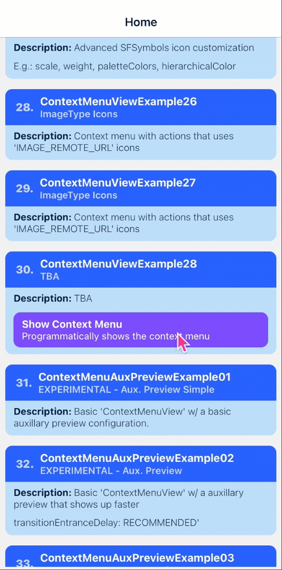

<br>

### `ContextMenuView` Auxiliary Preview - Example 01

**Summary**: TBA

<br>

| Notes                    |
| ------------------------ |
| TBA<br><br>📝 **Note A**: |

<br>

[🔗 Full Example](./example/srcexamples/ContextMenuAuxPreviewExample01.tsx)

```jsx
// 📝 Note: for the sake of brevity, some of the code is omitted...
export function ContextMenuAuxPreviewExample01() {
  return (
    <ContextMenuView
      menuConfig={{
        // ...
      }}
      isAuxiliaryPreviewEnabled={true}
      renderAuxiliaryPreview={() => (
        <View style={[styles.auxRootContainer, {
          // The view you return will be wrapped by another view. 
          // The parent view will be resized to match the width of the aux. 
          // preview.
          //
          // since this view is going to be resized, let's stretch to match the 
          // the size of the parent, and center the content
          flex: 1,
          alignItems: 'center',
          justifyContent: 'center',
        }]}>
          <TouchableOpacity style={styles.buttonContainer}>
            { /** ... */ }
          </TouchableOpacity>
        </View>
      )}
    >
      {/** ... */}
    </ContextMenuView>
  );
};
```

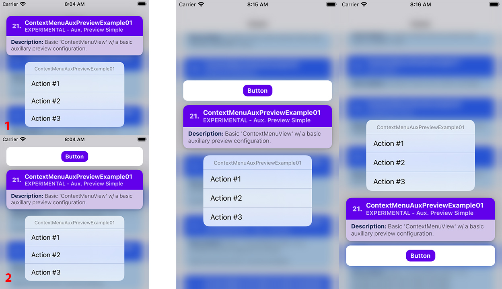


<br>

### `ContextMenuView` Auxiliary Preview - Example 02

**Summary**: TBA

<br>

| Notes                    |
| ------------------------ |
| TBA<br><br>📝 **Note A**: |

<br>

[🔗 Full Example](./example/srcexamples/ContextMenuAuxPreviewExample02.tsx)

```jsx
// 📝 Note: for the sake of brevity, some of the code is omitted...
export function ContextMenuAuxPreviewExample02() {
  return (
    <ContextMenuView
      menuConfig={{
        // ...
      }}
      // If you want to immediately show the aux. preview, then
      // set `transitionEntranceDelay` to: `RECOMMENDED`.
      // 
      // The default is: `AFTER_PREVIEW`.
      //
      // You can also pass in a number indicating how long delay
      // is in seconds  (e.g. 0.3).
      //
      // Note: Do not pass in a number below 0.25 to avoid any
      // layout bugs...
      auxiliaryPreviewConfig={{
        transitionEntranceDelay: 'RECOMMENDED'
      }}
      renderAuxiliaryPreview={() => (
        <View style={styles.auxRootContainer}>
          <Text style={styles.textLabel}>
            Faster Transition
          </Text>
        </View>
      )}
    >
      {/** ... */}
    </ContextMenuView>
  );
};
```

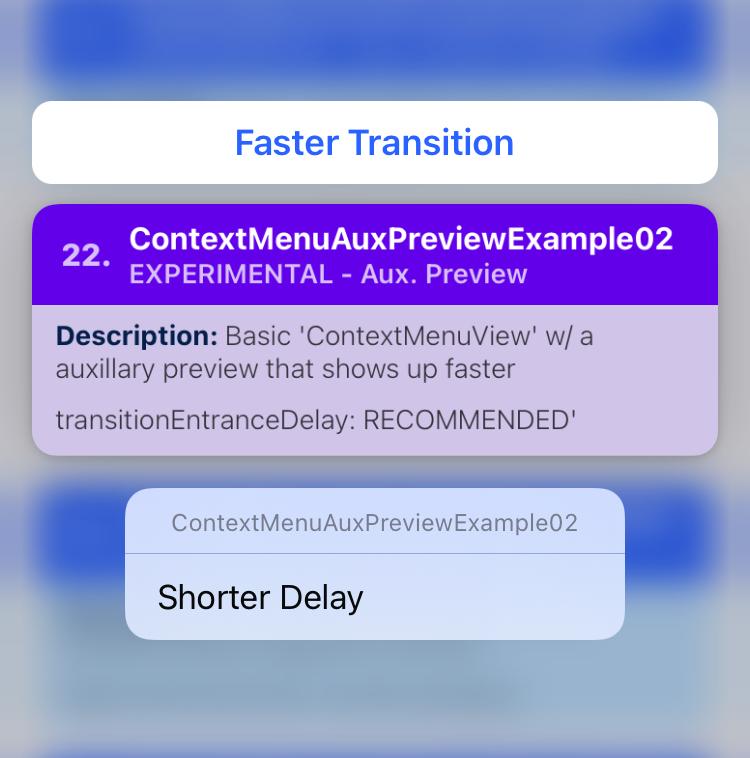


<br>

### `ContextMenuView` Auxiliary Preview - Example 03

**Summary**: TBA

<br>

| Notes                    |
| ------------------------ |
| TBA<br><br>📝 **Note A**: |

<br>

[🔗 Full Example](./example/srcexamples/ContextMenuAuxPreviewExample03.tsx)

```jsx
// 📝 Note: for the sake of brevity, some of the code is omitted...
export function ContextMenuAuxPreviewExample03() {
  return (
    <ContextMenuView
      menuConfig={{
        // ...
      }}
      auxiliaryPreviewConfig={{
        // Align the aux. preview to the left...
        // 📝 Note: By default, this is set to: `stretchPreview`
        alignmentHorizontal: 'previewLeading',
      }}
      renderAuxiliaryPreview={() => (
        <View style={styles.auxRootContainer}>
          <Text style={styles.textLabel}>
            To the left (to the left)
          </Text>
        </View>
      )}
    >
      {/** ... */}
    </ContextMenuView>
  );
};
```

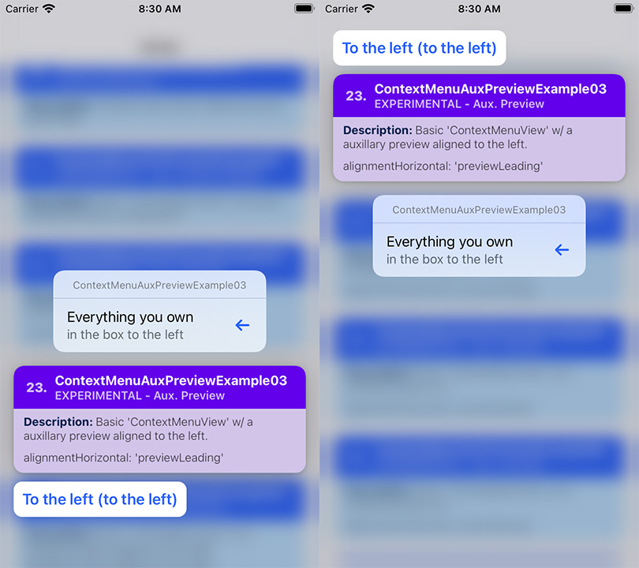


<br>

### `ContextMenuView` Auxiliary Preview - Example 04

**Summary**: TBA

<br>

| Notes                    |
| ------------------------ |
| TBA<br><br>📝 **Note A**: |

<br>

[🔗 Full Example](./example/srcexamples/ContextMenuAuxPreviewExample04.tsx)

```jsx
// 📝 Note: for the sake of brevity, some of the code is omitted...
export function ContextMenuAuxPreviewExample04() {
  return (
    <ContextMenuView
      menuConfig={{
        // ...
      }}
      auxiliaryPreviewConfig={{
        // Align the aux. preview to the right...
        // 📝 Note: By default, this is set to: `stretchPreview`
        alignmentHorizontal: 'previewTrailing',
      }}
      renderAuxiliaryPreview={() => (
        <View style={styles.auxRootContainer}>
          <Text style={styles.textLabel}>
            Yeah right, yeah right
          </Text>
        </View>
      )}
    >
      {/** ... */}
    </ContextMenuView>
  );
};
```


<br>

### `ContextMenuView` Auxiliary Preview - Example 05

**Summary**: TBA

<br>

| Notes                    |
| ------------------------ |
| TBA<br><br>📝 **Note A**: |

<br>

[🔗 Full Example](./example/srcexamples/ContextMenuAuxPreviewExample05.tsx)

```jsx
// 📝 Note: for the sake of brevity, some of the code is omitted...
export function ContextMenuAuxPreviewExample05() {
  return (
    <ContextMenuView
      menuConfig={{
        // ...
      }}
      // Align the aux. preview to the center of the context
      // menu preview...
      //
      // 📝 Note: By default, this is set to: `stretchPreview`
      auxiliaryPreviewConfig={{
        alignmentHorizontal: 'previewCenter',
      }}
      renderAuxiliaryPreview={() => (
        <View style={styles.auxRootContainer}>
          <Text style={styles.textLabel}>
            Center
          </Text>
        </View>
      )}
    >
      { /** ... */ }
    </ContextMenuView>
  );
};
```

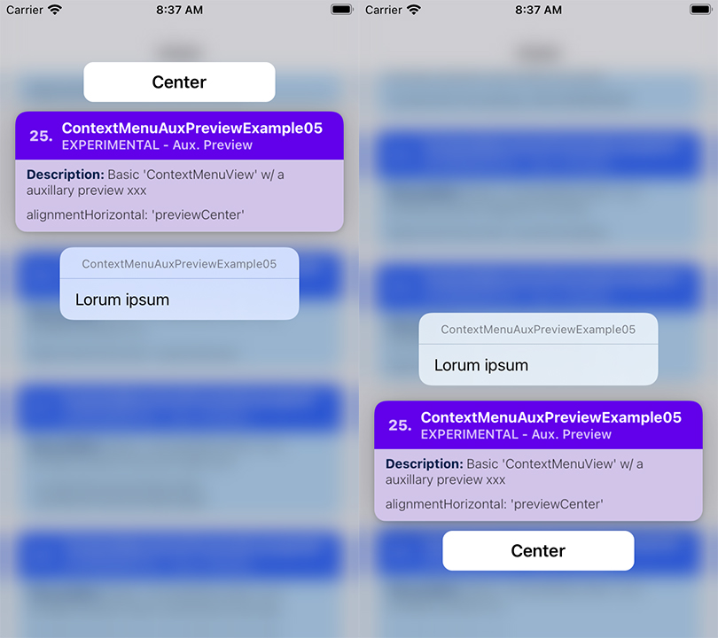


<br>

### `ContextMenuView` Auxiliary Preview - Example 06

**Summary**: TBA

<br>

| Notes                    |
| ------------------------ |
| TBA<br><br>📝 **Note A**: |

<br>

[🔗 Full Example](./example/srcexamples/ContextMenuAuxPreviewExample06.tsx)

```jsx
// 📝 Note: for the sake of brevity, some of the code is omitted...
export function ContextMenuAuxPreviewExample06(props) {
  return (
    <ContextMenuView
      menuConfig={{
        // ...
      }}
      auxiliaryPreviewConfig={{
        // Configure the aux. preview to use the entire width of
        // the screen...
        //
        // 📝 Note: By default, this is set to: `stretchPreview`
        alignmentHorizontal: 'stretchScreen',
      }}
      renderAuxiliaryPreview={() => (
        <View style={styles.auxRootContainer}>
          <View style={styles.innerContainer}>
            <Text style={styles.textLabel}>
              Stretch to Edges of Screen
            </Text>
          </View>
        </View>
      )}
    >
      {/** ... */}
    </ContextMenuView>
  );
};
```

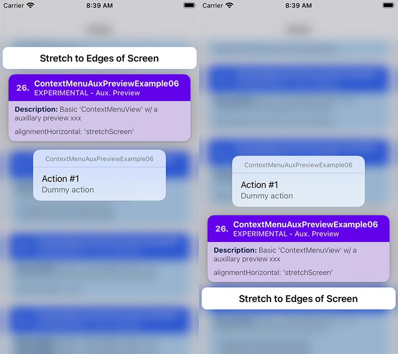


<br>

### `ContextMenuView` Auxiliary Preview - Example 07

**Summary**: TBA

<br>

| Notes                    |
| ------------------------ |
| TBA<br><br>📝 **Note A**: |

<br>

[🔗 Full Example](./example/srcexamples/ContextMenuAuxPreviewExample07.tsx)

```jsx
// 📝 Note: for the sake of brevity, some of the code is omitted...
export function ContextMenuAuxPreviewExample07(props) {
  return (
    <ContextMenuView
      menuConfig={{
        // ...
      }}
      auxiliaryPreviewConfig={{
        // Configure the aux. preview to have a fixed size 
        // of 100 x 100
        width: 100,
        height: 100,
        alignmentHorizontal: 'previewCenter',
      }}
      renderAuxiliaryPreview={() => (
        <View style={[styles.auxRootContainer, {
          // Parent has been reized to `100x100`,
          // so fit to the size of the parent view...
          flex: 1,
        }]}>
          <Text style={styles.textLabel}>
            100
          </Text>
          <Text style={styles.textLabel}>
            x
          </Text>
          <Text style={styles.textLabel}>
            100
          </Text>
        </View>
      )}
    >
      {/** ... */}
    </ContextMenuView>
  );
};
```

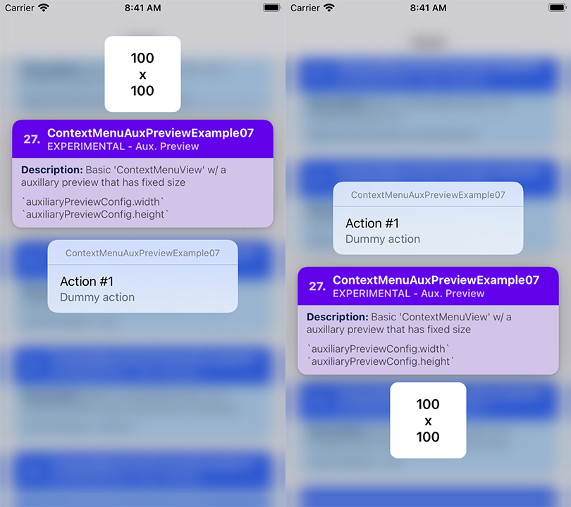


<br>

### `ContextMenuView` Auxiliary Preview - Example 08

**Summary**: TBA

<br>

| Notes                    |
| ------------------------ |
| TBA<br><br>📝 **Note A**: |

<br>

[🔗 Full Example](./example/srcexamples/ContextMenuAuxPreviewExample08.tsx)

```jsx
// 📝 Note: for the sake of brevity, some of the code is omitted...
export function ContextMenuAuxPreviewExample08(props) {
  return (
    <ContextMenuView
      menuConfig={{
        menuTitle: 'ContextMenuAuxPreviewExample08',
      }}
      auxiliaryPreviewConfig={{
        // Configure the aux. preview to always appear on top of
        // the context menu preview...
        //
        // 📝 Note: This is set to `automatic` by default.
        anchorPosition: 'top',
      }}
      renderAuxiliaryPreview={() => (
        // ...
      )}
    >
      {/** ... */}
    </ContextMenuView>
  );
};
```

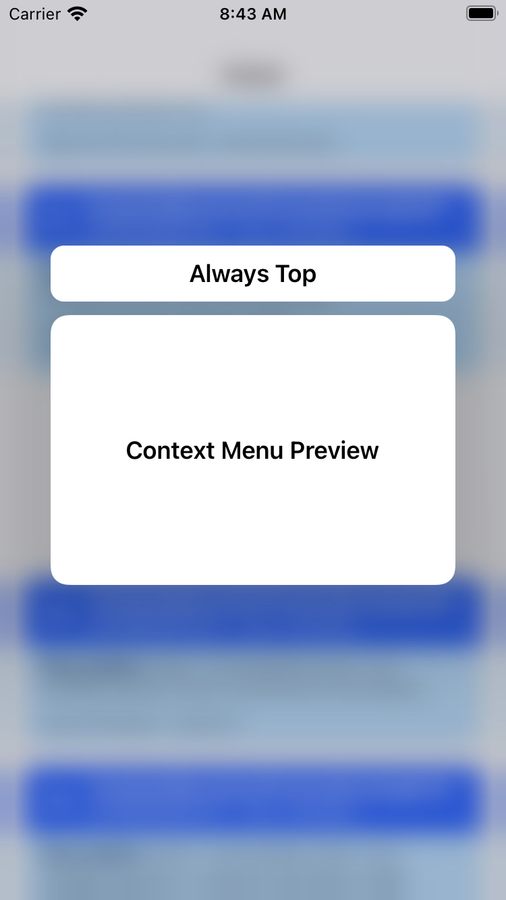


<br>

### `ContextMenuView` Auxiliary Preview - Example 09

**Summary**: TBA

<br>

| Notes                    |
| ------------------------ |
| TBA<br><br>📝 **Note A**: |

<br>

[🔗 Full Example](./example/srcexamples/ContextMenuAuxPreviewExample09.tsx)

```jsx
export function ContextMenuAuxPreviewExample09(props) {
  return (
    <ContextMenuView
      // ...
      auxiliaryPreviewConfig={{
        // Configure the aux. preview to always appear on the
        // bottom of the context menu preview...
        //
        // 📝 Note: This is set to `automatic` by default.
        anchorPosition: 'bottom',
      }}
      renderAuxiliaryPreview={() => (
        <View style={styles.auxRootContainer}>
          <Text style={styles.textLabel}>
            Always Bottom
          </Text>
        </View>
      )}
    >
      {/** ... */}
    </ContextMenuView>
  );
};
```

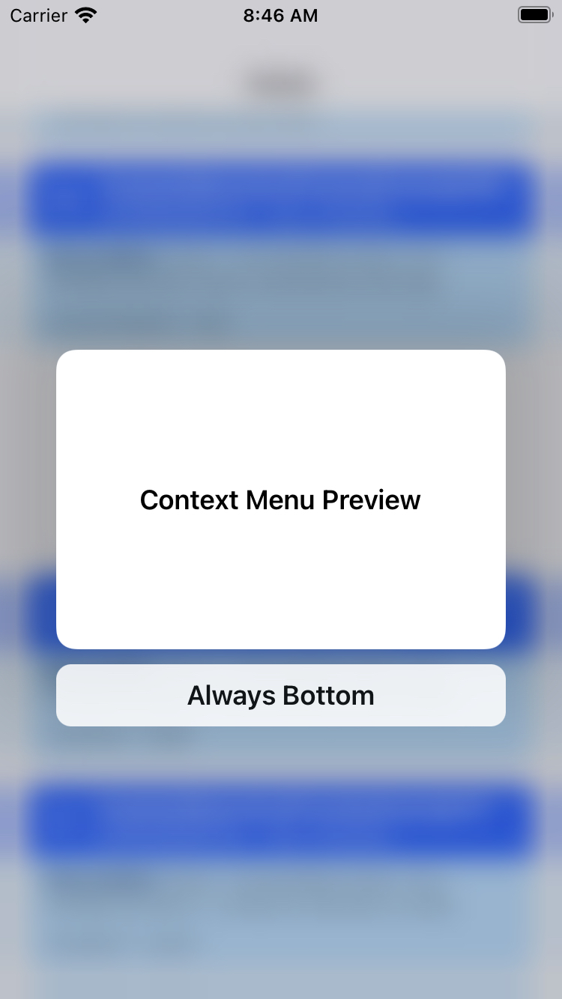


<br>

### `ContextMenuView` Auxiliary Preview - Example 10

**Summary**: TBA

<br>

| Notes                    |
| ------------------------ |
| TBA<br><br>📝 **Note A**: |

<br>

[🔗 Full Example](./example/srcexamples/ContextMenuAuxPreviewExample10.tsx)

```jsx
// 📝 Note: for the sake of brevity, some of the code is omitted...
export function ContextMenuAuxPreviewExample10(props) {
  return (
    <ContextMenuView
      menuConfig={{
        // ...
      }}
      auxiliaryPreviewConfig={{
        // configure the entrance transition for the aux.
        // preview to use a 'slide' transition...
        transitionEntranceDelay: 0.5,
        transitionConfigEntrance: {
          transition: 'slide',
          duration: 0.4,
          options: ['curveEaseIn'],
        },
      }}
      renderAuxiliaryPreview={() => (
        // ...
      )}
    >
      {/** .... */}
    </ContextMenuView>
  );
};
```

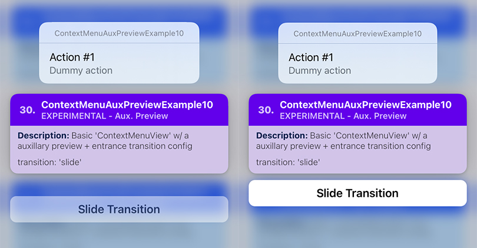


<br>

### `ContextMenuView` Auxiliary Preview - Example 11

**Summary**: TBA

<br>

| Notes                    |
| ------------------------ |
| TBA<br><br>📝 **Note A**: |

<br>

[🔗 Full Example](./example/srcexamples/ContextMenuAuxPreviewExample11.tsx)

```jsx
// 📝 Note: for the sake of brevity, some of the code is omitted...
export function ContextMenuAuxPreviewExample11(props) {
  return (
    <ContextMenuView
      menuConfig={{
        // ...
      }}
      auxiliaryPreviewConfig={{
        // configure the entrance transition for the aux.
        // preview to use a 'zoom' transition...
        transitionConfigEntrance: {
          transition: 'zoom',
          duration: 0.5,
          options: ['curveEaseOut'],
        },
      }}
      renderAuxiliaryPreview={() => (
        // ...
      )}
    >
      {/** ... */}
    </ContextMenuView>
  );
};
```

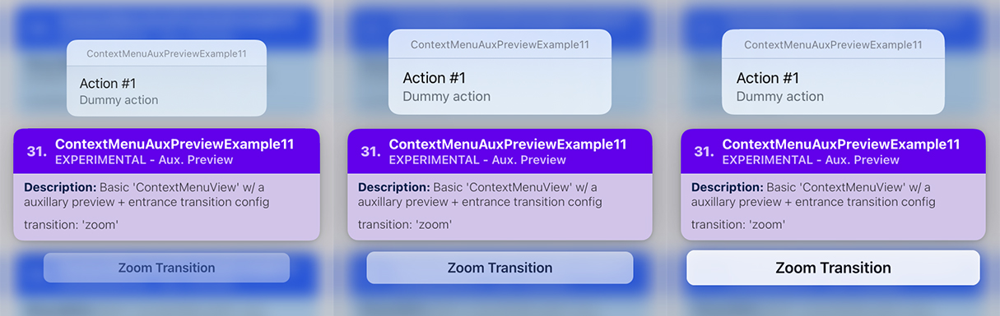


<br>

### `ContextMenuView` Auxiliary Preview - Example 12

**Summary**: TBA

<br>

| Notes                    |
| ------------------------ |
| TBA<br><br>📝 **Note A**: |

<br>

[🔗 Full Example](./example/srcexamples/ContextMenuAuxPreviewExample12.tsx)

```jsx
// 📝 Note: for the sake of brevity, some of the code is omitted...
export function ContextMenuAuxPreviewExample12(props) {
  return (
    <ContextMenuView
      menuConfig={{
        // ...
      }}
      auxiliaryPreviewConfig={{
        transitionConfigEntrance: {
          // configure the entrance transition for the aux.
          // preview to use a 'zoom' transition...
          transition: 'zoomAndSlide',
          duration: 0.4,
          options: ['curveEaseInOut'],

          // change transition offsets
          zoomOffset: 0.2,
          slideOffset: 100,
        },
      }}
      renderAuxiliaryPreview={() => (
        // ...
      )}
    >
      {/** ... */}
    </ContextMenuView>
  );
};
```

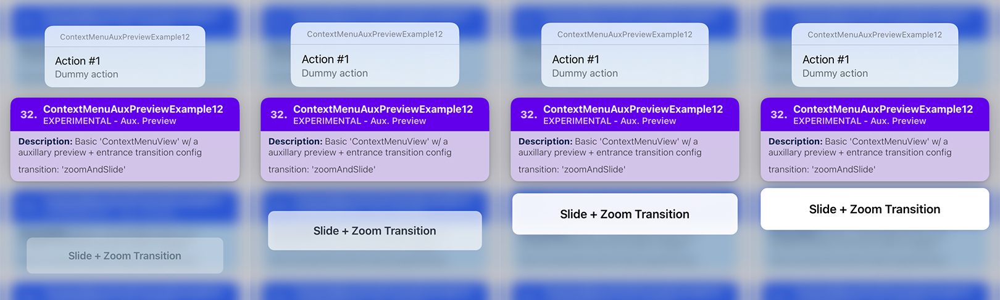


<br>

### `ContextMenuView` Auxiliary Preview - Example 13

**Summary**: TBA

<br>

| Notes                    |
| ------------------------ |
| TBA<br><br>📝 **Note A**: |

<br>

[🔗 Full Example](./example/srcexamples/ContextMenuAuxPreviewExample13.tsx)

```jsx
// 📝 Note: for the sake of brevity, some of the code is omitted...
export function ContextMenuAuxPreviewExample13(props) {
  return (
    <ContextMenuView
      menuConfig={{
        // ...
      }}
      auxiliaryPreviewConfig={{
        // Add some space between the aux. preview, and the
        // menu preview...
        marginPreview: 30,
      }}
      renderAuxiliaryPreview={() => (
        // ...
      )}
    >
      {/** ... */}
    </ContextMenuView>
  );
};
```

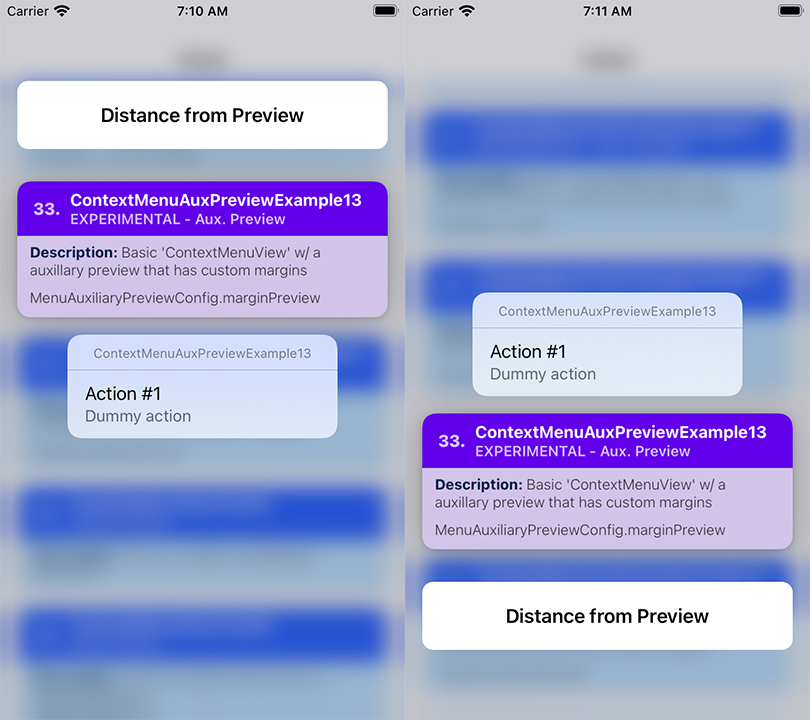


<br>

### `ContextMenuView` Auxiliary Preview - Example 14

**Summary**: TBA

<br>

| Notes                    |
| ------------------------ |
| TBA<br><br>📝 **Note A**: |

<br>

[🔗 Full Example](./example/srcexamples/ContextMenuAuxPreviewExample14.tsx)

```jsx
// 📝 Note: for the sake of brevity, some of the code is omitted...
export function ContextMenuAuxPreviewExample14(props) {
  return (
    <ContextMenuView
      menuConfig={{
        // ...
      }}
      auxiliaryPreviewConfig={{
        // Add some space between the edges of the screen and
        // the aux. preview...
        marginAuxiliaryPreview: 30,
      }}
      renderAuxiliaryPreview={() => (
        // ...
      )}
    >
      {/** ... */}
    </ContextMenuView>
  );
};
```

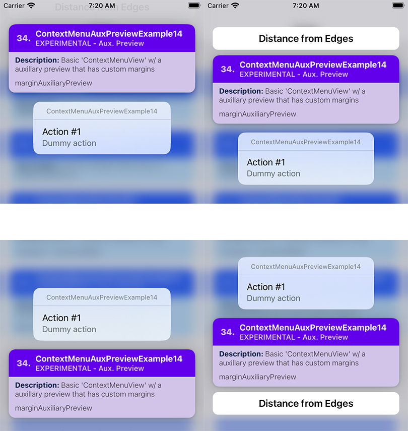


<br>


### `ContextMenuView` Auxiliary Preview - Example 15

**Summary**: TBA

<br>

| Notes                    |
| ------------------------ |
| TBA<br><br>📝 **Note A**: |

<br>

[🔗 Full Example](./example/srcexamples/ContextMenuAuxPreviewExample15.tsx)

```jsx
// 📝 Note: for the sake of brevity, some of the code is omitted...

export function ContextMenuAuxPreviewExample15(props) {
  return (
    <ContextMenuView
      menuConfig={{
        // ...
      }}
      auxiliaryPreviewConfig={{
        // ...
        
        // The space between the aux. preview, and the
        // menu preview...
        // 
        // A negative value means that you want the aux. preview
        // to appear closer to the menu preview.
        //
        // This is particularly useful if the menu preview is
        // too big, and it causes the menu items to go out of 
        // bounds...
        marginPreview: -60,
      }}
      renderAuxiliaryPreview={() => (
        <View style={[styles.auxRootContainer, {
          alignItems: 'center',
          justifyContent: 'center',
        }]}>
          <Text style={styles.textLabel}>
            Aux. Preview
          </Text>
        </View>
      )}
      previewConfig={{
        previewType: 'CUSTOM',
        previewSize: 'STRETCH',
      }}
      renderPreview={() => (
        <View style={[styles.previewRootContainer, {
          alignItems: 'center',
          justifyContent: 'center',
        }]}>
          <Text style={styles.textLabel}>
            Custom Menu Preview
          </Text>
        </View>
      )}
    >
      {/** ... */}
    </ContextMenuView>
  );
};
```

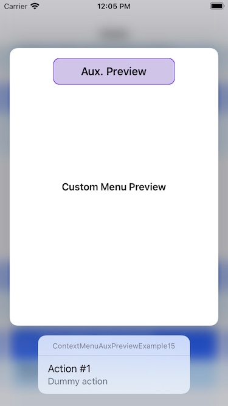


<br>

### `ContextMenuView` Auxiliary Preview - Example 16

**Summary**:  Programmatically shows the auxiliary preview as a popover, without showing the context menu.

<br>

| Notes |
| ----- |
| TBA   |

<br>

[🔗 Full Example](./example/srcexamples/ContextMenuViewExampleXX.tsx)

```jsx
// 📝 Note: for the sake of brevity, some of the code is omitted...
export function ContextMenuAuxPreviewExample16(props) {
  const menuRef = React.useRef<ContextMenuView>(null);
  
  return (
    <ContextMenuView
      ref={menuRef}
      menuConfig={/* ... */}
      auxiliaryPreviewConfig={{
        alignmentHorizontal: 'previewCenter',
        transitionEntranceDelay: 'RECOMMENDED',
        height: 100,
        width: 150,
      }}
      renderAuxiliaryPreview={() => (
        <View style={[styles.auxRootContainer, {
          flex: 1,
          alignItems: 'center',
          justifyContent: 'center',
        }]}>
          <Text style={styles.textLabel}>
            Center
          </Text>
        </View>
      )}
    >
      <ContextMenuCard /* ... */>
        <CardButton
          title={'Show Aux. Preview as Popover'}
          onPress={() => {
            menuRef.current?.showAuxiliaryPreviewAsPopover();
          }}
        />
      </ContextMenuCard>
    </ContextMenuView>
  );
};
```

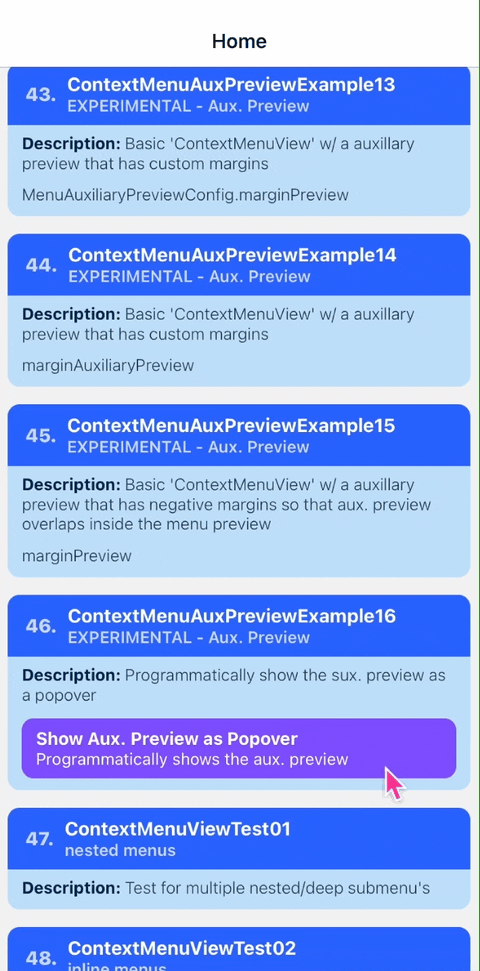

<br>

### `ContextMenuButton` Example 01

**Summary**: TBA

<br>

| Notes                    |
| ------------------------ |
| TBA<br><br>📝 **Note A**: |

<br>

[🔗 Full Example](./example/srcexamples/ContextMenuButtonExample01.tsx)

```jsx
 // 📝 Note: for the sake of brevity, some of the code is omitted...

import { ContextMenuButton } from 'react-native-ios-context-menu';

export function ContextMenuButtonExample01() {
  return (
    <ContextMenuButton
      menuConfig={{
        menuTitle: 'ContextMenuButtonSimpleExample01',
          menuItems: [{
            actionKey  : 'key-01',
            actionTitle: 'Action #1',
          }, {
            actionKey  : 'key-02'   ,
            actionTitle: 'Action #2',
          }, {
            actionKey  : 'key-03'   ,
            actionTitle: 'Action #3',
          }],
      }}
      onPressMenuItem={({nativeEvent}) => {
        Alert.alert(
          'onPressMenuItem Event',
          `actionKey: ${nativeEvent.actionKey} - actionTitle: ${nativeEvent.actionTitle}`
        );
      }}
    >
      {/** Components */}
    </ContextMenuButton>
  );
};
```

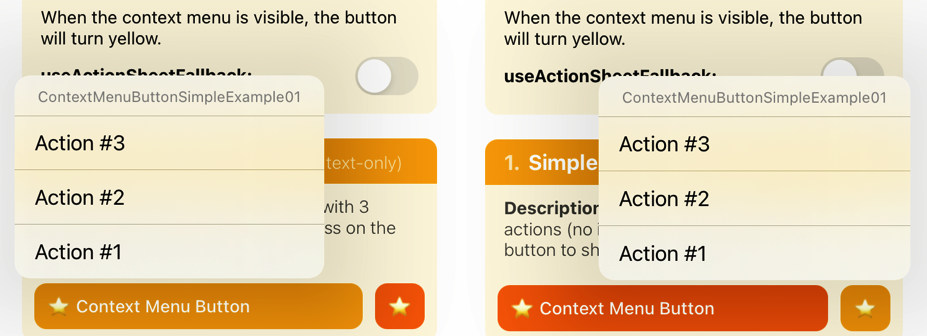


<br>

### `ContextMenuButton` Example 02

**Summary**: TBA

<br>

| Notes                    |
| ------------------------ |
| TBA<br><br>📝 **Note A**: |

<br>

[🔗 Full Example](./example/srcexamples/ContextMenuButtonExample02.tsx)

```jsx
 // 📝 Note: for the sake of brevity, some of the code is omitted...
import { ContextMenuButton } from 'react-native-ios-context-menu';

export function ContextMenuButtonExample02(props) {
  return (
    <ContextMenuButton
      isMenuPrimaryAction={true}
      menuConfig={{
        menuTitle: 'ContextMenuButtonSimpleExample02',
        menuItems: [{
          actionKey  : 'key-01',
          actionTitle: 'Action #1',
          icon: {
            type: 'IMAGE_SYSTEM',
            imageValue: {
              systemName: 'folder',
            },
          }
        }, {
          actionKey  : 'key-02'   ,
          actionTitle: 'Action #2',
          icon: {
            type: 'IMAGE_SYSTEM',
            imageValue: {
              systemName: 'dial.fill',
            },
          }
        }, {
          actionKey  : 'key-03'   ,
          actionTitle: 'Action #3',
          icon: {
            type: 'IMAGE_SYSTEM',
            imageValue: {
              systemName: 'archivebox.fill',
            },
          }
        }],
      }}
      onPressMenuItem={({nativeEvent}) => {
        Alert.alert(
          'onPressMenuItem Event',
          `actionKey: ${nativeEvent.actionKey} - actionTitle: ${nativeEvent.actionTitle}`
        );
      }}
    >
      {/** Components */}
    </ContextMenuButton>
  );
};
```


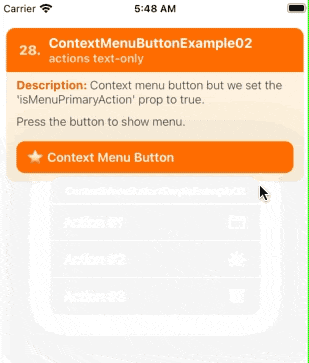

<br><br>

## F. Showcase, Tests and Demos

### `ContextMenuView` Test 01

**Summary**: Test for multiple nested/deep submenus.

[🔗 Source Code](example/src/examples/ContextMenuViewTest01.tsx)

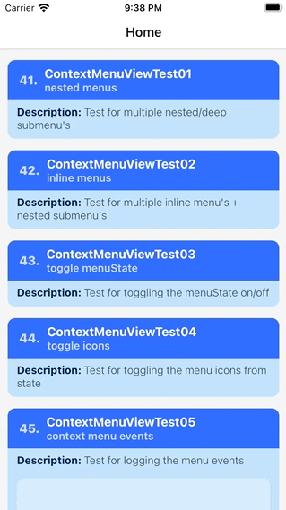

<br>

### `ContextMenuView` Test 02

**Summary**: Test for multiple inline menus + nested submenus.

[🔗 Source Code](example/src/examples/ContextMenuViewTest02.tsx)

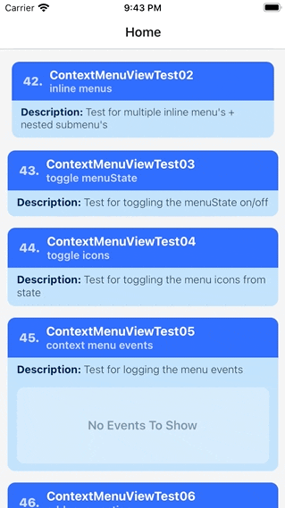

<br>

### `ContextMenuView` Test 03

**Summary**: Test for toggling the `menuState` on and off.

[🔗 Source Code](example/src/examples/ContextMenuViewTest03.tsx)

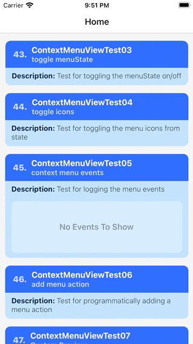

<br>

### `ContextMenuView` Test 04

**Summary**: Test for changing the menu icons based on the current `menuState`.

[🔗 Source Code](example/src/examples/ContextMenuViewTest04.tsx)

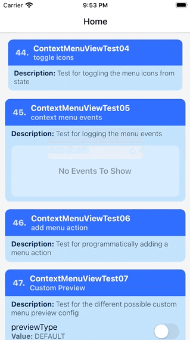

<br>

### `ContextMenuView` Test 05

**Summary**: Test for logging all the menu-related events.

[🔗 Source Code](example/src/examples/ContextMenuViewTest05.tsx)

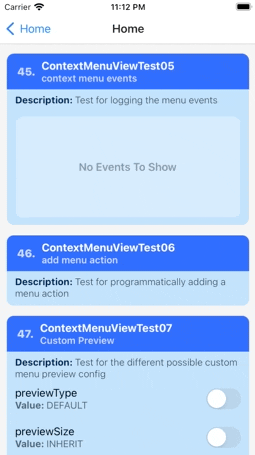

<br>

### `ContextMenuView` Test 06

**Summary**: Test for programmatically adding a menu action item.

[🔗 Source Code](example/src/examples/ContextMenuViewTest06.tsx)

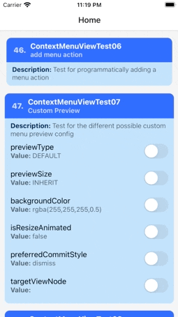

<br>

### `ContextMenuView` Test 07

**Summary**: Test for checking the different possible custom menu preview configurations.

[🔗 Source Code](example/src/examples/ContextMenuViewTest07.tsx)

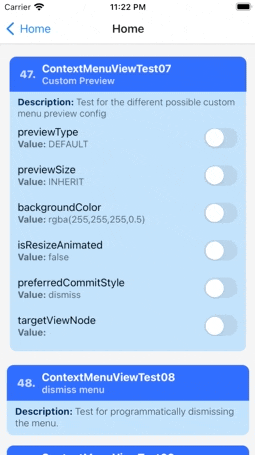

<br>

### `ContextMenuView` Test 08

**Summary**: Test for programmatically dismissing the menu.

[🔗 Source Code](example/src/examples/ContextMenuViewTest08.tsx)

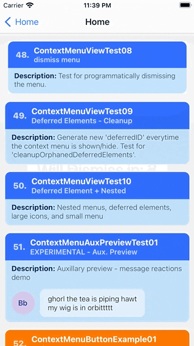

<br>

### `ContextMenuView` Test 09

**Summary**: Generate new 'deferredID' everytime the context menu is shown/hide. This is a test for `cleanupOrphanedDeferredElements`.

[🔗 Source Code](example/src/examples/ContextMenuViewTest09.tsx)

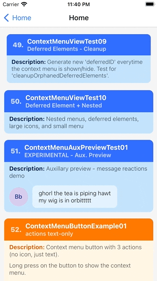

<br>

### `ContextMenuView` Test 10

**Summary**: Test for nested menus, deferred elements, large icons, and small menus,

[🔗 Source Code](example/src/examples/ContextMenuViewTest10.tsx)

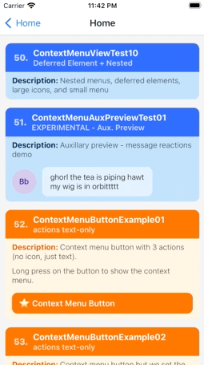

<br>

### `ContextMenuAuxPreview` Test 01

**Summary**: TBA

[🔗 Source Code](example/src/examples/ContextMenuAuxPreviewTest01.tsx)

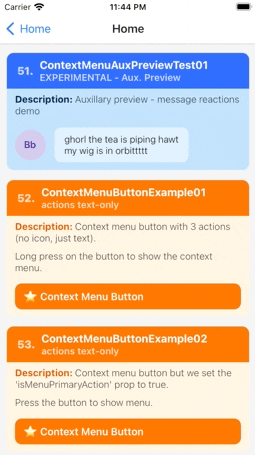

<br>

### `Test02Screen` 

**Summary**: Repro for [Issue #43](https://github.com/dominicstop/react-native-ios-context-menu/issues/43) 

[🔗 Source Code](example/src/screens/Test02Screen.tsx)

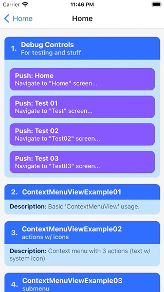

<br>

### `Test03Screen` 

**Summary**: Repro for [Issue #47](https://github.com/dominicstop/react-native-ios-context-menu/issues/47)

[🔗 Source Code](example/src/screens/Test03Screen.tsx)

## E. Usage And Examples

### `ContextMenuView` Example 01

**Summary**: A basic context menu that has 3 menu action items (e.g. "Action #1", "Action #2", and "Action #3").

<br>

| Notes                                                        |
| :----------------------------------------------------------- |
| 1️⃣ — The `ContextMenuView.menuConfig` prop accepts an optional `MenuConfig` object. <br/>This object will be used to create and configure the context menu. |
| 2️⃣ — You can set the context menu title via passing a string value to the `MenuConfig.menuTitle` property.<br><br>📝 **Note**: You can pass an empty string if you don't want a title to appear on top your context menu. |
| 3️⃣ — To populate the context menu with action items, you can pass a `MenuActionConfig` object in the `MenuConfig.menuItems` property.<br><br>📝 **Note A**: The `MenuConfig.menuItems` property can accept an array of a `MenuElementConfig` union type.<br><br>To be more specific, the `menuItems` property can accept an array containing any of the following object types:  `MenuConfig` object, `MenuActionConfig`, and `DeferredMenuElementConfig`.<br/><br/>📝 **Note B**: If you pass in a `MenuConfig` object in the  `MenuConfig.menuItems` property, it means that you want to create a submenu. See [`ContextMenuView` Example 03](#ContextMenuView-Example-03) for more details.<br/><br/>📝 **Note C**: If you pass in a `DeferredMenuElementConfig` object in the  `MenuConfig.menuItems` property, it means that you want to create a deferred menu item (i.e. a menu item that has a loading indicator). See [`ContextMenuView` Example 19](#ContextMenuView-Example-19) for more details. |
| 4️⃣ — A `MenuActionConfig` object represents an action item in the context menu (e.g. copy, paste, delete, etc).<br><br>As such, if you pass in a `MenuActionConfig` object to `MenuConfig.menuItems`, it means that you want to create a context menu action.<br/><br/>📝 **Note A**: The `MenuActionConfig.actionKey` property serves as a unique identifier for your menu action. If you have multiple menu actions, the `actionKey` will help you differentiate them.<br><br>📝 **Note B**: You will receive the value you passed in `MenuActionConfig.actionKey` in the `ContextMenuView.onPressMenuItem` event (i.e. via the  `nativeEvent` object). |
| 5️⃣ — You can use the `ContextMenuView.onPressMenuItem` event prop to get notified whenever a menu action item has been selected.<br><br>The function you pass to the `onPressMenuItem` prop will receive a `OnPressMenuItemEventObject` object.<br/><br/>📝 **Note A**: Details about the selected menu action item can be accessed via the `OnPressMenuItemEventObject.nativeEvent` object.<br><br>E.g. `OnPressMenuItemEventObject``.nativeEvent.actionKey`.<br/><br/>📝 **Note B**: If `ContextMenuView.shouldWaitForMenuToHide`<br/>`BeforeFiringOnPressMenuItem` prop is set to `true` (which it is by default), then this event will fire after the `onMenuDidHide` event is triggered. |

<br>

[🔗 Full Example](./example/src/examples/ContextMenuViewExample01.tsx)

```jsx
// 📝 Note: for the sake of brevity, some of the code is omitted...
import { ContextMenuView } from 'react-native-ios-context-menu';

export function ContextMenuViewExample01(props) {
  return (
    <ContextMenuView
      menuConfig={{
        // Note: If you don't want a menu title to appear for your
        // context menu, you can just pass in an empty string
        menuTitle: 'ContextMenuViewExample01',
        menuItems: [{
          actionKey  : 'key-01',
          actionTitle: 'Action #1',
        }, {
          actionKey  : 'key-02'   ,
          actionTitle: 'Action #2',
        }, {
          actionKey  : 'key-03'   ,
          actionTitle: 'Action #3',
        }],
      }}
      onPressMenuItem={({nativeEvent}) => {
        Alert.alert(
          'onPressMenuItem Event',
          `actionKey: ${nativeEvent.actionKey} - actionTitle: ${nativeEvent.actionTitle}`
        );
      }}
    >
      {/** Components */}
    </ContextMenuView>
  );
};
```


<br>

### `ContextMenuView` Example 02

**Summary**: Icon Example — This examples shows how to add a system icon in the context menu action.

<br>

| Notes                                                        |
| ------------------------------------------------------------ |
| 1️⃣ — A menu action (i.e. `MenuActionConfig` object) can be configured to show an icon via its `MenuActionConfig.icon` property.<br><br>📝 **Note A**: The `icon` property accepts a `ImageItemConfig` object.<br/><br/>📝 **Note B**: A `ImageItemConfig` object is used to describe images/assets (e.g. SF Symbols icons, images, xcasset images, programmatic images, etc). |
| 2️⃣ — In this example, we want to use a "SF Symbols" icon for the menu action.<br/><br>In order to do this, the `ImageItemConfig.type` property must be set to `"IMAGE_SYSTEM"`.<br><br>📝 **Note A**: Passing in a value of `"IMAGE_SYSTEM"` to the `type` property means that we want to create a "SF Symbols" system icon.<br/><br/>📝 **Note B**: Using a "SF Symbols" icon requires iOS 13+.<br/><br/> 📝 **Note C**: Via the `ImageItemConfig` object, you can also configure the context menu action to use other icons (e.g. `xcasset` items, images, gradients, solid colors, etc).<br/><br/>📝 **Note D**: You can apply a tint to the icon via the `ImageItemConfig.imageOptions` property using the `UIImageConfig.tint` and `UIImageConfig.renderingMode` property. See [`ContextMenuView` Example 17](#ContextMenuView-Example-17) for more details. |
| 3️⃣ — In order to configure what kind of "SF Symbols" icon we want to use for the menu action, we need to pass in a `ImageSystemConfig` object to the  `ImageItemConfig.imageValue` property.<br/><br/>We can set what kind of icon to use via passing a string value to the `ImageSystemConfig.systemName` property.<br/><br/>📝 **Note A**: An `ImageSystemConfig` object is used to generate a "SF Symbols" image. Using this configuration object, we can optionally customize the "SF Symbols" icon further via the following properties:  `pointSize`, `weight`, `scale`, `hierarchicalColor`, `paletteColors`, etc.<br><br>📝 **Note B**: The string value passed to the `ImageSystemConfig.systemName` property must be a valid SF Symbols name.<br/><br/>📝 **Note C**: To view the list of SF Symbols icons (along with their corresponding icon names), you'll need to download the SF Symbols Mac app from [this page](https://developer.apple.com/design/human-interface-guidelines/sf-symbols/overview/). |

<br>

[🔗 Full Example](./example/src/examples/ContextMenuViewExample02.tsx)

```jsx
// 📝 Note: for the sake of brevity, some of the code is omitted...
import { ContextMenuView } from 'react-native-ios-context-menu';

export function ContextMenuViewExample02(props) {
  return (
    <ContextMenuView
      menuConfig={{
        menuTitle: 'ContextMenuViewExample02',
        menuItems: [{
          actionKey  : 'key-01',
          actionTitle: 'Action #1',
          icon: {
            type: 'IMAGE_SYSTEM',
            imageValue: {
              systemName: 'folder',
            },
          }
        }, {
          actionKey  : 'key-02'   ,
          actionTitle: 'Action #2',
          icon: {
            type: 'IMAGE_SYSTEM',
            imageValue: {
              systemName: 'dial.fill',
            },
          }
        }, {
          actionKey  : 'key-03'   ,
          actionTitle: 'Action #3',
          icon: {
            type: 'IMAGE_SYSTEM',
            imageValue: {
              systemName: 'archivebox.fill',
            },
          }
        }],
      }}
    >
      {/** Components */}
    </ContextMenuView>
  );
};
```


<br>

### `ContextMenuView` Example 03

**Summary**: Nested Menu — This example shows a context menu that has a submenu item inside its list of menu actions.

<br>

| Notes                                                        |
| ------------------------------------------------------------ |
| 1️⃣ — A context menu supports having nested menu's (i.e. submenu's).<br><br>A submenu is basically just another menu with it's own separate list of menu actions. Tapping it will show another context menu (visually this is similar to a dropdown menu). |
| 2️⃣ — As mentioned in the earlier examples, the `MenuConfig.menuItems` property can accept a `MenuActionConfig` object, or a `MenuConfig` object.<br/><br/>Passing in a `MenuActionConfig` object to `MenuConfig.menuItems` makes a menu action, conversely passing in a  `MenuConfig` object will create a submenu item.<br/><br/>In other words, to make a submenu, you just need to pass a `MenuConfig` item in the `MenuConfig.menuItems` property.<br/><br/>📝 **Note**: You can nest as many submenu's you want (but just remember that having more than 3 nested submenus is considered bad UX). |

<br>

[🔗 Full Example](./example/src/examples/ContextMenuViewExample03.tsx)

```jsx
 // 📝 Note: for the sake of brevity, some of the code is omitted...
import { ContextMenuView } from 'react-native-ios-context-menu';

export function ContextMenuViewExample03(props) {
  return (
    <ContextMenuView
      menuConfig={{
        menuTitle: 'ContextMenuViewExample03',
        menuItems: [{
          actionKey  : 'key-01',
          actionTitle: 'Action #1',
          icon: {
            type: 'IMAGE_SYSTEM',
            imageValue: {
              systemName: 'folder',
            },
          }
        }, {
          menuTitle: 'Submenu...',
          menuItems: [{
            actionKey  : 'key-01-01',
            actionTitle: 'Submenu Action #1',
            icon: {
              type: 'IMAGE_SYSTEM',
              imageValue: {
                systemName: 'star',
              },
            }
          }, {
            actionKey  : 'key-01-02',
            actionTitle: 'Submenu Action #2',
            icon: {
              type: 'IMAGE_SYSTEM',
              imageValue: {
                systemName: 'star.lefthalf.fill',
              },
            }
          }, {
            actionKey  : 'key-01-03',
            actionTitle: 'Submenu Action #3',
            icon: {
              type: 'IMAGE_SYSTEM',
              imageValue: {
                systemName: 'star.fill',
              },
            }
          }]
        }],
      }}
    >
      {/** Components */}
    </ContextMenuView>
  );
};
```


<br>

### `ContextMenuView` Example 04

**Summary**: Menu Attributes — This example context menu showcases the `MenuActionConfig.menuAttributes` property.

<br>

| Notes                                                        |
| ------------------------------------------------------------ |
| 1️⃣ — The `MenuActionConfig.menuAttributes` property accepts an array of strings (i.e. an array of `MenuAttributes` items).<br><br>In this example, the context menu has 3 actions, each with a different menu attribute assigned to it.<br/><br/>The first menu action is a "disabled" action, i.e. it has it's `menuAttributes` set to `['disabled']`, causing the action title text and icon becomes greyed out. |
| 2️⃣ — The second menu action is a destructive action.<br><br>It has it's `menuAttributes` set to `['destructive']`, causing the action title text and icon becomes red. |
| 3️⃣ — The third menu action is a "hidden" action. It has it's `menuAttributes` set to `['hidden']`.<br/><br/>The menu action is not visible in the menu's list of actions. This is useful for temporarily hiding a menu action item. |
| 4️⃣ — The fourth menu action is a "disabled" + "destructive"  action.<br>Visually, it looks very similar to an action that has the `['disabled']`  attribute. |

<br>

[🔗 Full Example](./example/src/examples/ContextMenuViewExample04.tsx)

```jsx
 // 📝 Note: for the sake of brevity, some of the code is omitted...
import { ContextMenuView } from 'react-native-ios-context-menu';

export function ContextMenuViewExample04(props) {
  return (
    <ContextMenuView
      menuConfig={{
        menuTitle: 'ContextMenuViewExample04',
        menuItems: [{
          actionKey     : 'key-01',
          actionTitle   : 'Disabled Action',
          menuAttributes: ['disabled'],
          icon: {
            type: 'IMAGE_SYSTEM',
            imageValue: {
              systemName: 'folder',
            },
          }
        }, {
          actionKey     : 'key-02'   ,
          actionTitle   : 'Destructive Action',
          menuAttributes: ['destructive'],
          icon: {
            type: 'IMAGE_SYSTEM',
            imageValue: {
              systemName: 'trash',
            },
          }
        }, {
          actionKey     : 'key-03'   ,
          actionTitle   : 'Hidden Action',
          menuAttributes: ['hidden'],
          icon: {
            type: 'IMAGE_SYSTEM',
            imageValue: {
              systemName: 'trash',
            },
          }
        }, {
          actionKey     : 'key-04'   ,
          actionTitle   : 'Disabled/Destructive',
          menuAttributes: ['disabled', 'destructive'],
          icon: {
            type: 'IMAGE_SYSTEM',
            imageValue: {
              systemName: 'trash.fill',
            },
          }
        }],
      }}
    >
      {/** Components */}
    </ContextMenuView>
  );
};
```


<br>

### `ContextMenuView` Example 05

**Summary**: Nested Menu + Menu Attributes — A context menu that has a in-line submenu.

<br>

| Notes                                                        |
| ------------------------------------------------------------ |
| You can set the menu options via the `MenuConfig.menuOptions` property. It accepts an array of `UIMenuOptions` strings (e.g. `'destructive'`, `'displayInline'`).<br><br>If you pass in `['displayInline']` to `menuOptions`, the submenu will be added/combined to its parent menu, but with a small separator between them. |

<br>

[🔗 Full Example](./example/src/examples/ContextMenuViewExample05.tsx)

```jsx
 // 📝 Note: for the sake of brevity, some of the code is omitted...
import { ContextMenuView } from 'react-native-ios-context-menu';

export function ContextMenuViewExample05(props) {
  return (
    <ContextMenuView
      menuConfig={{
        menuTitle: 'ContextMenuViewExample03',
        menuItems: [{
          actionKey  : 'key-01',
          actionTitle: 'Action #1',
          // ...
        }, {
          menuTitle: 'Submenu...',
          // Create an "Inline submenu" by adding `displayInline`
          // in the menu options...
          menuOptions: ['displayInline'],
          menuItems: [{
            actionKey  : 'key-01-01',
            actionTitle: 'Submenu Action #1',
            // ...
          }, {
            actionKey  : 'key-01-02',
            actionTitle: 'Submenu Action #2',
            // ...
          }, {
            actionKey  : 'key-01-03',
            actionTitle: 'Submenu Action #3',
            // ...
          }]
        }],
      }}
    >
      {/** Components */}
    </ContextMenuView>
  );
};
```


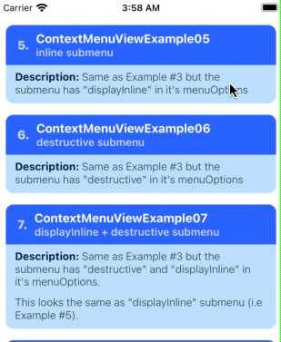

<br>

### `ContextMenuView` Example 06

**Summary**: Menu Options — A context menu that has a destructive submenu.

<br>

| Notes                                                        |
| ------------------------------------------------------------ |
| You can set the menu options via the `MenuConfig.menuOptions` property. It accepts an array of `UIMenuOptions` strings (e.g. `destructive`, `displayInline`).<br><br>If you pass in `['destructive']` to `menuOptions`, it will tint the submenu to red (but it's menu items won't be affected). |

<br>

[🔗 Full Example](./example/src/examples/ContextMenuViewExample06.tsx)

```jsx
 // 📝 Note: for the sake of brevity, some of the code is omitted...
import { ContextMenuView } from 'react-native-ios-context-menu';

export function ContextMenuViewExample06(props) {
  return (
    <ContextMenuView
      menuConfig={{
        menuTitle: 'ContextMenuViewExample06',
        menuItems: [{
          actionKey  : 'key-01',
          actionTitle: 'Action #1',
          // ...
        }, {
          menuTitle: 'Submenu...',
          // Create an "destructive" submenu by adding
          // `destructive` in the menu options...
          menuOptions: ['destructive'],
          menuItems: [{
            actionKey  : 'key-01-01',
            actionTitle: 'Submenu Action #1',
            // ...
          }, {
            actionKey  : 'key-01-02',
            actionTitle: 'Submenu Action #2',
            // ...
          }, {
            actionKey  : 'key-01-03',
            actionTitle: 'Submenu Action #3',
            // ...
          }]
        }],
      }}
    >
      {/** Components */}
    </ContextMenuView>
  );
};
```


<br>

### `ContextMenuView` Example 07

**Summary**: Menu Options — A context menu that set to be both "destructive" and "display in-line".

<br>

| Notes                                                        |
| ------------------------------------------------------------ |
| You can set the menu options via the `MenuConfig.menuOptions` property. It accepts an array of `UIMenuOptions` strings (e.g. `destructive`, `displayInline`).<br><br>Passing in `['destructive', 'displayInline']` to `menuOptions`, is functionally the same as passing in `['displayInline']`. |

<br>

[🔗 Full Example](./example/src/examples/ContextMenuViewExample07.tsx)

```jsx
 // 📝 Note: for the sake of brevity, some of the code is omitted...
import { ContextMenuView } from 'react-native-ios-context-menu';

export function ContextMenuViewExample07(props) {
  return (
    <ContextMenuView
      menuConfig={{
        menuTitle: 'ContextMenuViewExample07',
        menuItems: [{
          actionKey  : 'key-01',
          actionTitle: 'Action #1',
          // ...
        }, {
          menuTitle: 'Submenu...',
          // Make the submenu both `'displayInline'` and
          // `'destructive'`.
          //
          // Visually, this is just the same as passing in 
          // 'displayInline'.
          menuOptions: ['displayInline', 'destructive'],
          menuItems: [{
            actionKey  : 'key-01-01',
            actionTitle: 'Submenu Action #1',
            // ...
          }, {
            actionKey  : 'key-01-02',
            actionTitle: 'Submenu Action #2',
            // ...
          }, {
            actionKey  : 'key-01-03',
            actionTitle: 'Submenu Action #3',
            // ...
          }]
        }],
      }}
    >
      {/** Components */}
    </ContextMenuView>
  );
};
```


<br>

### `ContextMenuView` Example 08

**Summary**: Menu State — A context menu with 3 actions that has `'on'`, `'off'`, and `'mixed'` `menuState`.

<br>

| Notes                                                        |
| ------------------------------------------------------------ |
| You can set an menu action item's the menu state via the `MenuActionConfig.menuState` property.<br><br>📝 **Note**: On iOS 13, an action item's menu state is indicated via changing it's icon to a checkmark. However on later version of iOS this behavior has been changed to showing a checkmark besides the action title (see gifs/screenshots below). |

<br>

[🔗 Full Example](./example/src/examples/ContextMenuViewExample08.tsx)

```jsx
 // 📝 Note: for the sake of brevity, some of the code is omitted...
import { ContextMenuView } from 'react-native-ios-context-menu';

export function ContextMenuViewExample08(props) {
  return (
    <ContextMenuView
      menuConfig={{
        menuTitle: 'ContextMenuViewExample08',
        menuItems: [{
          actionKey  : 'key-01',
          actionTitle: 'menuState: on',
          // show a checkmark
          menuState: 'on',
          // ...
        }, {
          actionKey  : 'key-02'   ,
          actionTitle: 'menuState: off',
          // no checkmark
          menuState: 'off',
          // ...
        }, {
          actionKey  : 'key-03'   ,
          actionTitle: 'menuState: mixed',
          // visually this is the same as 'on'
          menuState: 'mixed',
          // ...
        }],
      }}
    >
      {/** Components */}
    </ContextMenuView>
  );
};
```


<br>

### `ContextMenuView` Example 09

**Summary**: Events — An example for the `onPressMenuItem` event prop.

| Notes                                                        |
| ------------------------------------------------------------ |
| The `onPressMenuItem` event prop allows you to know which menu item was pressed via the `nativeEvent.actionKey` property in the event object.<br><br>📝 **Note A**: The entire menu action config (i.e. `MenuActionConfig`) object of the selected item can be accessed via the `nativeEvent` object (e.g. `nativeEvent.actionTitle`, `nativeEvent.menuState`, etc).<br><br>📝 **Note B**: For the full type declaration for all the events, see: [`MenuEvents.ts`](./src/types/MenuEvents.ts). |

<br>

[🔗 Full Example](./example/src/examples/ContextMenuViewExample09.tsx)

```jsx
 // 📝 Note: for the sake of brevity, some of the code is omitted...
import { ContextMenuView } from 'react-native-ios-context-menu';

export function ContextMenuViewExample09(props) {
  return (
    <ContextMenuView
      menuConfig={{
        menuTitle: 'ContextMenuViewExample09',
        menuItems: [{
          actionKey  : 'save',
          actionTitle: 'Save',
          // ...
        }, {
          actionKey  : 'like',
          actionTitle: 'Like',
          // ...
        }, {
          actionKey  : 'play',
          actionTitle: 'Play',
          // ...
        }],
      }}
      // Use `actionKey` to identify which menu action was
      // pressed....
      onPressMenuItem={({nativeEvent}) => {
        switch (nativeEvent.actionKey) {
          case 'save':
            Alert.alert('saving...');
            break;

          case 'like':
            Alert.alert('liking...');
            break;

          case 'play':
            Alert.alert('playing...');
            break;
        };
      }}
    >
      {/** Components */}
    </ContextMenuView>
  );
};
```


<br>

### `ContextMenuView` Example 10

**Summary**: Dynamic Menu — An example showing how to dynamically update the context menu while it's visible. In this example, the menu action changes every time the counter increments every second.

<br>

| Notes                                                        |
| ------------------------------------------------------------ |
| On iOS 14+ you can update the menu while it's visible, e.g. like adding and removing items in the context menu, or changing the action title, etc.<br><br>You can control the context menu config using state, and dynamically change it as shown in the example below.<br><br>📝 **Note A**: On iOS 13 the context menu will not update while it's visible.<br/><br/>📝 **Note B**: On iOS 15+, all changes to the context menu config are applied using a fade/crossfade transition. |

<br>

[🔗 Full Example](./example/src/examples/ContextMenuViewExample10.tsx)

```jsx
 // 📝 Note: for the sake of brevity, some of the code is omitted...
export function ContextMenuViewExample10(props) {
  // `timer` will increment every second... 
  const [timer, setTimer] = React.useState(0);

  // ...
  return (
    <ContextMenuView
      // ...
      menuConfig={{
        menuTitle: 'ContextMenuViewExample10',
        menuItems: [{
          actionKey  : 'key-00',
          actionTitle: `Static Action`,
          // ...
        }, {
          actionKey  : 'key-01',
          // update the action title every second...
          actionTitle: `timer: ${timer}`,
          icon: {
            type: 'IMAGE_SYSTEM',
            imageValue: {
               // update the icon every second...
              systemName: ((timer % 2 === 0)
                ? 'heart'
                : 'heart.fill'
              ),
            },
          }
        }, 
        // this item will be added and removed...
        (timer % 3 === 0) && {
          actionKey  : 'key-02',
          actionTitle: `Dynamic Action`,
          // ...
        }],
      }}
    >
      {/** Components */}
    </ContextMenuView>
  );
};
```


<br>

### `ContextMenuView` Example 11

**Summary**: Context Menu Previews — An example showing how to use a custom preview for the context menu.

<br>

| Notes                                                        |
| ------------------------------------------------------------ |
| 1️⃣ — The `ContextMenuView.renderPreview` render prop allows you show a custom preview when the context menu appears.<br><br>📝 **Note**: The `renderPreview` prop accepts a function that returns an element. The returned element will be shown inside the context menu preview. |
| 2️⃣ — The `ContextMenuView.previewConfig` is used to control the behavior and appearance of the custom context menu preview.<br/><br/>In order to show the custom context menu preview, we must first set `MenuPreviewConfig.previewType` to `'CUSTOM'`. By default, this property is set to `'DEFAULT'`, which means that you do not want to use a custom preview.<br/><br/>📝 **Note A**: The `previewConfig` prop accepts a `MenuPreviewConfig` object.<br/><br/>📝 **Note B**: The `previewType` property accepts a `MenuPreviewType` string. You can set this to `'DEFAULT'` if you want to quickly disable the custom preview. |
| 3️⃣ — In this example, we want the custom preview to be as big as possible, so we set the `MenuPreviewConfig.previewSize` property to `'STRETCH'`.<br/><br/>📝 **Note**: The `previewSize` property accepts a `MenuPreviewSize` string. By default, this prop is set to `'INHERIT'`, which means to just match the size of the root view returned from `renderPreview`. |

<br>

[🔗 Full Example](./example/src/examples/ContextMenuViewExample11.tsx)

```jsx
 // 📝 Note: for the sake of brevity, some of the code is omitted...
import { ContextMenuView } from 'react-native-ios-context-menu';

export function ContextMenuViewExample11(props) {
  return (
    <ContextMenuView
      previewConfig={{
        previewType: 'CUSTOM',
        previewSize: 'STRETCH',
        backgroundColor: 'white'
      }}
      renderPreview={() => (
        <View>
          <Text>
            Hello World
          </Text>
          <Text>
            Hello World
          </Text>
          <Text>
            Hello World
          </Text>
        </View>
      )}
      onPressMenuPreview={() => {
        Alert.alert(
          'onPressMenuPreview Event',
          `Menu preview was pressed...`
        );
      }}
    >
      {/** Components */}
    </ContextMenuView>
  );
};
```


<br>

### `ContextMenuView` Example 12

**Summary**: Context Menu Previews — An example showing a custom context menu preview that dynamically changes its size due to its contents updating every second.

<br>

| Notes                                                        |
| ------------------------------------------------------------ |
| 📝 **Note**: By default, custom preview will animate to its new size. If you want to disable this behavior, set `MenuPreviewConfig.isResizeAnimated` property to `false`. |

<br>

[🔗 Full Example](./example/src/examples/ContextMenuViewExample12.tsx)

```jsx
 // 📝 Note: for the sake of brevity, some of the code is omitted...

export function ContextMenuViewExample12(props) {
  // increments every second...
  const [timer, setTimer] = React.useState(0);

	// ...
  return (
    <ContextMenuView
      menuConfig={{
        menuTitle: 'ContextMenuViewExample12',
        menuItems: [{
          // ...
        }],
      }}
      previewConfig={{
        previewType: 'CUSTOM',
        backgroundColor: 'white'
      }}
      // The context menu preview grows and shrinks due to the labels/
      // text changing every second...
      renderPreview={() => (
        <View>
          <Text>
            {`Counter: ${timer}`}
          </Text>
          <Text>
            {(timer % 2 === 0)? 'EVEN' : 'The number is: ODD'}
          </Text>
        </View>
      )}
      // ...
    >
      {/** Components */}
    </ContextMenuView>
  );
};
```


<br>

### `ContextMenuView` Example 13

**Summary**: Menu Action — An example showing how to add a subtitle to menu action.

<br>

| Notes                                                        |
| ------------------------------------------------------------ |
| You can add a subtitle to a menu action via passing a string value to the `MenuActionConfig.actionSubtitle` property.<br><br>📝 **Note A**: On iOS 13/14, you add subtitles to the menu action via the `MenuActionConfig.discoverabilityTitle` property, but on iOS 15+ this property is now used for the "discoverability heads-up display" UI.<br/><br/>📝 **Note B**: For backwards compatibility, the string value you passed to `discoverabilityTitle` will also be used to set `actionSubtitle` on iOS 15+.<br><br>To disable this automatic behavior, set the `ContextMenuView.shouldUseDiscoverability` `TitleAsFallbackValueForSubtitle` prop to `false`. |

<br>

[🔗 Full Example](./example/src/examples/ContextMenuViewExample13.tsx)

```jsx
 // 📝 Note: for the sake of brevity, some of the code is omitted...
import { ContextMenuView } from 'react-native-ios-context-menu';

export function ContextMenuViewExample13(props) {
  return (
    <ContextMenuView
      menuConfig={{
        menuTitle: 'ContextMenuViewExample13',
        menuItems: [{
          actionKey: 'key-01',
          actionTitle: 'Action #1',
          // old way of adding a subtitle...
          // iOS 13 to 14 (still works on iOS 15+)
          discoverabilityTitle: 'Action subtitle',
        }, {
          actionKey: 'key-02'   ,
          actionTitle: 'Action #2',
          // new way of adding a subtitle...
          // iOS 15+ only, but is automatically backwards compatible w/
          // iOS 13/14...
          actionSubtitle: 'Lorum ipsum sit amit dolor aspicing',
        }, {
          actionKey: 'key-03'   ,
          actionTitle: 'Action #3',
          actionSubtitle: 'Very long `discoverabilityTitle` lorum ipsum sit amit',
        }],
      }}
    >
      {/** Components */}
    </ContextMenuView>
  );
};
```


<br>

### `ContextMenuView` Example 14

**Summary**: Context Menu Previews — An example that changes the exit transition of the context menu preview when its tapped using the `preferredCommitStyle ` config.

<br>

| Notes                                                        |
| ------------------------------------------------------------ |
| The `MenuPreviewConfig.preferredCommitStyle` allows you to configure what preset exit transition to use when the context menu preview is pressed.<br><br>📝 **Note A**: By default, `MenuPreviewConfig.preferredCommitStyle` is set to `'dismiss'`.<br><br>📝 **Note B**:  A `preferredCommitStyle` of `'pop'`' is usually used when navigating to another screen (i.e. a view controller is pushed without the normal push transition). |

<br>

[🔗 Full Example](./example/src/examples/ContextMenuViewExample14.tsx)

```jsx
 // 📝 Note: for the sake of brevity, some of the code is omitted...
export function ContextMenuViewExample14(props) {
  return (
    <ContextMenuView
      previewConfig={{
        previewType: 'CUSTOM',
        previewSize: 'STRETCH',
        backgroundColor: 'rgba(255,255,255,0.75)',
	      // change the exit transition that occurs when the 
        // context menu preview is pressed.
        preferredCommitStyle: 'pop',
      }}
      renderPreview={() => (
        {/** ... */}
      )}
    >
      {/** Components */}
    </ContextMenuView>
  );
};
```


<br>

### `ContextMenuView` Example 15

**Summary**: Context Menu Previews — An example showing how to configure a context menu that uses targeted previews.

<br>

| Notes                                                        |
| ------------------------------------------------------------ |
| By default, the child elements you render inside the `ContextMenuView` component will be used as the preview when the context menu interaction is triggered.<br><br>Targeted previews allows you to specify which specific view to use for the context menu preview, so that when the context menu interaction begins, a different view will be used for the preview (including the initial transition, see the gif below the example code).<br><br>📝 **Note A**: The context menu interaction will still be triggered by long pressing on the child elements in the `ContextMenuView` component.<br><br>As such, if the view that you are using for the targeted preview is not a child of `ContextMenuView`, then holding down on that view will not trigger the context menu interaction.<br/><br/>📝 **Note B**: Targeted previews is different from setting a [custom context menu preview](#ContextMenuView-Example-11) via the `renderPreview` prop.<br><br>A custom preview will replace the contents of the context menu preview entirely with your custom view component once the menu is opened.<br><br>A targeted preview on the other hand will change which view to use for the context menu entrance/exit transition (as well as what view to show in the preview if you do not have a custom preview). |

<br>

[🔗 Full Example](./example/src/examples/ContextMenuViewExample15.tsx)

```jsx
 // 📝 Note: for the sake of brevity, some of the code is omitted...
import { ContextMenuView } from 'react-native-ios-context-menu';

export function ContextMenuViewExample15(props) {
  const [targetViewNode, setTargetViewNode] = React.useState();
  
  React.useEffect(() => {
    // please note that when a view unmounts and remounts (e.g.
    // when you have a view inside a list comp)., you need to
    // get the new associated `reactTag` for that view
    //
    // otherwise the `reactTag` value you provide to the 
    // `previewConfig` will be stale...
    //
    // this is why we have to set `targetViewNode` back to 
    // `udefined` when the component unmounts
    return () => {
      setTargetViewNode(undefined);
    }
  }, []);

  return (
    <ContextMenuView
      menuConfig={{
        // ...
      }}
      previewConfig={{
        // specify which view to use as the preview target
        targetViewNode: targetViewNode,
      }}
    >
      <View
        style={styles.targetContainer}
        // we need to get the `reactTag` of the view; one way is
        // to get it from the `onLayout` event
        //
        // alternatively, you can also obtain the `reactTag` of a  
        // a view via: `nativeViewRef?.nativeTag`
        //
        // the `reactTag` for a given view is the same across re-renders,
        // so we only really need to get it once when the view mounts...
        //
        onLayout={!targetViewNode && (({nativeEvent}) => {
          setTargetViewNode(nativeEvent.target)
        })}
      >
        <Text style={styles.text}>
          {`Hello! Target Node: ${targetViewNode}`}
        </Text>
      </View>
    </ContextMenuView>
  );
};
```


<br>

### `ContextMenuView` Example 15-02

**Summary**: Context Menu Previews (Cont). — An example showing how to configure a context menu that uses targeted previews + `WrapperView`.

<br>

[🔗 Full Example](./example/src/examples/ContextMenuViewExample15_02.tsx)

```jsx
// 📝 Note: for the sake of brevity, some of the code is omitted...
import { ContextMenuView } from 'react-native-ios-context-menu';
import { WrapperView } from 'react-native-ios-utilities';

export function ContextMenuViewExample15_02(props) {
  // save a ref. to the `WrapperView` element containing the preview target you 
  // want to use for the context menu.
  //
  // you can then call `getNativeReactTag` to get the associated `reactTag`
  // for that view. 
  const wrapperViewRef = React.useRef();

  return (
    <ContextMenuView
      menuConfig={{
        // ...
      }}
      previewConfig={{
        // get the associated `reactTag` of the view element you want use as the 
        // preview target
        targetViewNode: wrapperViewRef.current?.getNativeReactTag(),
      }}
    >
      <WrapperView
        ref={wrapperViewRef}
        style={styles.targetContainer}
      >
        <Text style={styles.text}>
          {`Hello inside: WrapperView\nTarget Node: ${wrapperViewRef.current?.getNativeReactTag()}`}
        </Text>
      </WrapperView>
    </ContextMenuView>
  );
};
```


<br>

### `ContextMenuView` Example 16

**Summary**: Icon Example — An example showing a context menu with an action that uses a `'IMAGE_ASSET'` image for its icon.

<br>

| Notes                                                        |
| ------------------------------------------------------------ |
| A config of `ImageItemConfig.type` set to `'IMAGE_ASSET'` means that you want to use a `xcasset` image asset.<br/><br/>📝 **Note**: The string value you pass to the `ImageItemConfig.imageValue` must match the corresponding asset that you want to use in your project's `xcasset` catalog. |

<br>

[🔗 Full Example](./example/src/examples/ContextMenuViewExample16.tsx)

```jsx
 // 📝 Note: for the sake of brevity, some of the code is omitted...
import { ContextMenuView } from 'react-native-ios-context-menu';

export function ContextMenuViewExample16(props) {
  return (
    <ContextMenuView
      menuConfig={{
        menuTitle: 'ContextMenuViewExample16',
        menuItems: [{
          actionKey: 'key-01',
          actionTitle: 'Action #1',
          // ...
        }, {
          actionKey: 'key-02'   ,
          actionTitle: 'Action #2',
          // ...
        }, {
          actionKey  : 'key-03'   ,
          actionTitle: 'Action #3',
          discoverabilityTitle: 'Use "ASSET" icon',
          icon: {
            // specify that you want to use an asset icon
            type: 'IMAGE_ASSET',
            // pass the name of the asset
            imageValue: 'icon-rainbow-flag',
          }
        }],
      }}
    >
      {/** Components */}
    </ContextMenuView>
  );
};
```


<br>

### `ContextMenuView` Example 17

**Summary**: Icon Example — An example showing a context menu with action items that have different colored icons.

<br>

| Notes                                                        |
| ------------------------------------------------------------ |
| A `ImageItemConfig` object has an optional called `imageOptions`. This property accepts a `UIImageConfig` object.<br><br>You can tint the image to a specified color using the `UIImageConfig.tint` property. This property accepts a color string in either `rgb`, `rgba`, or `hex` format.<br><br>You can also choose to provide a dynamic color config if you want to use a specific color for light/dark mode.<br><br>📝 **Note A**: Any image can be tinted to a specific color, not just `'IMAGE_SYSTEM'` images.<br/><br/>📝 **Note B**: In order for the tint to take effect, set `UIImageConfig.renderingMode` to `alwaysOriginal`. |

<br>

[🔗 Full Example](./example/src/examples/ContextMenuViewExample17.tsx)

```jsx
 // 📝 Note: for the sake of brevity, some of the code is omitted...
import { ContextMenuView } from 'react-native-ios-context-menu';

export function ContextMenuViewExample17(props) {
  return (
    <ContextMenuView
      menuConfig={{
        menuTitle: 'ContextMenuViewExample17',
        menuItems: [{
          actionKey  : 'key-01',
          actionTitle: 'Action #1',
          icon: {
            type: 'IMAGE_SYSTEM',
            imageValue: {
              systemName: 'cloud.heavyrain.fill',
            },
            // blue icon
            imageOptions: {
              tint: 'blue',
              renderingMode: 'alwaysOriginal',
            },
          },
        }, {
          actionKey  : 'key-02',
          actionTitle: 'Action #2',
          icon: {
            // ...
            // orange icon
            imageOptions: {
              tint: 'rgb(218,165,32)',
              renderingMode: 'alwaysOriginal',
            },
          },
        }, {
          actionKey  : 'key-03',
          actionTitle: 'Action #3',
          icon: {
            // ...
            // pink icon
            imageOptions: {
              tint: '#FF1493',
              renderingMode: 'alwaysOriginal',
            },
          },
        }, {
          actionKey  : 'key-04',
          actionTitle: 'Action #4',
          icon: {
            // ...
            // green icon
            imageOptions: {
              tint: 'rgba(124,252,0,0.5)',
              renderingMode: 'alwaysOriginal',
            },
          },
        }]
      }}
    >
      {/** Components */}
    </ContextMenuView>
  );
};
```


<br>

### `ContextMenuView` Example 18

**Summary**: Icon Example — An example showing a context menu with action items that has icons that uses local image assets imported via `require(...)`.

<br>

| Notes                                                        |
| ------------------------------------------------------------ |
| 1️⃣ — The first step that we need to do is to generate a `ImageResolvedAssetSource` object of the local image asset we want to use. This object contains metadata about the image as well as its URI in the file system.<br><br> The `Image.resolveAssetSource` function returns a `ImageResolvedAssetSource` that corresponds to the source argument you pass into it. Give this function the return value of `require(path/to/image.png)`. |
| 2️⃣ — A config of `ImageItemConfig.type` set to `'IMAGE_REQUIRE'` means that we want to use a local image asset imported via the `require(...)` function.<br/><br/>The `ImageItemConfig.imageValue` property accepts a `ImageResolvedAssetSource` object that corresponds to the image asset that you want to use. |

<br>

[🔗 Full Example](./example/src/examples/ContextMenuViewExample18.tsx)

```jsx
 // 📝 Note: for the sake of brevity, some of the code is omitted...
import { ContextMenuView } from 'react-native-ios-context-menu';

// Generate a `ImageResolvedAssetSource` object based on the
// image assets...

const iconA = Image.resolveAssetSource(
  require('../assets/emoji-pleading-face.png')
);

const iconB = Image.resolveAssetSource(
  require('../assets/emoji-smiling-face-with-hearts.png')
);

const iconC = Image.resolveAssetSource(
  require('../assets/emoji-sparkling-heart.png')
);

export function ContextMenuViewExample18(props) {
  return (
    <ContextMenuView
      menuConfig={{
        menuTitle: 'ContextMenuViewExample18',
        menuItems: [{
          actionKey  : 'key-01'   ,
          actionTitle: 'Action #1',
          discoverabilityTitle: 'Use "REQUIRE" icon',
          // `IconConfig` has been deprecated, please use 
          // `ImageItemConfig` instead (but it'll still work 
          // for now).
          // 
          // The other two menu actions in this example 
          // uses `ImageItemConfig` to set the menu action icons. 
          icon: {
            iconType: 'REQUIRE',
            iconValue: iconA,
          }
        }, {
          actionKey: 'key-02'   ,
          actionTitle: 'Action #2',
          
          // Set config to use images via `require`
          type: 'IMAGE_REQUIRE',
          
          // Pass in the corresponding
          // `ImageResolvedAssetSource` object of the image
          // that you want to use as the icon...
          imageValue: iconB,
        }, {
          actionKey: 'key-03'   ,
          actionTitle: 'Action #3',
          icon: {
            type: 'IMAGE_REQUIRE',
            imageValue: iconC,
          }
        }],
      }}
    >
      {/** Components */}
    </ContextMenuView>
  );
};
```


<br>

### `ContextMenuView` Example 19

**Summary**: Dynamic Menu — An example showing a context menu that shows a loading indicator using deferred menu elements.

<br>

| Notes                                                        |
| ------------------------------------------------------------ |
| 1️⃣ — If you control your `ContextMenuView.menuConfig` via state, then you can already dynamically add menu items while the context menu is visible (See [`ContextMenuView` Example 10](#ContextMenuView-Example-10)). However, there is no indication in the UI that items are currently being loaded.<br><br>You can use a "deferred element" in order to add an action item that has a loading indicator. Once you are done loading the content, then you can replace the deferred element with the actual menu items that you want to add.<br/><br/>📝 **Note**: Deferred elements are only available on iOS 14 and above. |
| 2️⃣ —  As mentioned in the previous examples, the `MenuConfig.menuItems` property can accept an array of `MenuElementConfig` union type. This means that it can accept an array containing any of the following object types:  `MenuConfig` object, `MenuActionConfig`, and `DeferredMenuElementConfig`.<br/><br/>If we pass in a `DeferredMenuElementConfig` to `menuItems`, it means that we want to create "deferred element" item. |
| 3️⃣ — To create a deferred element, we just need to create a "config" object that has a property containing both `type` and `deferredID`.<br><br>The `DeferredMenuElementConfig.type` property must be set to a string value of `'deferred'`. This indicates that we want to create a deferred element.<br/><br/>The `DeferredMenuElementConfig.deferredID` property must be set to a unique string value. Since we can have multiple deferred elements, the value you pass into this property will be used to identify which deferred element will be replaced with the menu items you want to add when the loading is complete. |
| 4️⃣ — Once the context menu is open, any deferred menu items in `MenuConfig.menuItems` will trigger the `ContextMenuView.onRequestDeferredElement` event to fire. Via the event, you will receive two arguments: `deferredID` string and `provider` callback function.<br><br>The `deferredID` string corresponds to which deferred element that we need to load, while the `provider` callback function is used to provide the menu items that we want to add and replace the deferred element with. |
| 5️⃣ — The `provider` callback function accepts an array of `MenuElementConfig` items.<br/><br/>To replace the deferred element with the menu items you want add, simply call the `provider` callback function with the array of  `MenuConfig`, `MenuActionConfig`, or `DeferredMenuElementConfig` objects.<br/><br/>📝 **Note A**: Since the deferred elements were loaded/replaced using the `onRequestDeferredElement` event, there are now two sources of truths for the context menu config: One provided via the `ContextMenuView.menuConfig` prop, and the other via the `onRequestDeferredElement` event.<br><br>If you are using a state-controlled menu config, see: [`ContextMenuView` Example 20](#ContextMenuView-Example-20).<br><br>📝 **Note B**: It is recommended that you cache the items you have loaded, and then combine them with the existing `menuConfig` once the menu has been closed. |

<br>

[🔗 Full Example](./example/src/examples/ContextMenuViewExample19.tsx)

```jsx
// 📝 Note: for the sake of brevity, some of the code is omitted...
export function ContextMenuViewExample19(props) {
  return (
    <ContextMenuView
      menuConfig={{
        menuTitle: 'ContextMenuViewExample19',
        menuItems: [{
          actionKey  : 'key-01',
          actionTitle: 'Action #1',
          actionSubtitle: 'Dummy action'
        }, {
          // Create a deferred menu item... 
          // this will act as a placeholder and will be replaced
          // with the actual menu items later
          type: 'deferred',
          
          // if we have multiple deferred items, you can use 
          // the `deferredID` to distinguish between them
          deferredID: 'deferred-01'
        }],
      }}
      
      // this event will fire when a deferred menu item 
      // is present...
      onRequestDeferredElement={async (deferredID, provider) => {
        switch(deferredID) {
          case 'deferred-01':
            // dummy delay, wait for 1 second...
            await Helpers.timeout(1000);

            // provide the items to add to the context menu...
            provider([{
              type: 'action',
              actionKey: 'action-02',
              actionTitle: 'Deferred Item 02',
              actionSubtitle: 'Deferred item...'
            }, {
              type: 'action',
              actionKey: 'action-03',
              actionTitle: 'Deferred Item 03',
              actionSubtitle: 'Deferred item...'
            }]);
            break;
        };
      }}
    >
      {/** ... */}
    </ContextMenuView>
  );
};
```


<br>

### `ContextMenuView` Example 20

**Summary**: Dynamic Menu — An example showing a state-controlled context menu that shows a loading indicator using deferred menu elements.

<br>

| Notes |
| ----- |
| TBA   |

<br>

[🔗 Full Example](./example/src/examples/ContextMenuViewExample20.tsx)

```jsx
// 📝 Note: for the sake of brevity, some of the code is omitted...
export function ContextMenuViewExample20(props) {
  const [extraMenuItems, setExtraMenuItems] = React.useState([]);

  const [isLoading, setIsLoading] = React.useState(true);
  const [didLoadItems, setDidLoadItems] = React.useState(false);

  return (
    <ContextMenuView
      menuConfig={{
        menuTitle: 'ContextMenuViewExample20',
        menuItems: [{
          actionKey  : 'key-01',
          actionTitle: 'Action #1',
          actionSubtitle: 'Dummy action'
        },

        // add deferred item so that the loading indicator
        // appears...
        isLoading && ({
          type: 'deferred',
          deferredID: 'deferred-01'
        }), 

        // add the extra menu items...
        ...extraMenuItems,

        didLoadItems && ({
          type: 'menu',
          menuTitle: '',
          menuOptions: ['displayInline'],
          menuItems: [{
            type: 'action',
            actionKey: 'clear_cache',
            actionTitle: 'Clear Cache',
            actionSubtitle: 'Remove loaded items...',
            menuAttributes: ['destructive'],
          }]
        })],
      }}
      // this event will fire when a deferred menu item is present...
      onMenuWillShow={async () => {
        if(didLoadItems) return;

        // for the purposes of this example, let's add a delay
        // before showing the loading indicator...
        // 
        // this way, we can see the context menu updating and
        // showing the loading indicator.
        // 
        // Ideally, `isLoading` should already be set to `true`
        // before the context menu is shown...
        await Helpers.timeout(750);
        setIsLoading(true);

        // loading...
        // dummy delay, wait for 2 second...
        await Helpers.timeout(2000);
        setDidLoadItems(true);

        // add extra menu items
        setExtraMenuItems([{
          type: 'action',
          actionKey: 'action-02',
          actionTitle: 'Deferred Item 02',
          actionSubtitle: 'Deferred item...'
        }, {
          type: 'action',
          actionKey: 'action-03',
          actionTitle: 'Deferred Item 03',
          actionSubtitle: 'Deferred item...'
        }]);

        // hide the loading indicator
        setIsLoading(false);
      }}
    >
      {/** ... */}
    </ContextMenuView>
  );
};
```


<br>

### `ContextMenuView` Example 21

**Summary**: Menu Element Size — TBA

<br>

| Notes |
| ----- |
| TBA   |

<br>

[🔗 Full Example](./example/src/examples/ContextMenuViewExample21.tsx)

```jsx
// 📝 Note: for the sake of brevity, some of the code is omitted...
export function ContextMenuViewExample21(props) {

  return (
    <ContextMenuView
      menuConfig={{
        menuTitle: 'ContextMenuViewExample21',
        menuPreferredElementSize: 'medium',
        menuItems: [{
          actionKey: 'key-01',
          actionTitle: 'Action #1',
          // ...
        }, {
          actionKey: 'key-02'   ,
          actionTitle: 'Action #2',
          // ...

        }, {
          actionKey  : 'key-03'   ,
          actionTitle: 'Action #3',
          // ...
        }],
      }}
    >
      {/** ... */}
    </ContextMenuView>
  );
};
```


<br>

### `ContextMenuView` Example 22

**Summary**: Menu Element Size — TBA

<br>

| Notes |
| ----- |
| TBA   |

<br>

[🔗 Full Example](./example/src/examples/ContextMenuViewExample22.tsx)

```jsx
// 📝 Note: for the sake of brevity, some of the code is omitted...
export function ContextMenuViewExample22(props) {

  return (
    <ContextMenuView
      menuConfig={{
        menuTitle: '',
        menuPreferredElementSize: 'small',
        menuItems: [{
          actionKey: 'key-01',
          actionTitle: '',
          // ...
        }, {
          actionKey: 'key-02'   ,
          actionTitle: '',
          // ...
          }
        }, {
          actionKey: 'key-03',
          actionTitle: '',
          // ...
        }],
      }}
    >
      {/** ... */}
    </ContextMenuView>
  );
};
```


<br>

### `ContextMenuView` Example 23

**Summary**: Menu Element Size — TBA

<br>

| Notes |
| ----- |
|       |

<br>

[🔗 Full Example](./example/src/examples/ContextMenuViewExample23.tsx)

```jsx
// 📝 Note: for the sake of brevity, some of the code is omitted...
export function ContextMenuViewExample23(props) {

  return (
    <ContextMenuView
      menuConfig={{
        menuTitle: '',
        menuItems: [{
          type: 'action',
          actionKey: 'remove-rating',
          menuAttributes: ['destructive'],
          actionTitle: 'Remove Rating',
           icon: { /** ... */ }
        }, {
          type: 'action',
          actionKey: 'info',
          actionTitle: 'Information',
           icon: { /** ... */ }
        }, {
          type: 'menu',
          menuTitle: '',
          menuOptions: ['displayInline'],
          menuPreferredElementSize: 'small',
          menuItems: [{
            actionKey: 'key-01-01',
            actionTitle: '',
            icon: { /** ... */ }
          }, {
            actionKey: 'key-01-02',
            actionTitle: '',
            icon: { /** ... */ }
          }, {
            actionKey: 'key-01-03',
            actionTitle: '',
            icon: { /** ... */ }
          }],
        }, {
          type: 'menu',
          menuTitle: '',
          menuOptions: ['displayInline'],
          menuPreferredElementSize: 'small',
          menuItems: [{
            actionKey: 'key-02-01',
            actionTitle: '',
            icon: { /** ... */ }
          }, {
            actionKey: 'key-02-02',
            actionTitle: '',
            icon: { /** ... */ }
          }, {
            actionKey: 'key-02-03',
            actionTitle: '',
            icon: { /** ... */ }
          }],
        }]
      }}
    >
      { /** ... */ }
    </ContextMenuView>
  );
};
```


<br>

### `ContextMenuView` Example 24

**Summary**: Menu Attributes — `keepsMenuPresented`

<br>

| Notes |
| ----- |
| TBA   |

<br>

[🔗 Full Example](./example/src/examples/ContextMenuViewExample24.tsx)

```jsx
// 📝 Note: for the sake of brevity, some of the code is omitted...
export function ContextMenuViewExample24(props) {
  const [actionState1, setActionState1] = React.useState(false);
  const [actionState2, setActionState2] = React.useState(false);
  const [actionState3, setActionState3] = React.useState(false);

  const isResetEnabled = (
    actionState1 ||
    actionState2 ||
    actionState3 
  );

  const handleOnPressMenuItem = ({nativeEvent}) => {
    // ...
  };

  return (
    <ContextMenuView
      style={props.style}
      onPressMenuItem={handleOnPressMenuItem}
      menuConfig={{
        menuTitle: 'ContextMenuViewExample24',
        menuItems: [{
          actionKey: 'key-01',
          actionTitle: `Action 1: ${actionState1? 'on' : 'off'}`,
          menuState: (actionState1? 'on' : 'off'),
          menuAttributes: ['keepsMenuPresented'],
          icon: { /** ... */ }
        }, {
          actionKey  : 'key-02',
          actionTitle: `Action 2: ${actionState2? 'on' : 'off'}`,
          menuState  : (actionState2? 'on' : 'off'),
          menuAttributes: ['keepsMenuPresented'],
          icon: { /** ... */ }
        }, {
          actionKey: 'key-03',
          actionTitle: `Action 3: ${actionState3? 'on' : 'off'}`,
          menuState: (actionState3? 'on' : 'off'),
          menuAttributes: ['keepsMenuPresented'],
          icon: { /** ... */ }
        }, {
          actionKey: 'key-04',
          actionTitle: `Reset All`,
          menuAttributes: [
            'keepsMenuPresented',
            isResetEnabled? 'destructive' : 'hidden',
          ],
          icon: { /** ... */ }
        }]
      }}
    >
      { /** ... */ }
    </ContextMenuView>
  );
};
```


<br>

### `ContextMenuView` Example 25

**Summary**:  Icon Example — Advanced customization (e.g. `scale`, `weight`, `paletteColors`, `hierarchicalColor`).

<br>

| Notes |
| ----- |
| TBA   |

<br>

[🔗 Full Example](./example/src/examples/ContextMenuViewExample25.tsx)

```jsx
// 📝 Note: for the sake of brevity, some of the code is omitted...
export function ContextMenuViewExample25(props) {
  return (
    <ContextMenuView
      style={props.style}
      menuConfig={{
        menuTitle: 'ContextMenuViewExample25',
        menuItems: [{
          type: 'menu',
          menuTitle: '',
          menuOptions: ['displayInline'],
          menuItems: [{
            actionKey: 'key-01-01',
            actionTitle: 'small',
            icon: {
              type: 'IMAGE_SYSTEM',
              imageValue: {
                systemName: 'heart',
                scale: 'small',
              },
            }
          }, {
            actionKey: 'key-01-02',
            actionTitle: 'medium',
            icon: {
              type: 'IMAGE_SYSTEM',
              imageValue: {
                systemName: 'heart',
                scale: 'medium',
              },
            }
          }, {
            actionKey: 'key-01-03',
            actionTitle: 'large',
            icon: {
              type: 'IMAGE_SYSTEM',
              imageValue: {
                systemName: 'heart',
                scale: 'large',
              },
            }
          }],
        }, {
          type: 'menu',
          menuTitle: '',
          menuOptions: ['displayInline'],
          menuItems: [{
            actionKey: 'key-02-01',
            actionTitle: 'ultraLight',
            icon: {
              type: 'IMAGE_SYSTEM',
              imageValue: {
                systemName: 'heart',
                weight: 'ultraLight',
              },
            }
          }, {
            actionKey: 'key-02-02',
            actionTitle: 'semibold',
            icon: {
              type: 'IMAGE_SYSTEM',
              imageValue: {
                systemName: 'heart',
                weight: 'semibold',
              },
            }
          }, {
            actionKey: 'key-02-03',
            actionTitle: 'black',
            icon: {
              type: 'IMAGE_SYSTEM',
              imageValue: {
                systemName: 'heart',
                weight: 'black',
              },
            }
          }],
        },  {
          type: 'menu',
          menuTitle: '',
          menuOptions: ['displayInline'],
          menuItems: [{
            actionKey: 'key-03-01',
            actionTitle: 'paletteColors',
            icon: {
              type: 'IMAGE_SYSTEM',
              imageValue: {
                systemName: 'delete.left.fill',
                paletteColors: ['red', 'blue']
              },
            }
          }, {
            actionKey: 'key-03-02',
            actionTitle: 'semibold',
            icon: {
              type: 'IMAGE_SYSTEM',
              imageValue: {
                systemName: 'delete.left.fill',
                hierarchicalColor: 'red',
              },
            }
          }, {
            actionKey: 'key-03-03',
            actionTitle: 'paletteColors',
            icon: {
              type: 'IMAGE_SYSTEM',
              imageValue: {
                systemName: 'folder.fill.badge.plus',
                paletteColors: ['blue', 'red']
              },
            }
          },  {
            actionKey: 'key-03-04',
            actionTitle: 'hierarchicalColor',
            icon: {
              type: 'IMAGE_SYSTEM',
              imageValue: {
                systemName: 'folder.fill.badge.plus',
                hierarchicalColor: 'blue',
              },
            }
          }],
        }],
      }}
    >
      {/** .... */}
    </ContextMenuView>
  );
};
```


<br>

### `ContextMenuView` Example 26

**Summary**:  Icon Example — Network/Remote images as icons.

<br>

| Notes |
| ----- |
| TBA   |

<br>

[🔗 Full Example](./example/src/examples/ContextMenuViewExample26.tsx)

```jsx

// 📝 Note: for the sake of brevity, some of the code is omitted...
export function ContextMenuViewExample26(props) {
  return (
    <ContextMenuView
      menuConfig={{
        menuTitle: 'ContextMenuViewExample26',
        menuItems: [{
          actionKey  : 'key-01'   ,
          actionTitle: 'Action #1',
          menuSubtitle: 'Use "IMAGE_REMOTE_URL" icon',
          icon: {
            type: 'IMAGE_REMOTE_URL',
            imageValue: {
              url: 'https://picsum.photos/id/1/100'
            },
          }
        }, {
          actionKey  : 'key-02'   ,
          actionTitle: 'Action #2',
          menuSubtitle: '"IMAGE_REMOTE_URL" + shouldLazyLoad',
          icon: {
            type: 'IMAGE_REMOTE_URL',
            imageValue: {
              url: 'https://picsum.photos/id/2/100'
            },
            imageLoadingConfig: {
              shouldLazyLoad: true,
            },
            imageOptions: {
              cornerRadius: 15,
            },
          }
        }, {
          actionKey  : 'key-03'   ,
          actionTitle: 'Action #3',
          menuSubtitle: '"IMAGE_REMOTE_URL" + shouldLazyLoad + shouldCache',
          icon: {
            type: 'IMAGE_REMOTE_URL',
            imageValue: {
              url: 'https://picsum.photos/id/2/100'
            },
            imageLoadingConfig: {
              shouldLazyLoad: true,
              shouldCache: true,
            },
            imageOptions: {
              cornerRadius: 30,
              tint: 'rgba(255,0,0,0.5)',
              renderingMode: 'alwaysOriginal',
            },
          }
        }],
      }}
    >
      {/** ... */}
    </ContextMenuView>
  );
};
```


<br>

### `ContextMenuView` Example 27

**Summary**:  Icon Example — Network/Remote images as icons + fallback image.

<br>

| Notes |
| ----- |
| TBA   |

<br>

[🔗 Full Example](./example/src/examples/ContextMenuViewExample27.tsx)

```jsx
// 📝 Note: for the sake of brevity, some of the code is omitted...
export function ContextMenuViewExample27(props) {
  return (
    <ContextMenuView
      menuConfig={{
        menuTitle: 'ContextMenuViewExample27',
        menuItems: [{
          actionKey  : 'key-01'   ,
          actionTitle: 'Action #1',
          actionSubtitle: 'fallbackBehavior: whileNotLoaded',
          icon: {
            type: 'IMAGE_REMOTE_URL',
            imageValue: {
              url: 'https://fake.url.com/asset-1',
              fallbackImage: {
                type: 'IMAGE_SYSTEM',
                imageValue: {
                  systemName: 'trash',
                },
              },
            },
            imageLoadingConfig: {
              // will use the fallback image while the remote
              // image hasn't been loaded yet
              fallbackBehavior: 'whileNotLoaded',
              shouldLazyLoad: true,
              shouldImmediatelyRetryLoading: true,
              maxRetryAttempts: 20,
            },
          }, 
        }, {
          actionKey  : 'key-02'   ,
          actionTitle: 'Action #2',
          actionSubtitle: 'fallbackBehavior: onLoadError',
          icon: {
            type: 'IMAGE_REMOTE_URL',
            imageValue: {
              url: 'https://fake.url.com/asset-2',
              fallbackImage: {
                type: 'IMAGE_SYSTEM',
                imageValue: {
                  systemName: 'trash',
                },
              },
            },
            imageLoadingConfig: {
              // will use the fallback image when it encounters
              // an error whe loading the remote image
              fallbackBehavior: 'onLoadError',
              shouldLazyLoad: true,
              shouldImmediatelyRetryLoading: true,
              maxRetryAttempts: 20,
            },
          }
        },  {
          actionKey  : 'key-03'   ,
          actionTitle: 'Action #3',
          actionSubtitle: 'fallbackBehavior: afterFinalAttempt',
          icon: {
            type: 'IMAGE_REMOTE_URL',
            imageValue: {
              url: 'https://fake.url.com/asset-3',
              fallbackImage: {
                type: 'IMAGE_SYSTEM',
                imageValue: {
                  systemName: 'trash',
                },
              },
            },
            imageLoadingConfig: {
              // will use the fallback image when it encounters
              // an error whe loading the remote image, and the
              // number of loading attempts exceeds 
              // `maxRetryAttempts` 
              fallbackBehavior: 'afterFinalAttempt',
              shouldLazyLoad: true,
              shouldImmediatelyRetryLoading: true,
              maxRetryAttempts: 20,
            },
          }
        }],
      }}
    >
      {/** ... */}
    </ContextMenuView>
  );
};

```


<br>

### `ContextMenuView` Example 28

**Summary**:  Programmatically shows the context menu

<br>

| Notes |
| ----- |
| TBA   |

<br>

[🔗 Full Example](./example/src/examples/ContextMenuViewExample28.tsx)

```jsx
// 📝 Note: for the sake of brevity, some of the code is omitted...
export function ContextMenuViewExample28(props) {
  const menuRef = React.useRef<ContextMenuView>(null);
  
  return (
    <ContextMenuView
      ref={menuRef}
      menuConfig={{ /* ... */ }}
    >
      <ContextMenuCard /* ... */>
        <CardButton
          title={'Show Context Menu'}
          subtitle={'Programmatically shows the context menu'}
          onPress={() => {
            menuRef.current?.presentMenu();
          }}
        />
      </ContextMenuCard>
    </ContextMenuView>
  );
};

```


<br>

### `ContextMenuView` Auxiliary Preview - Example 01

**Summary**: TBA

<br>

| Notes                    |
| ------------------------ |
| TBA<br><br>📝 **Note A**: |

<br>

[🔗 Full Example](./example/src/examples/ContextMenuAuxPreviewExample01.tsx)

```jsx
// 📝 Note: for the sake of brevity, some of the code is omitted...
export function ContextMenuAuxPreviewExample01() {
  return (
    <ContextMenuView
      menuConfig={{
        // ...
      }}
      isAuxiliaryPreviewEnabled={true}
      renderAuxiliaryPreview={() => (
        <View style={[styles.auxRootContainer, {
          // The view you return will be wrapped by another view. 
          // The parent view will be resized to match the width of the aux. 
          // preview.
          //
          // since this view is going to be resized, let's stretch to match the 
          // the size of the parent, and center the content
          flex: 1,
          alignItems: 'center',
          justifyContent: 'center',
        }]}>
          <TouchableOpacity style={styles.buttonContainer}>
            { /** ... */ }
          </TouchableOpacity>
        </View>
      )}
    >
      {/** ... */}
    </ContextMenuView>
  );
};
```


<br>

### `ContextMenuView` Auxiliary Preview - Example 02

**Summary**: TBA

<br>

| Notes                    |
| ------------------------ |
| TBA<br><br>📝 **Note A**: |

<br>

[🔗 Full Example](./example/src/examples/ContextMenuAuxPreviewExample02.tsx)

```jsx
// 📝 Note: for the sake of brevity, some of the code is omitted...
export function ContextMenuAuxPreviewExample02() {
  return (
    <ContextMenuView
      menuConfig={{
        // ...
      }}
      // If you want to immediately show the aux. preview, then
      // set `transitionEntranceDelay` to: `RECOMMENDED`.
      // 
      // The default is: `AFTER_PREVIEW`.
      //
      // You can also pass in a number indicating how long delay
      // is in seconds  (e.g. 0.3).
      //
      // Note: Do not pass in a number below 0.25 to avoid any
      // layout bugs...
      auxiliaryPreviewConfig={{
        transitionEntranceDelay: 'RECOMMENDED'
      }}
      renderAuxiliaryPreview={() => (
        <View style={styles.auxRootContainer}>
          <Text style={styles.textLabel}>
            Faster Transition
          </Text>
        </View>
      )}
    >
      {/** ... */}
    </ContextMenuView>
  );
};
```


<br>

### `ContextMenuView` Auxiliary Preview - Example 03

**Summary**: TBA

<br>

| Notes                    |
| ------------------------ |
| TBA<br><br>📝 **Note A**: |

<br>

[🔗 Full Example](./example/src/examples/ContextMenuAuxPreviewExample03.tsx)

```jsx
// 📝 Note: for the sake of brevity, some of the code is omitted...
export function ContextMenuAuxPreviewExample03() {
  return (
    <ContextMenuView
      menuConfig={{
        // ...
      }}
      auxiliaryPreviewConfig={{
        // Align the aux. preview to the left...
        // 📝 Note: By default, this is set to: `stretchPreview`
        alignmentHorizontal: 'previewLeading',
      }}
      renderAuxiliaryPreview={() => (
        <View style={styles.auxRootContainer}>
          <Text style={styles.textLabel}>
            To the left (to the left)
          </Text>
        </View>
      )}
    >
      {/** ... */}
    </ContextMenuView>
  );
};
```


<br>

### `ContextMenuView` Auxiliary Preview - Example 04

**Summary**: TBA

<br>

| Notes                    |
| ------------------------ |
| TBA<br><br>📝 **Note A**: |

<br>

[🔗 Full Example](./example/src/examples/ContextMenuAuxPreviewExample04.tsx)

```jsx
// 📝 Note: for the sake of brevity, some of the code is omitted...
export function ContextMenuAuxPreviewExample04() {
  return (
    <ContextMenuView
      menuConfig={{
        // ...
      }}
      auxiliaryPreviewConfig={{
        // Align the aux. preview to the right...
        // 📝 Note: By default, this is set to: `stretchPreview`
        alignmentHorizontal: 'previewTrailing',
      }}
      renderAuxiliaryPreview={() => (
        <View style={styles.auxRootContainer}>
          <Text style={styles.textLabel}>
            Yeah right, yeah right
          </Text>
        </View>
      )}
    >
      {/** ... */}
    </ContextMenuView>
  );
};
```


<br>

### `ContextMenuView` Auxiliary Preview - Example 05

**Summary**: TBA

<br>

| Notes                    |
| ------------------------ |
| TBA<br><br>📝 **Note A**: |

<br>

[🔗 Full Example](./example/src/examples/ContextMenuAuxPreviewExample05.tsx)

```jsx
// 📝 Note: for the sake of brevity, some of the code is omitted...
export function ContextMenuAuxPreviewExample05() {
  return (
    <ContextMenuView
      menuConfig={{
        // ...
      }}
      // Align the aux. preview to the center of the context
      // menu preview...
      //
      // 📝 Note: By default, this is set to: `stretchPreview`
      auxiliaryPreviewConfig={{
        alignmentHorizontal: 'previewCenter',
      }}
      renderAuxiliaryPreview={() => (
        <View style={styles.auxRootContainer}>
          <Text style={styles.textLabel}>
            Center
          </Text>
        </View>
      )}
    >
      { /** ... */ }
    </ContextMenuView>
  );
};
```


<br>

### `ContextMenuView` Auxiliary Preview - Example 06

**Summary**: TBA

<br>

| Notes                    |
| ------------------------ |
| TBA<br><br>📝 **Note A**: |

<br>

[🔗 Full Example](./example/src/examples/ContextMenuAuxPreviewExample06.tsx)

```jsx
// 📝 Note: for the sake of brevity, some of the code is omitted...
export function ContextMenuAuxPreviewExample06(props) {
  return (
    <ContextMenuView
      menuConfig={{
        // ...
      }}
      auxiliaryPreviewConfig={{
        // Configure the aux. preview to use the entire width of
        // the screen...
        //
        // 📝 Note: By default, this is set to: `stretchPreview`
        alignmentHorizontal: 'stretchScreen',
      }}
      renderAuxiliaryPreview={() => (
        <View style={styles.auxRootContainer}>
          <View style={styles.innerContainer}>
            <Text style={styles.textLabel}>
              Stretch to Edges of Screen
            </Text>
          </View>
        </View>
      )}
    >
      {/** ... */}
    </ContextMenuView>
  );
};
```


<br>

### `ContextMenuView` Auxiliary Preview - Example 07

**Summary**: TBA

<br>

| Notes                    |
| ------------------------ |
| TBA<br><br>📝 **Note A**: |

<br>

[🔗 Full Example](./example/src/examples/ContextMenuAuxPreviewExample07.tsx)

```jsx
// 📝 Note: for the sake of brevity, some of the code is omitted...
export function ContextMenuAuxPreviewExample07(props) {
  return (
    <ContextMenuView
      menuConfig={{
        // ...
      }}
      auxiliaryPreviewConfig={{
        // Configure the aux. preview to have a fixed size 
        // of 100 x 100
        width: 100,
        height: 100,
        alignmentHorizontal: 'previewCenter',
      }}
      renderAuxiliaryPreview={() => (
        <View style={[styles.auxRootContainer, {
          // Parent has been reized to `100x100`,
          // so fit to the size of the parent view...
          flex: 1,
        }]}>
          <Text style={styles.textLabel}>
            100
          </Text>
          <Text style={styles.textLabel}>
            x
          </Text>
          <Text style={styles.textLabel}>
            100
          </Text>
        </View>
      )}
    >
      {/** ... */}
    </ContextMenuView>
  );
};
```


<br>

### `ContextMenuView` Auxiliary Preview - Example 08

**Summary**: TBA

<br>

| Notes                    |
| ------------------------ |
| TBA<br><br>📝 **Note A**: |

<br>

[🔗 Full Example](./example/src/examples/ContextMenuAuxPreviewExample08.tsx)

```jsx
// 📝 Note: for the sake of brevity, some of the code is omitted...
export function ContextMenuAuxPreviewExample08(props) {
  return (
    <ContextMenuView
      menuConfig={{
        menuTitle: 'ContextMenuAuxPreviewExample08',
      }}
      auxiliaryPreviewConfig={{
        // Configure the aux. preview to always appear on top of
        // the context menu preview...
        //
        // 📝 Note: This is set to `automatic` by default.
        anchorPosition: 'top',
      }}
      renderAuxiliaryPreview={() => (
        // ...
      )}
    >
      {/** ... */}
    </ContextMenuView>
  );
};
```


<br>

### `ContextMenuView` Auxiliary Preview - Example 09

**Summary**: TBA

<br>

| Notes                    |
| ------------------------ |
| TBA<br><br>📝 **Note A**: |

<br>

[🔗 Full Example](./example/src/examples/ContextMenuAuxPreviewExample09.tsx)

```jsx
export function ContextMenuAuxPreviewExample09(props) {
  return (
    <ContextMenuView
      // ...
      auxiliaryPreviewConfig={{
        // Configure the aux. preview to always appear on the
        // bottom of the context menu preview...
        //
        // 📝 Note: This is set to `automatic` by default.
        anchorPosition: 'bottom',
      }}
      renderAuxiliaryPreview={() => (
        <View style={styles.auxRootContainer}>
          <Text style={styles.textLabel}>
            Always Bottom
          </Text>
        </View>
      )}
    >
      {/** ... */}
    </ContextMenuView>
  );
};
```


<br>

### `ContextMenuView` Auxiliary Preview - Example 10

**Summary**: TBA

<br>

| Notes                    |
| ------------------------ |
| TBA<br><br>📝 **Note A**: |

<br>

[🔗 Full Example](./example/src/examples/ContextMenuAuxPreviewExample10.tsx)

```jsx
// 📝 Note: for the sake of brevity, some of the code is omitted...
export function ContextMenuAuxPreviewExample10(props) {
  return (
    <ContextMenuView
      menuConfig={{
        // ...
      }}
      auxiliaryPreviewConfig={{
        // configure the entrance transition for the aux.
        // preview to use a 'slide' transition...
        transitionEntranceDelay: 0.5,
        transitionConfigEntrance: {
          transition: 'slide',
          duration: 0.4,
          options: ['curveEaseIn'],
        },
      }}
      renderAuxiliaryPreview={() => (
        // ...
      )}
    >
      {/** .... */}
    </ContextMenuView>
  );
};
```


<br>

### `ContextMenuView` Auxiliary Preview - Example 11

**Summary**: TBA

<br>

| Notes                    |
| ------------------------ |
| TBA<br><br>📝 **Note A**: |

<br>

[🔗 Full Example](./example/src/examples/ContextMenuAuxPreviewExample11.tsx)

```jsx
// 📝 Note: for the sake of brevity, some of the code is omitted...
export function ContextMenuAuxPreviewExample11(props) {
  return (
    <ContextMenuView
      menuConfig={{
        // ...
      }}
      auxiliaryPreviewConfig={{
        // configure the entrance transition for the aux.
        // preview to use a 'zoom' transition...
        transitionConfigEntrance: {
          transition: 'zoom',
          duration: 0.5,
          options: ['curveEaseOut'],
        },
      }}
      renderAuxiliaryPreview={() => (
        // ...
      )}
    >
      {/** ... */}
    </ContextMenuView>
  );
};
```


<br>

### `ContextMenuView` Auxiliary Preview - Example 12

**Summary**: TBA

<br>

| Notes                    |
| ------------------------ |
| TBA<br><br>📝 **Note A**: |

<br>

[🔗 Full Example](./example/src/examples/ContextMenuAuxPreviewExample12.tsx)

```jsx
// 📝 Note: for the sake of brevity, some of the code is omitted...
export function ContextMenuAuxPreviewExample12(props) {
  return (
    <ContextMenuView
      menuConfig={{
        // ...
      }}
      auxiliaryPreviewConfig={{
        transitionConfigEntrance: {
          // configure the entrance transition for the aux.
          // preview to use a 'zoom' transition...
          transition: 'zoomAndSlide',
          duration: 0.4,
          options: ['curveEaseInOut'],

          // change transition offsets
          zoomOffset: 0.2,
          slideOffset: 100,
        },
      }}
      renderAuxiliaryPreview={() => (
        // ...
      )}
    >
      {/** ... */}
    </ContextMenuView>
  );
};
```


<br>

### `ContextMenuView` Auxiliary Preview - Example 13

**Summary**: TBA

<br>

| Notes                    |
| ------------------------ |
| TBA<br><br>📝 **Note A**: |

<br>

[🔗 Full Example](./example/src/examples/ContextMenuAuxPreviewExample13.tsx)

```jsx
// 📝 Note: for the sake of brevity, some of the code is omitted...
export function ContextMenuAuxPreviewExample13(props) {
  return (
    <ContextMenuView
      menuConfig={{
        // ...
      }}
      auxiliaryPreviewConfig={{
        // Add some space between the aux. preview, and the
        // menu preview...
        marginPreview: 30,
      }}
      renderAuxiliaryPreview={() => (
        // ...
      )}
    >
      {/** ... */}
    </ContextMenuView>
  );
};
```


<br>

### `ContextMenuView` Auxiliary Preview - Example 14

**Summary**: TBA

<br>

| Notes                    |
| ------------------------ |
| TBA<br><br>📝 **Note A**: |

<br>

[🔗 Full Example](./example/src/examples/ContextMenuAuxPreviewExample14.tsx)

```jsx
// 📝 Note: for the sake of brevity, some of the code is omitted...
export function ContextMenuAuxPreviewExample14(props) {
  return (
    <ContextMenuView
      menuConfig={{
        // ...
      }}
      auxiliaryPreviewConfig={{
        // Add some space between the edges of the screen and
        // the aux. preview...
        marginAuxiliaryPreview: 30,
      }}
      renderAuxiliaryPreview={() => (
        // ...
      )}
    >
      {/** ... */}
    </ContextMenuView>
  );
};
```


<br>


### `ContextMenuView` Auxiliary Preview - Example 15

**Summary**: TBA

<br>

| Notes                    |
| ------------------------ |
| TBA<br><br>📝 **Note A**: |

<br>

[🔗 Full Example](./example/src/examples/ContextMenuAuxPreviewExample15.tsx)

```jsx
// 📝 Note: for the sake of brevity, some of the code is omitted...

export function ContextMenuAuxPreviewExample15(props) {
  return (
    <ContextMenuView
      menuConfig={{
        // ...
      }}
      auxiliaryPreviewConfig={{
        // ...
        
        // The space between the aux. preview, and the
        // menu preview...
        // 
        // A negative value means that you want the aux. preview
        // to appear closer to the menu preview.
        //
        // This is particularly useful if the menu preview is
        // too big, and it causes the menu items to go out of 
        // bounds...
        marginPreview: -60,
      }}
      renderAuxiliaryPreview={() => (
        <View style={[styles.auxRootContainer, {
          alignItems: 'center',
          justifyContent: 'center',
        }]}>
          <Text style={styles.textLabel}>
            Aux. Preview
          </Text>
        </View>
      )}
      previewConfig={{
        previewType: 'CUSTOM',
        previewSize: 'STRETCH',
      }}
      renderPreview={() => (
        <View style={[styles.previewRootContainer, {
          alignItems: 'center',
          justifyContent: 'center',
        }]}>
          <Text style={styles.textLabel}>
            Custom Menu Preview
          </Text>
        </View>
      )}
    >
      {/** ... */}
    </ContextMenuView>
  );
};
```


<br>

### `ContextMenuView` Auxiliary Preview - Example 16

**Summary**:  Programmatically shows the auxiliary preview as a popover, without showing the context menu.

<br>

| Notes |
| ----- |
| TBA   |

<br>

[🔗 Full Example](./example/src/examples/ContextMenuViewExampleXX.tsx)

```jsx
// 📝 Note: for the sake of brevity, some of the code is omitted...
export function ContextMenuAuxPreviewExample16(props) {
  const menuRef = React.useRef<ContextMenuView>(null);
  
  return (
    <ContextMenuView
      ref={menuRef}
      menuConfig={/* ... */}
      auxiliaryPreviewConfig={{
        alignmentHorizontal: 'previewCenter',
        transitionEntranceDelay: 'RECOMMENDED',
        height: 100,
        width: 150,
      }}
      renderAuxiliaryPreview={() => (
        <View style={[styles.auxRootContainer, {
          flex: 1,
          alignItems: 'center',
          justifyContent: 'center',
        }]}>
          <Text style={styles.textLabel}>
            Center
          </Text>
        </View>
      )}
    >
      <ContextMenuCard /* ... */>
        <CardButton
          title={'Show Aux. Preview as Popover'}
          onPress={() => {
            menuRef.current?.showAuxiliaryPreviewAsPopover();
          }}
        />
      </ContextMenuCard>
    </ContextMenuView>
  );
};
```


<br>

### `ContextMenuButton` Example 01

**Summary**: TBA

<br>

| Notes                    |
| ------------------------ |
| TBA<br><br>📝 **Note A**: |

<br>

[🔗 Full Example](./example/src/examples/ContextMenuButtonExample01.tsx)

```jsx
 // 📝 Note: for the sake of brevity, some of the code is omitted...

import { ContextMenuButton } from 'react-native-ios-context-menu';

export function ContextMenuButtonExample01() {
  return (
    <ContextMenuButton
      menuConfig={{
        menuTitle: 'ContextMenuButtonSimpleExample01',
          menuItems: [{
            actionKey  : 'key-01',
            actionTitle: 'Action #1',
          }, {
            actionKey  : 'key-02'   ,
            actionTitle: 'Action #2',
          }, {
            actionKey  : 'key-03'   ,
            actionTitle: 'Action #3',
          }],
      }}
      onPressMenuItem={({nativeEvent}) => {
        Alert.alert(
          'onPressMenuItem Event',
          `actionKey: ${nativeEvent.actionKey} - actionTitle: ${nativeEvent.actionTitle}`
        );
      }}
    >
      {/** Components */}
    </ContextMenuButton>
  );
};
```


<br>

### `ContextMenuButton` Example 02

**Summary**: TBA

<br>

| Notes                    |
| ------------------------ |
| TBA<br><br>📝 **Note A**: |

<br>

[🔗 Full Example](./example/src/examples/ContextMenuButtonExample02.tsx)

```jsx
 // 📝 Note: for the sake of brevity, some of the code is omitted...
import { ContextMenuButton } from 'react-native-ios-context-menu';

export function ContextMenuButtonExample02(props) {
  return (
    <ContextMenuButton
      isMenuPrimaryAction={true}
      menuConfig={{
        menuTitle: 'ContextMenuButtonSimpleExample02',
        menuItems: [{
          actionKey  : 'key-01',
          actionTitle: 'Action #1',
          icon: {
            type: 'IMAGE_SYSTEM',
            imageValue: {
              systemName: 'folder',
            },
          }
        }, {
          actionKey  : 'key-02'   ,
          actionTitle: 'Action #2',
          icon: {
            type: 'IMAGE_SYSTEM',
            imageValue: {
              systemName: 'dial.fill',
            },
          }
        }, {
          actionKey  : 'key-03'   ,
          actionTitle: 'Action #3',
          icon: {
            type: 'IMAGE_SYSTEM',
            imageValue: {
              systemName: 'archivebox.fill',
            },
          }
        }],
      }}
      onPressMenuItem={({nativeEvent}) => {
        Alert.alert(
          'onPressMenuItem Event',
          `actionKey: ${nativeEvent.actionKey} - actionTitle: ${nativeEvent.actionTitle}`
        );
      }}
    >
      {/** Components */}
    </ContextMenuButton>
  );
};
```


<br><br>

## F. Showcase, Tests and Demos

### `ContextMenuView` Test 01

**Summary**: Test for multiple nested/deep submenus.

[🔗 Source Code](example/src/examples/ContextMenuViewTest01.tsx)


<br>

### `ContextMenuView` Test 02

**Summary**: Test for multiple inline menus + nested submenus.

[🔗 Source Code](example/src/examples/ContextMenuViewTest02.tsx)


<br>

### `ContextMenuView` Test 03

**Summary**: Test for toggling the `menuState` on and off.

[🔗 Source Code](example/src/examples/ContextMenuViewTest03.tsx)


<br>

### `ContextMenuView` Test 04

**Summary**: Test for changing the menu icons based on the current `menuState`.

[🔗 Source Code](example/src/examples/ContextMenuViewTest04.tsx)


<br>

### `ContextMenuView` Test 05

**Summary**: Test for logging all the menu-related events.

[🔗 Source Code](example/src/examples/ContextMenuViewTest05.tsx)


<br>

### `ContextMenuView` Test 06

**Summary**: Test for programmatically adding a menu action item.

[🔗 Source Code](example/src/examples/ContextMenuViewTest06.tsx)


<br>

### `ContextMenuView` Test 07

**Summary**: Test for checking the different possible custom menu preview configurations.

[🔗 Source Code](example/src/examples/ContextMenuViewTest07.tsx)


<br>

### `ContextMenuView` Test 08

**Summary**: Test for programmatically dismissing the menu.

[🔗 Source Code](example/src/examples/ContextMenuViewTest08.tsx)


<br>

### `ContextMenuView` Test 09

**Summary**: Generate new 'deferredID' everytime the context menu is shown/hide. This is a test for `cleanupOrphanedDeferredElements`.

[🔗 Source Code](example/src/examples/ContextMenuViewTest09.tsx)


<br>

### `ContextMenuView` Test 10

**Summary**: Test for nested menus, deferred elements, large icons, and small menus,

[🔗 Source Code](example/src/examples/ContextMenuViewTest10.tsx)


<br>

### `ContextMenuAuxPreview` Test 01

**Summary**: TBA

[🔗 Source Code](example/src/examples/ContextMenuAuxPreviewTest01.tsx)


<br>

### `Test02Screen` 

**Summary**: Repro for [Issue #43](https://github.com/dominicstop/react-native-ios-context-menu/issues/43) 

[🔗 Source Code](example/src/screens/Test02Screen.tsx)


<br>

### `Test03Screen` 

**Summary**: Repro for [Issue #47](https://github.com/dominicstop/react-native-ios-context-menu/issues/47)

[🔗 Source Code](example/src/screens/Test03Screen.tsx)


<br><br>

## G. Meta

<br><br>

## H. Licence

[MIT](./LICENSE)

<br><br>

## Misc and Contact

* 🐤 **Twitter/X**: [`@GoDominic`](https://x.com/GoDominic)
* 🦋 **Bluesky**: [`@godominic.bsky.social`](https://bsky.app/profile/godominic.bsky.social)
* 💌 **Email**: <a href="mailto:dominicgo@dominicgo.dev?">`dominicgo@dominicgo.dev`</a>
* 🌐 **Website**: [dominicgo.dev](https://dominicgo.dev)

