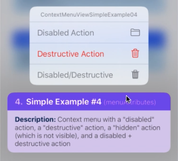
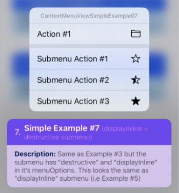
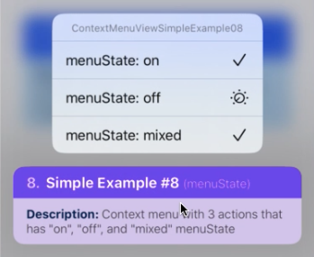

# react-native-ios-context-menu

<br>

**Left**: [Example 1](https://github.com/dominicstop/react-native-ios-context-menu/blob/master/example/src/components/ContextMenuViewSimpleExample01.js), [Example 2](https://github.com/dominicstop/react-native-ios-context-menu/blob/master/example/src/components/ContextMenuViewSimpleExample02.js), and **Right**: [Example 3](https://github.com/dominicstop/react-native-ios-context-menu/blob/master/example/src/components/ContextMenuViewSimpleExample03.js), [Example 4](https://github.com/dominicstop/react-native-ios-context-menu/blob/master/example/src/components/ContextMenuViewSimpleExample04.js)


**Left**: [Example 5](https://github.com/dominicstop/react-native-ios-context-menu/blob/master/example/src/components/ContextMenuViewSimpleExample05.js), [Example 6](https://github.com/dominicstop/react-native-ios-context-menu/blob/master/example/src/components/ContextMenuViewSimpleExample06.js), and **Right**: [Example 7](https://github.com/dominicstop/react-native-ios-context-menu/blob/master/example/src/components/ContextMenuViewSimpleExample07.js), [Example 8](https://github.com/dominicstop/react-native-ios-context-menu/blob/master/example/src/components/ContextMenuViewSimpleExample08.js)


**Left**: [Test 1](https://github.com/dominicstop/react-native-ios-context-menu/blob/master/example/src/components/ContextMenuViewTest01.js), and **Right**: [Test 2](https://github.com/dominicstop/react-native-ios-context-menu/blob/master/example/src/components/ContextMenuViewTest02.js)


**Left**: [Test 3](https://github.com/dominicstop/react-native-ios-context-menu/blob/master/example/src/components/ContextMenuViewTest03.js), and **Right**: [Test 4](https://github.com/dominicstop/react-native-ios-context-menu/blob/master/example/src/components/ContextMenuViewTest04.js)


**Left**: [Test 5](https://github.com/dominicstop/react-native-ios-context-menu/blob/master/example/src/components/ContextMenuViewTest05.js), and **Right**: [Test 6](https://github.com/dominicstop/react-native-ios-context-menu/blob/master/example/src/components/ContextMenuViewTest06.js)


---
<br>

### 🚧⚠️ Documentation WIP 🚧⚠️

<br>

## 1. Installation

```sh
# install via NPM
npm install react-native-ios-context-menu

# or install via yarn
yarn add react-native-ios-context-menu

# then run pod install (uses autolinking)
cd ios && pod install
```

<br>

### 1.1 Installation Notes
This library is written in swift. If you are having trouble building your app after installing this library, try adding an empty swift file.
1.  Open up your `ios/project.xcworkspace` project
2. On the project navigator panel, right click on your project group (or another folder/group) and select "*New File...*" option
3. In the popup/sheet, select swift click **next** button
4. In the "*Save As*" popup/sheet, rename the file if you want to and then click create
5. If Xcode asks you to create a "*Objective-C Bridging Header*" choose yes

<br>

## 2. Usage
Please check out the examples section or the [examples directory](https://github.com/dominicstop/react-native-ios-context-menu/tree/master/example/src/components) for more on how to use it.

```js
import { ContextMenuView } from "react-native-ios-context-menu";
```

<br>

## 3. Documentation

<br>

## 4. Examples

### 4.1 [Simple Example #1](https://github.com/dominicstop/react-native-ios-context-menu/blob/master/example/src/components/ContextMenuViewSimpleExample01.js)
A plain context menu configured with 3 actions (no icons, just text).

<br>

```jsx
<ContextMenuView
  // `menuConfig` prop accepts a `MenuConfig` object
  menuConfig={{
    menuTitle: 'ContextMenuViewSimpleExample01', // title of our menu
	 // a `MenuConfig` object has `menuItems` property
    // which is an array of `MenuConfig` or `MenuAction` object
    // these are the items we want to show in our menu
    menuItems: [{
	   // a menu action config item  - `MenuAction` object
      // represents an menu item that we want to show in our menu
      actionKey  : 'key-01'   , // an id for your action
      actionTitle: 'Action #1', // text to display in your menu action
    }, {
	   // another `MenuAction` object item
      actionKey  : 'key-02'   ,
      actionTitle: 'Action #2',
    }, {
      // and another `MenuAction` object item
      actionKey  : 'key-03'   ,
      actionTitle: 'Action #3',
    }],
  }}
/>
```

<br>


<br>

### 4.2 [Simple Example #2](https://github.com/dominicstop/react-native-ios-context-menu/blob/master/example/src/components/ContextMenuViewSimpleExample02.js)
A menu configured with 3 actions with "system" [SF Symbols](https://developer.apple.com/design/human-interface-guidelines/sf-symbols/overview/) icons.

<br>

```jsx
<ContextMenuView
  menuConfig={{
    menuTitle: 'ContextMenuViewSimpleExample02',
    menuItems: [{
	   // a menu action config item - `MenuAction` object
      actionKey  : 'key-01'   ,
      actionTitle: 'Action #1',
      imageType  : 'SYSTEM'   , // indicates that we want to use SF Symbols
      imageValue : 'folder'   , // the icon string of SF Symbols icon
    }, {
	   // another `MenuAction` object item
      actionKey  : 'key-02'   ,
      actionTitle: 'Action #2',
      imageType  : 'SYSTEM'   , // don't forget to add this property/key
      imageValue : 'dial.fill', // a SF symbol has other variants for an icon
    }, {
      // and another `MenuAction` object item
      actionKey  : 'key-03'   ,
      actionTitle: 'Action #3',
      imageType  : 'SYSTEM'   ,
      imageValue : 'archivebox.fill',
    }],
  }}
/>
```

<br>


<br>

### 4.3 [Simple Example #3](https://github.com/dominicstop/react-native-ios-context-menu/blob/master/example/src/components/ContextMenuViewSimpleExample03.js)
A menu configured with 3 actions with "system" SF Symbols icons.

<br>

```jsx

<ContextMenuView
  // `menuConfig` prop accepts a `MenuConfig` object
  menuConfig={{
    menuTitle: 'ContextMenuViewSimpleExample03', // title of our menu
	 // a `MenuConfig` object has `menuItems` property
    // which is an array of `MenuConfig` or `MenuAction` object
    // these are the items we want to show in our menu
    menuItems: [{
      // a menu action config item - `MenuAction` object
      actionKey  : 'key-01',
      actionTitle: 'Action #1',
      imageType  : 'SYSTEM',
      imageValue : 'folder',
    }, {
      // a menu config item, i.e. a submenu - `MenuConfig` object
      // the `menuItems` property can accept an array of both a `MenuAction`
      // object and a `MenuConfig` object. If we pass a `MenuConfig` object
      // this means that we want to show another menu i.e. a submenu
      menuTitle: 'Submenu...', // the title of submenu

      // Since this is a `MenuConfig` object, we have a `menuItems` property.
      // This represents the items that we want to show in our submenu.
      // An array of `MenuAction` or `MenuConfig` object. If you want another 
      // submenu in your submenu, pass a `MenuConfig` object.
      menuItems: [{
        // a menu action config item - `MenuAction` object
        actionKey  : 'key-01-01',
        actionTitle: 'Submenu Action #1',
        imageType  : 'SYSTEM',
        imageValue : 'star',
      }, {
        // another `MenuAction` object item
        actionKey  : 'key-01-02',
        actionTitle: 'Submenu Action #2',
        imageType  : 'SYSTEM',
        imageValue : 'star.lefthalf.fill',
      }, {
        // and another `MenuAction` object item
        actionKey  : 'key-01-03',
        actionTitle: 'Submenu Action #3',
        imageType  : 'SYSTEM',
        imageValue : 'star.fill',
      }]
    }],
  }}
/>
```

<br>


<br>

### 4.4 [Simple Example #4](https://github.com/dominicstop/react-native-ios-context-menu/blob/master/example/src/components/ContextMenuViewSimpleExample04.js)
A example context menu with a "disabled" action, a "destructive" action, a "hidden" action (which is not visible), and a disabled + destructive action.

<br>

```jsx
<ContextMenuView
  menuConfig={{
    menuTitle: 'ContextMenuViewSimpleExample04',
    menuItems: [{
      actionKey     : 'key-01',
      actionTitle   : 'Disabled Action',
      imageType     : 'SYSTEM',
      imageValue    : 'folder',
      menuAttributes: ['disabled']
    }, {
      actionKey     : 'key-02'   ,
      actionTitle   : 'Destructive Action',
      imageType     : 'SYSTEM',
      imageValue    : 'trash',
      menuAttributes: ['destructive']
    }, {
      actionKey     : 'key-03'   ,
      actionTitle   : 'Hidden Action',
      imageType     : 'SYSTEM',
      imageValue    : 'trash',
      menuAttributes: ['hidden']
    }, {
      actionKey     : 'key-04'   ,
      actionTitle   : 'Disabled/Destructive',
      imageType     : 'SYSTEM',
      imageValue    : 'trash.fill',
      menuAttributes: ['disabled', 'destructive']
    }],
  }}
/>
```

<br>



<br>

### 4.5 [Simple Example #5](https://github.com/dominicstop/react-native-ios-context-menu/blob/master/example/src/components/ContextMenuViewSimpleExample05.js)
Same as Example #3 but the submenu has "displayInline" in it's menuOptions

<br>

```jsx
<ContextMenuView
  menuConfig={{
    menuTitle: 'ContextMenuViewSimpleExample05',
    menuItems: [{
      actionKey  : 'key-01',
      actionTitle: 'Action #1',
      imageType  : 'SYSTEM',
      imageValue : 'folder',
    }, {
      menuTitle: 'Submenu...',
      menuOptions: ['displayInline'],
      menuItems: [{
        actionKey  : 'key-01-01',
        actionTitle: 'Submenu Action #1',
        imageType  : 'SYSTEM',
        imageValue : 'star',
      }, {
        actionKey  : 'key-01-02',
        actionTitle: 'Submenu Action #2',
        imageType  : 'SYSTEM',
        imageValue : 'star.lefthalf.fill',
      }, {
        actionKey  : 'key-01-03',
        actionTitle: 'Submenu Action #3',
        imageType  : 'SYSTEM',
        imageValue : 'star.fill',
      }]
    }]
  }}
/>
```

<br>


<br>

### 4.6 [Simple Example #6](https://github.com/dominicstop/react-native-ios-context-menu/blob/master/example/src/components/ContextMenuViewSimpleExample06.js)
Same as Example #3 but the submenu has "destructive" in it's menuOptions

<br>

```jsx
<ContextMenuView
  menuConfig={{
    menuTitle: 'ContextMenuViewSimpleExample06',
    menuItems: [{
      actionKey  : 'key-01',
      actionTitle: 'Action #1',
      imageType  : 'SYSTEM',
      imageValue : 'folder',
    }, {
      menuTitle: 'Submenu...',
      menuOptions: ['destructive'],
      menuItems: [{
        actionKey  : 'key-01-01',
        actionTitle: 'Submenu Action #1',
        imageType  : 'SYSTEM',
        imageValue : 'star',
      }, {
        actionKey  : 'key-01-02',
        actionTitle: 'Submenu Action #2',
        imageType  : 'SYSTEM',
        imageValue : 'star.lefthalf.fill',
      }, {
        actionKey  : 'key-01-03',
        actionTitle: 'Submenu Action #3',
        imageType  : 'SYSTEM',
        imageValue : 'star.fill',
      }]
    }],
  }}
/>
```

<br>


<br>

### 4.7 [Simple Example #7](https://github.com/dominicstop/react-native-ios-context-menu/blob/master/example/src/components/ContextMenuViewSimpleExample07.js)
Same as Example #3 but the submenu has "destructive" and "displayInline" in it's menuOptions. This looks the same as "displayInline" submenu (i.e Example #5)

<br>

```jsx
<ContextMenuView
  menuConfig={{
    menuTitle: 'ContextMenuViewSimpleExample07',
    menuItems: [{
      actionKey  : 'key-01',
      actionTitle: 'Action #1',
      imageType  : 'SYSTEM',
      imageValue : 'folder',
    }, {
      menuTitle: 'Submenu...',
      menuOptions: ['displayInline', 'destructive'],
      menuItems: [{
        actionKey  : 'key-01-01',
        actionTitle: 'Submenu Action #1',
        imageType  : 'SYSTEM',
        imageValue : 'star',
      }, {
        actionKey  : 'key-01-02',
        actionTitle: 'Submenu Action #2',
        imageType  : 'SYSTEM',
        imageValue : 'star.lefthalf.fill',
      }, {
        actionKey  : 'key-01-03',
        actionTitle: 'Submenu Action #3',
        imageType  : 'SYSTEM',
        imageValue : 'star.fill',
      }]
    }],
  }}
/>
```

<br>



<br>

### 4.8 [Simple Example #8](https://github.com/dominicstop/react-native-ios-context-menu/blob/master/example/src/components/ContextMenuViewSimpleExample08.js)
Context menu with 3 actions that has "on", "off", and "mixed" menuState

<br>

```jsx
<ContextMenuView
  menuConfig={{
    menuTitle: 'ContextMenuViewSimpleExample08',
    menuItems: [{
      actionKey  : 'key-01',
      actionTitle: 'menuState: on',
      imageType  : 'SYSTEM',
      imageValue : 'folder',
      menuState  : 'on',
    }, {
      actionKey  : 'key-02'   ,
      actionTitle: 'menuState: off',
      imageType  : 'SYSTEM',
      imageValue : 'dial',
      menuState  : 'off',
    }, {
      actionKey  : 'key-03'   ,
      actionTitle: 'menuState: mixed',
      imageType  : 'SYSTEM'   ,
      imageValue : 'archivebox',
      menuState  : 'mixed',
    }],
  }}
/>
```

<br>



<br>

## License

MIT

<br>

## Links
* I'm [@DominicGo](https://twitter.com/GoDominic) on twitter if you have any questions ✨
* Other libraries: [`react-native-ios-modal`](https://github.com/dominicstop/react-native-ios-modal)